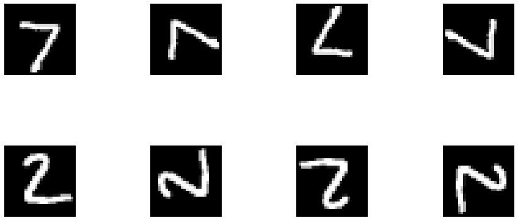
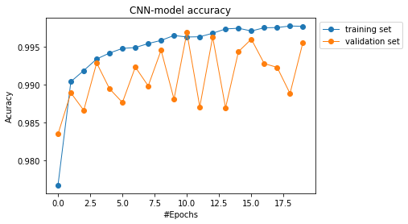
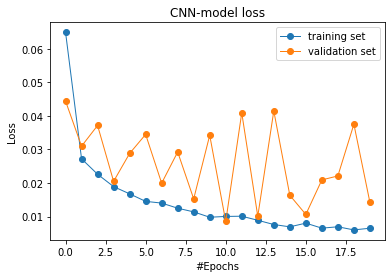
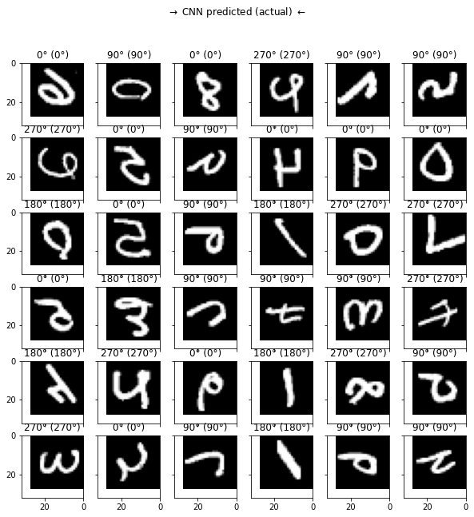
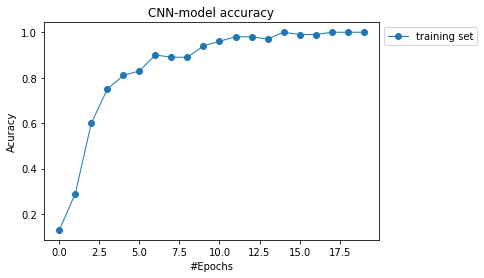
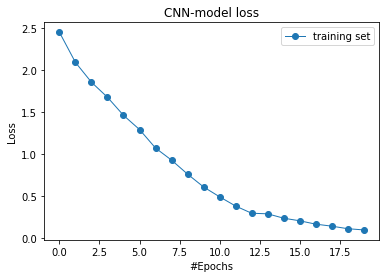
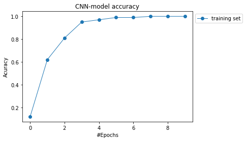
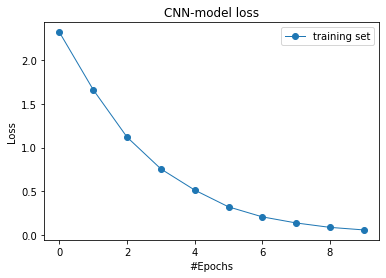

# Prédiction des données MNIST avec uniquement 100 labels

# Importing Libraries


```
import numpy as np
import pandas as pd
import tensorflow as tf
import matplotlib.pyplot as plt
import os
```

## Loading the Dataset
MNIST is a dataset of 60,000 28x28 grayscale images of the 10 digits, along with a test set of 10,000 images.


```
from keras.datasets import mnist 
from keras import backend as K
from collections import Counter
(X_train_Original, Y_train_Original), (X_test_Original, Y_test_Original) = mnist.load_data()
# Counting the number of every class
EachClassSize = Counter(Y_train_Original.reshape(-1))
```

    Downloading data from https://storage.googleapis.com/tensorflow/tf-keras-datasets/mnist.npz
    11493376/11490434 [==============================] - 0s 0us/step


```

```


```
# from google.colab import drive
# drive.mount('/content/drive')
```


```
from keras.backend import clear_session
clear_session()
```


```
# Taking  100 Data with labels 
nber = 100 # number of labeled data
labels = [key for (key,value) in EachClassSize.items()] # take only the key of the dictionary object
idx100 = []
for i in range(len(labels)):
  idx = labels[i]==Y_train_Original
  index = np.arange(0,len(Y_train_Original))[idx]
  for j in range(10):
    idx100.append(index[j])
 

y_train100 = Y_train_Original[idx100]
x_train100 = X_train_Original[idx100]
x_train59900 = np.delete(X_train_Original,idx100,axis=0)
```


```
EachClassSize_test_100 = Counter(y_train100.reshape(-1))
```

# Part 1 - Self supervised Learning

Self supervised learning consist: 
- to work on unlabeled data
- Choose a pretexte task of classification
- Train the RotNet to learn the pretexte task

According to our article, the pretexte is to recognize the geometric transformation applied to an image that is given to the RotNet as input. 
the set of geometric transformations taken in the papers are all the image rotations by multiples of 90 degrees, i.e., 2d image rotations by
0, 90, 180, and 270 degrees. 

So, the pseudo labels will be the rotations, i.e., 0 for "0°", 1 for "90°", 2 for "180°" and 3 for "270°".


## The rotation operator

We define it as $Rot(X; d)$. It's an operator that rotates image $X$ by $d$ degrees. 

According to the article, In order to implement the image rotations by 90, 180, and 270 degrees (the 0 degrees case is the image itself), we use flip and transpose operations. Specifically 
- for 90 degrees rotation we first transpose the image and then flip it vertically (upside-down flip)
- for 180 degrees rotation we flip the image first vertically and then horizontally (left-right flip), and finally 
- for 270 degrees rotation we first flip vertically the image and then we transpose it.


```
def Rot(X, d):
  if d == 0: # 0 degrees rotation
      return X
  elif d == 90: # 90 degrees rotation
      return np.flipud(np.transpose(X))
  elif d == 180: # 180 degrees rotation
      return np.fliplr(np.flipud(X))
  elif d == 270: # 270 degrees rotation / or -90
      return np.transpose(np.flipud(X))
  else:
      raise ValueError('rotation should be 0, 90, 180, or 270 degrees')

```

## Applying of the operator in the whole dataset 
We apply the foou rotation on each image on the dataset and labelled the image with the ype of rotation as define above


```
n = x_train59900.shape[0]
RotX = np.zeros([4*n,28,28])# data obtained by rotation
Roty = np.zeros(4*n)# our pseudo labels
i=0
j=0
while i < 4*n:
  if j < n:  
    RotX[i] = Rot(x_train59900[j],  0)
    RotX[i+1] = Rot(x_train59900[j],  90)
    RotX[i+2] = Rot(x_train59900[j],  180)
    RotX[i+3] = Rot(x_train59900[j],  270)
    Roty[i:i+4] = np.array([0,1,2,3])
    j = j + 1
  i = i + 4
```


```
n_test = X_test_Original.shape[0]
RotX_test = np.zeros([4*n_test,28,28])# data obtained by rotation
Roty_test = np.zeros(4*n_test)# our pseudo labels
i=0
j = 0
while i < 4*n_test:
  if j < n:
    RotX_test[i] = Rot(X_test_Original[j],  0)
    RotX_test[i+1] = Rot(X_test_Original[j],  90)
    RotX_test[i+2] = Rot(X_test_Original[j],  180)
    RotX_test[i+3] = Rot(X_test_Original[j],  270)
    Roty_test[i:i+4] = np.array([0,1,2,3])
    j = j + 1
  i = i+ 4
```


```
# verification of the rotation

import matplotlib.gridspec as gridspec
def plot(samples):
    fig = plt.figure(figsize=(15, 15))
    gs = gridspec.GridSpec(4, 4)
    gs.update(wspace=1, hspace=1)

    for i, sample in enumerate(samples):
        ax = plt.subplot(gs[i])
        plt.axis('off')
        ax.set_xticklabels([])
        ax.set_yticklabels([])
        ax.set_aspect('equal')
        plt.imshow(sample.reshape(28, 28), cmap='Greys_r')
    return

plot(RotX_test[0:8])

```


    

    


## Data Preprocessing 
In order to avoid overfitting, we have to apply some transformations


```
# Splitting data
from sklearn.model_selection import train_test_split

RotX_train, RotX_val, Roty_train, Roty_val = train_test_split(
                                 RotX, Roty, 
                                 test_size = 0.2, random_state=12, 
                                 shuffle = True, stratify = Roty)
```


```
Counter(list(Roty_train.reshape(-1)))

```


    Counter({0.0: 47920, 1.0: 47920, 2.0: 47920, 3.0: 47920})


#### Convert class vectors to binary class matrices. (one-hot encoding)


```
from keras.utils import to_categorical
```


```
num_classes = np.int64(Roty.max()) +1
# Roty_val_before = Roty_val
```


```
RotX_train = RotX_train.astype('float32') 
RotX_train /= 255
RotX_train = RotX_train.reshape(-1, 28,28,1)

RotX_test = RotX_test.astype('float32') 
RotX_test /= 255
RotX_test = RotX_test.reshape(-1, 28,28,1)

RotX_val = RotX_val.astype('float32')
RotX_val /= 255
RotX_val = RotX_val.reshape(-1, 28,28,1)
```

## Transform y in *categorial*


```
Roty_train_before = Roty_train
Roty_test_before = Roty_test
Roty_val_before = Roty_val
```


```
Roty = to_categorical(Roty, num_classes)
Roty_train = to_categorical(Roty_train, num_classes)
Roty_val = to_categorical(Roty_val, num_classes)
Roty_test = to_categorical(Roty_test, num_classes)
```

Conv Net


```
from keras.models import Sequential
from keras.layers import Input, Dense, BatchNormalization, Dropout, ReLU, Activation, Flatten,Conv2D, MaxPooling2D
```

## Building the CNN
the CNN moedel trained to recognize rotations is called here RotNet


```
from keras.layers import Input, Flatten, Dense, ReLU, Activation, BatchNormalization, GlobalAveragePooling2D, AveragePooling2D, Reshape
from keras.models import Model,Sequential
from keras.backend import clear_session
clear_session()
```

## Modèle de base: **RotNet**

3 blocs de CNN.
 
Chaque bloc a 3 conv2D


```

RotNet = Sequential()

# Convolution

#Block 1

RotNet.add(Conv2D(filters = 192, kernel_size= 5, use_bias=False, padding='same', strides=(1, 1),input_shape=(28, 28,1)))
RotNet.add(BatchNormalization())
RotNet.add(Activation('relu'))

RotNet.add(Conv2D(filters = 160, kernel_size= 1, use_bias=False, padding='same', strides=(1, 1)))
RotNet.add(BatchNormalization())
RotNet.add(Activation('relu'))
# RotNet.add(BatchNormalization())

RotNet.add(Conv2D(filters = 96, kernel_size= 1, use_bias=False, padding='same', strides=(1, 1)))
RotNet.add(BatchNormalization())
RotNet.add(Activation('relu'))
# RotNet.add(BatchNormalization())

RotNet.add(MaxPooling2D(pool_size = 3, padding='same', strides=(2,2)))


# Bloc 2

RotNet.add(Conv2D(filters = 192, kernel_size= 5, use_bias=False, padding='same', strides=(1, 1)))
RotNet.add(BatchNormalization())
RotNet.add(Activation('relu'))

RotNet.add(Conv2D(filters = 192, kernel_size= 1, use_bias=False, padding='same', strides=(1, 1)))
RotNet.add(BatchNormalization())
RotNet.add(Activation('relu'))

RotNet.add(Conv2D(filters = 192, kernel_size= 1, use_bias=False, padding='same', strides=(1, 1)))
RotNet.add(BatchNormalization())
RotNet.add(Activation('relu'))

RotNet.add(AveragePooling2D(pool_size = 3, padding='same', strides=(2,2)))


# Bloc 3

RotNet.add(Conv2D(filters = 192, kernel_size= 3, use_bias=False, padding='same', strides=(1, 1)))
RotNet.add(BatchNormalization())
RotNet.add(Activation('relu'))

RotNet.add(Conv2D(filters = 192, kernel_size= 1, use_bias=False, padding='same', strides=(1, 1)))
RotNet.add(BatchNormalization())
RotNet.add(Activation('relu'))

RotNet.add(Conv2D(filters = 192, kernel_size= 1, use_bias=False, padding='same', strides=(1, 1)))
RotNet.add(BatchNormalization())
RotNet.add(Activation('relu'))


RotNet.add(GlobalAveragePooling2D())


RotNet.add(Dense(num_classes))
RotNet.add(Activation('softmax'))
```


```
RotNet.summary()
```

    Model: "sequential"
    _________________________________________________________________
    Layer (type)                 Output Shape              Param #   
    =================================================================
    conv2d (Conv2D)              (None, 28, 28, 192)       4800      
    _________________________________________________________________
    batch_normalization (BatchNo (None, 28, 28, 192)       768       
    _________________________________________________________________
    activation (Activation)      (None, 28, 28, 192)       0         
    _________________________________________________________________
    conv2d_1 (Conv2D)            (None, 28, 28, 160)       30720     
    _________________________________________________________________
    batch_normalization_1 (Batch (None, 28, 28, 160)       640       
    _________________________________________________________________
    activation_1 (Activation)    (None, 28, 28, 160)       0         
    _________________________________________________________________
    conv2d_2 (Conv2D)            (None, 28, 28, 96)        15360     
    _________________________________________________________________
    batch_normalization_2 (Batch (None, 28, 28, 96)        384       
    _________________________________________________________________
    activation_2 (Activation)    (None, 28, 28, 96)        0         
    _________________________________________________________________
    max_pooling2d (MaxPooling2D) (None, 14, 14, 96)        0         
    _________________________________________________________________
    conv2d_3 (Conv2D)            (None, 14, 14, 192)       460800    
    _________________________________________________________________
    batch_normalization_3 (Batch (None, 14, 14, 192)       768       
    _________________________________________________________________
    activation_3 (Activation)    (None, 14, 14, 192)       0         
    _________________________________________________________________
    conv2d_4 (Conv2D)            (None, 14, 14, 192)       36864     
    _________________________________________________________________
    batch_normalization_4 (Batch (None, 14, 14, 192)       768       
    _________________________________________________________________
    activation_4 (Activation)    (None, 14, 14, 192)       0         
    _________________________________________________________________
    conv2d_5 (Conv2D)            (None, 14, 14, 192)       36864     
    _________________________________________________________________
    batch_normalization_5 (Batch (None, 14, 14, 192)       768       
    _________________________________________________________________
    activation_5 (Activation)    (None, 14, 14, 192)       0         
    _________________________________________________________________
    average_pooling2d (AveragePo (None, 7, 7, 192)         0         
    _________________________________________________________________
    conv2d_6 (Conv2D)            (None, 7, 7, 192)         331776    
    _________________________________________________________________
    batch_normalization_6 (Batch (None, 7, 7, 192)         768       
    _________________________________________________________________
    activation_6 (Activation)    (None, 7, 7, 192)         0         
    _________________________________________________________________
    conv2d_7 (Conv2D)            (None, 7, 7, 192)         36864     
    _________________________________________________________________
    batch_normalization_7 (Batch (None, 7, 7, 192)         768       
    _________________________________________________________________
    activation_7 (Activation)    (None, 7, 7, 192)         0         
    _________________________________________________________________
    conv2d_8 (Conv2D)            (None, 7, 7, 192)         36864     
    _________________________________________________________________
    batch_normalization_8 (Batch (None, 7, 7, 192)         768       
    _________________________________________________________________
    activation_8 (Activation)    (None, 7, 7, 192)         0         
    _________________________________________________________________
    global_average_pooling2d (Gl (None, 192)               0         
    _________________________________________________________________
    dense (Dense)                (None, 4)                 772       
    _________________________________________________________________
    activation_9 (Activation)    (None, 4)                 0         
    =================================================================
    Total params: 998,084
    Trainable params: 994,884
    Non-trainable params: 3,200
    _________________________________________________________________


## Training the RotNet RotNet


```
from keras.optimizers import SGD
```

Optimizer


```
opt = SGD(learning_rate=0.1, momentum=0.9,  nesterov=True)
```


```
#Define the optimizer, the loss function and the metrics
RotNet.compile(loss='categorical_crossentropy', optimizer = opt, metrics=["accuracy"])
```

On fit le réseau sur les données


```
# Démarrage de l'entrainement du réseau
hist = RotNet.fit(RotX_train, Roty_train, 
            batch_size=128,
            epochs=20,
            shuffle=True,                       # verbosité
            verbose = 1,
            validation_data=(RotX_val, Roty_val))   # données de validation (X(données) et y(labels))   
```

    Epoch 1/20
      25/1498 [..............................] - ETA: 1:23:48 - loss: 0.8890 - accuracy: 0.5799

On trace la courbe d'apprentissage du réseau


```
plt.plot(hist.history['accuracy'], label='training set',marker='o', linestyle='solid',linewidth=1, markersize=6)
plt.plot(hist.history['val_accuracy'], label='validation set',marker='o', linestyle='solid',linewidth=1, markersize=6)
plt.title("CNN-model accuracy")
plt.xlabel('#Epochs')
plt.ylabel('Acuracy')
plt.legend(bbox_to_anchor=( 1., 1.))
```


    <matplotlib.legend.Legend at 0x7f7e2ea9fba8>


    

    


On trace la courbe de sa fonction de perte


```
plt.plot(hist.history['loss'], label='training set',marker='o', linestyle='solid',linewidth=1, markersize=6)
plt.plot(hist.history['val_loss'], label='validation set',marker='o', linestyle='solid',linewidth=1, markersize=6)
plt.title("CNN-model loss")
plt.xlabel('#Epochs')
plt.ylabel('Loss')
plt.legend(bbox_to_anchor=( 1., 1.))
```


    <matplotlib.legend.Legend at 0x7f7e2ebd1940>


    

    


```
LABELS = {
    0 : "0°", 
    1 : "90°", 
    2 : "180°", 
    3 : "270°", 
}
list(LABELS.items())
```


    [(0, '0°'), (1, '90°'), (2, '180°'), (3, '270°')]


# Test sur les données de validations


```
from sklearn.metrics import confusion_matrix,classification_report
y_pred = RotNet.predict(RotX_val)
y_pred = np.argmax(y_pred, axis=1)
# y_true = Roty_test


```


```
y_true = Roty_val_before.reshape(y_pred.shape)
```


```
from sklearn.metrics import accuracy_score
accuracy_score(y_true=y_true,y_pred=y_pred)
```


    0.9956176961602671


On fait une visualisation des prédictions des rotations sur les données de validation.

Si elle prédit mal on met une croix rouge sur l'image prédite

---


```
# Sample test data
ix = np.random.randint(0, 10000, size=36)
ex_im = RotX_val[ix]
ex_lb = Roty_val[ix]
print(RotX_val.shape)
# Predict
out = RotNet.predict(ex_im) #RotNet
classes = np.argmax(out, axis=1)  # softmax output -> class

# Plot
fig, axes = plt.subplots(6, 6, figsize=(10, 10), sharey=True, sharex=True);
fig.suptitle(r'$\rightarrow$ CNN predicted (actual) $\leftarrow$')

k = 0
for i in range(6):
    for j in range(6):
        # Switch Axes
        ax = axes[i, j]
        
        # Show image
        ax.imshow(ex_im[k].reshape(28, 28), cmap='Greys_r');
        
        # Determine labels
        actual_lab = LABELS[np.argmax(ex_lb[k])]
        pred_lab = LABELS[classes[k]]
        
        # Format title
        title = "{} ({})".format(pred_lab, actual_lab)
        title_color = 'black'
        
        # Mark image if wrong prediction
        if actual_lab != pred_lab:
            ax.plot(np.array([0, 32]), np.array([0, 32]), 'r-')
            ax.plot(np.array([0, 32]), np.array([32, 0]), 'r-')
            title_color = 'red'

        # Set title
        ax.set_title(title, color=title_color);
        
        # Set limits
        ax.set_xlim(32, 0)
        ax.set_ylim(32, 0)
            
        k += 1
```

    (47920, 28, 28, 1)


    

    


# Test sur les données test


```
from sklearn.metrics import confusion_matrix,classification_report
y_pred = RotNet.predict(RotX_test)
y_pred = np.argmax(y_pred, axis=1)

```


```
y_true = Roty_test_before.reshape(y_pred.shape)
```


```
from sklearn.metrics import accuracy_score
accuracy_score(y_true=y_true,y_pred=y_pred)
```


    0.9948


On fait une visualisation des prédictions des rotations sur les données de test.

Si elle prédit mal on met une croix rouge sur l'image prédite


```
# Sample test data
nb_data = 8
ix = np.random.randint(0, 10000, size=nb_data*nb_data)
ex_im = RotX_test[ix]
ex_lb = Roty_test[ix]
print(RotX_val.shape)
# Predict
out = RotNet.predict(ex_im) #RotNet
classes = np.argmax(out, axis=1)  # softmax output -> class

# Plot
fig, axes = plt.subplots(nb_data, nb_data, figsize=(10, 10), sharey=True, sharex=True);
fig.suptitle(r'$\rightarrow$ CNN predicted (actual) $\leftarrow$')

k = 0
for i in range(nb_data):
    for j in range(nb_data):
        # Switch Axes
        ax = axes[i, j]
        
        # Show image
        ax.imshow(ex_im[k].reshape(28, 28), cmap='Greys_r');
        
        # Determine labels
        actual_lab = LABELS[np.argmax(ex_lb[k])]
        pred_lab = LABELS[classes[k]]
        
        # Format title
        title = "{} ({})".format(pred_lab, actual_lab)
        title_color = 'black'
        
        # Mark image if wrong prediction
        if actual_lab != pred_lab:
            ax.plot(np.array([0, 32]), np.array([0, 32]), 'r-')
            ax.plot(np.array([0, 32]), np.array([32, 0]), 'r-')
            title_color = 'red'

        # Set title
        ax.set_title(title, color=title_color);
        
        # Set limits
        ax.set_xlim(32, 0)
        ax.set_ylim(32, 0)
            
        k += 1
```


```
scores = RotNet.evaluate(RotX_test, Roty_test, batch_size=128)
```


```
scores
```


    [0.015339497476816177, 0.9947999715805054]


# Géler certaines parties

On fait une copie du modèle créé en haut


```
model_frozen = RotNet

```


```
model_frozen.summary()
```

    Model: "sequential"
    _________________________________________________________________
    Layer (type)                 Output Shape              Param #   
    =================================================================
    conv2d (Conv2D)              (None, 28, 28, 192)       4800      
    _________________________________________________________________
    batch_normalization (BatchNo (None, 28, 28, 192)       768       
    _________________________________________________________________
    activation (Activation)      (None, 28, 28, 192)       0         
    _________________________________________________________________
    conv2d_1 (Conv2D)            (None, 28, 28, 160)       30720     
    _________________________________________________________________
    batch_normalization_1 (Batch (None, 28, 28, 160)       640       
    _________________________________________________________________
    activation_1 (Activation)    (None, 28, 28, 160)       0         
    _________________________________________________________________
    conv2d_2 (Conv2D)            (None, 28, 28, 96)        15360     
    _________________________________________________________________
    batch_normalization_2 (Batch (None, 28, 28, 96)        384       
    _________________________________________________________________
    activation_2 (Activation)    (None, 28, 28, 96)        0         
    _________________________________________________________________
    max_pooling2d (MaxPooling2D) (None, 14, 14, 96)        0         
    _________________________________________________________________
    conv2d_3 (Conv2D)            (None, 14, 14, 192)       460800    
    _________________________________________________________________
    batch_normalization_3 (Batch (None, 14, 14, 192)       768       
    _________________________________________________________________
    activation_3 (Activation)    (None, 14, 14, 192)       0         
    _________________________________________________________________
    conv2d_4 (Conv2D)            (None, 14, 14, 192)       36864     
    _________________________________________________________________
    batch_normalization_4 (Batch (None, 14, 14, 192)       768       
    _________________________________________________________________
    activation_4 (Activation)    (None, 14, 14, 192)       0         
    _________________________________________________________________
    conv2d_5 (Conv2D)            (None, 14, 14, 192)       36864     
    _________________________________________________________________
    batch_normalization_5 (Batch (None, 14, 14, 192)       768       
    _________________________________________________________________
    activation_5 (Activation)    (None, 14, 14, 192)       0         
    _________________________________________________________________
    average_pooling2d (AveragePo (None, 7, 7, 192)         0         
    _________________________________________________________________
    conv2d_6 (Conv2D)            (None, 7, 7, 192)         331776    
    _________________________________________________________________
    batch_normalization_6 (Batch (None, 7, 7, 192)         768       
    _________________________________________________________________
    activation_6 (Activation)    (None, 7, 7, 192)         0         
    _________________________________________________________________
    conv2d_7 (Conv2D)            (None, 7, 7, 192)         36864     
    _________________________________________________________________
    batch_normalization_7 (Batch (None, 7, 7, 192)         768       
    _________________________________________________________________
    activation_7 (Activation)    (None, 7, 7, 192)         0         
    _________________________________________________________________
    conv2d_8 (Conv2D)            (None, 7, 7, 192)         36864     
    _________________________________________________________________
    batch_normalization_8 (Batch (None, 7, 7, 192)         768       
    _________________________________________________________________
    activation_8 (Activation)    (None, 7, 7, 192)         0         
    _________________________________________________________________
    global_average_pooling2d (Gl (None, 192)               0         
    _________________________________________________________________
    dense (Dense)                (None, 4)                 772       
    _________________________________________________________________
    activation_9 (Activation)    (None, 4)                 0         
    =================================================================
    Total params: 998,084
    Trainable params: 994,884
    Non-trainable params: 3,200
    _________________________________________________________________


# Gèle des layers

Les deux premiers blocs sont gélés

Les poids reste modifiable à partir du dernier et troisième bloc.

Les vingt premières couches correspondent au deux premiers blocs de notre modèle de base


```
for layer in model_frozen.layers[:20]:
    layer.trainable=False
    
for layer in model_frozen.layers[20:]:
    layer.trainable=True
```


```
num_classes2 = np.int64(y_train100.max()) +1
```


```
model_frozen.summary()
```

    Model: "sequential"
    _________________________________________________________________
    Layer (type)                 Output Shape              Param #   
    =================================================================
    conv2d (Conv2D)              (None, 28, 28, 192)       4800      
    _________________________________________________________________
    batch_normalization (BatchNo (None, 28, 28, 192)       768       
    _________________________________________________________________
    activation (Activation)      (None, 28, 28, 192)       0         
    _________________________________________________________________
    conv2d_1 (Conv2D)            (None, 28, 28, 160)       30720     
    _________________________________________________________________
    batch_normalization_1 (Batch (None, 28, 28, 160)       640       
    _________________________________________________________________
    activation_1 (Activation)    (None, 28, 28, 160)       0         
    _________________________________________________________________
    conv2d_2 (Conv2D)            (None, 28, 28, 96)        15360     
    _________________________________________________________________
    batch_normalization_2 (Batch (None, 28, 28, 96)        384       
    _________________________________________________________________
    activation_2 (Activation)    (None, 28, 28, 96)        0         
    _________________________________________________________________
    max_pooling2d (MaxPooling2D) (None, 14, 14, 96)        0         
    _________________________________________________________________
    conv2d_3 (Conv2D)            (None, 14, 14, 192)       460800    
    _________________________________________________________________
    batch_normalization_3 (Batch (None, 14, 14, 192)       768       
    _________________________________________________________________
    activation_3 (Activation)    (None, 14, 14, 192)       0         
    _________________________________________________________________
    conv2d_4 (Conv2D)            (None, 14, 14, 192)       36864     
    _________________________________________________________________
    batch_normalization_4 (Batch (None, 14, 14, 192)       768       
    _________________________________________________________________
    activation_4 (Activation)    (None, 14, 14, 192)       0         
    _________________________________________________________________
    conv2d_5 (Conv2D)            (None, 14, 14, 192)       36864     
    _________________________________________________________________
    batch_normalization_5 (Batch (None, 14, 14, 192)       768       
    _________________________________________________________________
    activation_5 (Activation)    (None, 14, 14, 192)       0         
    _________________________________________________________________
    average_pooling2d (AveragePo (None, 7, 7, 192)         0         
    _________________________________________________________________
    conv2d_6 (Conv2D)            (None, 7, 7, 192)         331776    
    _________________________________________________________________
    batch_normalization_6 (Batch (None, 7, 7, 192)         768       
    _________________________________________________________________
    activation_6 (Activation)    (None, 7, 7, 192)         0         
    _________________________________________________________________
    conv2d_7 (Conv2D)            (None, 7, 7, 192)         36864     
    _________________________________________________________________
    batch_normalization_7 (Batch (None, 7, 7, 192)         768       
    _________________________________________________________________
    activation_7 (Activation)    (None, 7, 7, 192)         0         
    _________________________________________________________________
    conv2d_8 (Conv2D)            (None, 7, 7, 192)         36864     
    _________________________________________________________________
    batch_normalization_8 (Batch (None, 7, 7, 192)         768       
    _________________________________________________________________
    activation_8 (Activation)    (None, 7, 7, 192)         0         
    _________________________________________________________________
    global_average_pooling2d (Gl (None, 192)               0         
    _________________________________________________________________
    dense (Dense)                (None, 4)                 772       
    _________________________________________________________________
    activation_9 (Activation)    (None, 4)                 0         
    =================================================================
    Total params: 998,084
    Trainable params: 407,428
    Non-trainable params: 590,656
    _________________________________________________________________


ON choisit la sortie de la 4 ème dernière couche en partant de la dernière couche.

Cette couche corresponde à la dernière couche avant les couches de classification. Les sorties de cette couche sont les caractéristiques de l'image.

Ensuite le Global average pooling nous permet pour récupérer les poids des couches gélées.

Puis on on ajoute une couche Dense(10, activation="softmax") pour la prédiction de nos 10 classes (0,1,...,9)


```
X= model_frozen.layers[-4].output
InputMod = tf.keras.Input(shape=(28, 28, 1))
globalAv = GlobalAveragePooling2D()(X)
predictions = Dense(num_classes2, activation="softmax")(globalAv)
model_final = tf.keras.Model(model_frozen.input,predictions)
```

Optimizer du modèle final


```
from keras.optimizers import Adam
opt2 = SGD(learning_rate=0.1, momentum=0.9,  nesterov=True)

epochs = 50
learning_rate = 0.0005
decay_rate = learning_rate/epochs

opt2 = Adam(lr=learning_rate, beta_1=0.9, beta_2=0.999, epsilon=None, decay=decay_rate, amsgrad=False)
```


```
model_final.compile(loss='categorical_crossentropy', optimizer=opt2, metrics=["accuracy"])
```

On normalise les données train et on fait une copie des données y originales


```
x_train100_2 = x_train100.astype('float32') 
x_train100_2 /= 255
x_train100_2 = x_train100_2.reshape(-1, 28,28,1)

y_train100_before = y_train100

```

On transforme en categorial y_train100


```
y_train100_2 = to_categorical(y_train100, num_classes2)
```

On fit le modèle final sur les 100 données.


```
hist2 = model_final.fit(x_train100_2, y_train100_2, 
            batch_size = 10,
            epochs=20,
            shuffle=True,                       # verbosité
            verbose = 1,
            )
```

    Epoch 1/20
    10/10 [==============================] - 1s 5ms/step - loss: 2.5092 - accuracy: 0.1375
    Epoch 2/20
    10/10 [==============================] - 0s 5ms/step - loss: 2.0893 - accuracy: 0.2960
    Epoch 3/20
    10/10 [==============================] - 0s 4ms/step - loss: 1.9159 - accuracy: 0.5618
    Epoch 4/20
    10/10 [==============================] - 0s 5ms/step - loss: 1.6873 - accuracy: 0.7958
    Epoch 5/20
    10/10 [==============================] - 0s 4ms/step - loss: 1.4646 - accuracy: 0.8253
    Epoch 6/20
    10/10 [==============================] - 0s 4ms/step - loss: 1.3134 - accuracy: 0.8300
    Epoch 7/20
    10/10 [==============================] - 0s 4ms/step - loss: 1.0714 - accuracy: 0.9239
    Epoch 8/20
    10/10 [==============================] - 0s 4ms/step - loss: 0.9007 - accuracy: 0.9223
    Epoch 9/20
    10/10 [==============================] - 0s 4ms/step - loss: 0.7300 - accuracy: 0.8934
    Epoch 10/20
    10/10 [==============================] - 0s 3ms/step - loss: 0.5730 - accuracy: 0.9717
    Epoch 11/20
    10/10 [==============================] - 0s 3ms/step - loss: 0.5484 - accuracy: 0.9292
    Epoch 12/20
    10/10 [==============================] - 0s 3ms/step - loss: 0.4267 - accuracy: 0.9677
    Epoch 13/20
    10/10 [==============================] - 0s 4ms/step - loss: 0.2790 - accuracy: 0.9908
    Epoch 14/20
    10/10 [==============================] - 0s 3ms/step - loss: 0.2999 - accuracy: 0.9586
    Epoch 15/20
    10/10 [==============================] - 0s 3ms/step - loss: 0.2369 - accuracy: 1.0000
    Epoch 16/20
    10/10 [==============================] - 0s 3ms/step - loss: 0.1959 - accuracy: 0.9960
    Epoch 17/20
    10/10 [==============================] - 0s 3ms/step - loss: 0.1814 - accuracy: 0.9725
    Epoch 18/20
    10/10 [==============================] - 0s 3ms/step - loss: 0.1514 - accuracy: 1.0000
    Epoch 19/20
    10/10 [==============================] - 0s 4ms/step - loss: 0.1400 - accuracy: 1.0000
    Epoch 20/20
    10/10 [==============================] - 0s 3ms/step - loss: 0.1127 - accuracy: 1.0000


On trace les courbes d'apprentissage et de fonction de perte


```
plt.plot(hist2.history['accuracy'], label='training set',marker='o', linestyle='solid',linewidth=1, markersize=6)
# plt.plot(hist2.history['val_accuracy'], label='validation set',marker='o', linestyle='solid',linewidth=1, markersize=6)
plt.title("CNN-model accuracy")
plt.xlabel('#Epochs')
plt.ylabel('Acuracy')
plt.legend(bbox_to_anchor=( 1., 1.))
```


    <matplotlib.legend.Legend at 0x7f7dc6eb2a20>


    

    


```
plt.plot(hist2.history['loss'], label='training set',marker='o', linestyle='solid',linewidth=1, markersize=6)
# plt.plot(hist2.history['val_loss'], label='validation set',marker='o', linestyle='solid',linewidth=1, markersize=6)
plt.title("CNN-model loss")
plt.xlabel('#Epochs')
plt.ylabel('Loss')
plt.legend(bbox_to_anchor=( 1., 1.))
```


    <matplotlib.legend.Legend at 0x7f7dc6e46c50>


    

    


```
y_pred = model_final.predict(x_train100_2)
y_pred = np.argmax(y_pred, axis=1)


```


```
LABELS2 = {
    0 : "0", 
    1 : "1", 
    2 : "2", 
    3 : "3", 
    4 : "4",           
    5 : "5", 
    6 : "6",
    7 : "7", 
    8 : "8",
    9 : "9"
}
```

# On fait le test sur des données train 100


```
y_true = y_train100_before.reshape(y_pred.shape)

```

### Accuracy


```
from sklearn.metrics import accuracy_score
accuracy_score(y_true=y_true,y_pred=y_pred)
```


    0.99


# On fait le test sur les données test


```
X_test = X_test_Original.astype('float32') 
X_test /= 255
X_test = X_test.reshape(-1, 28,28,1)

```

## Accuracy sur les données test


```
y_pred3 = model_final.predict(X_test)
y_pred3 = np.argmax(y_pred3, axis=1)


```


```
y_true3 = Y_test_Original.reshape(y_pred3.shape)
```


```
accuracy_score(y_true=y_true3,y_pred=y_pred3)
```


    0.8787


```
y_test = to_categorical(Y_test_Original, num_classes2)
```


```
scores = model_final.evaluate(X_test, y_test, batch_size=128)
```

    79/79 [==============================] - 1s 13ms/step - loss: 0.6069 - accuracy: 0.8787


```
scores[1]
```


    0.8787000179290771


# Modèle supervisé

On crée ici un modèle avec la même architecture que notre modèle finale.

Mais cette fois on n'appliquera pas de transformations géométriques pour essayer de récupérer les caractéristiques de l'image.

Le but est de comparer ce modèle à notre modèle semi-supervisé


```
clear_session()
```


```

baseline = Sequential()

# Convolution

#Block 1

baseline.add(Conv2D(filters = 192, kernel_size= 5, use_bias=False, padding='same', strides=(1, 1),input_shape=(28, 28,1)))
baseline.add(BatchNormalization())
baseline.add(Activation('relu'))

baseline.add(Conv2D(filters = 160, kernel_size= 1, use_bias=False, padding='same', strides=(1, 1)))
baseline.add(BatchNormalization())
baseline.add(Activation('relu'))
# baseline.add(BatchNormalization())

baseline.add(Conv2D(filters = 96, kernel_size= 1, use_bias=False, padding='same', strides=(1, 1)))
baseline.add(BatchNormalization())
baseline.add(Activation('relu'))
# baseline.add(BatchNormalization())

baseline.add(MaxPooling2D(pool_size = 3, padding='same', strides=(2,2)))

# Bloc 2

baseline.add(Conv2D(filters = 192, kernel_size= 5, use_bias=False, padding='same', strides=(1, 1)))
baseline.add(BatchNormalization())
baseline.add(Activation('relu'))
# baseline.add(BatchNormalization())

baseline.add(Conv2D(filters = 192, kernel_size= 1, use_bias=False, padding='same', strides=(1, 1)))
baseline.add(BatchNormalization())
baseline.add(Activation('relu'))
# baseline.add(BatchNormalization())

baseline.add(Conv2D(filters = 192, kernel_size= 1, use_bias=False, padding='same', strides=(1, 1)))
baseline.add(BatchNormalization())
baseline.add(Activation('relu'))
# baseline.add(BatchNormalization())

baseline.add(AveragePooling2D(pool_size = 3, padding='same', strides=(2,2)))
# baseline.add(MaxPooling2D(pool_size = 3, strides=(2,2)))

# Bloc 3

baseline.add(Conv2D(filters = 192, kernel_size= 3, use_bias=False, padding='same', strides=(1, 1)))
baseline.add(BatchNormalization())
baseline.add(Activation('relu'))
# baseline.add(BatchNormalization())

baseline.add(Conv2D(filters = 192, kernel_size= 1, use_bias=False, padding='same', strides=(1, 1)))
baseline.add(BatchNormalization())
baseline.add(Activation('relu'))
# baseline.add(BatchNormalization())

baseline.add(Conv2D(filters = 192, kernel_size= 1, use_bias=False, padding='same', strides=(1, 1)))
baseline.add(BatchNormalization())
baseline.add(Activation('relu'))
# baseline.add(BatchNormalization())

baseline.add(GlobalAveragePooling2D())
# baseline.add(Dropout(0.6))


# baseline.add(Flatten())
baseline.add(Dense(num_classes2))
baseline.add(Activation('softmax'))
```


```
baseline.summary()
```

    Model: "sequential"
    _________________________________________________________________
    Layer (type)                 Output Shape              Param #   
    =================================================================
    conv2d (Conv2D)              (None, 28, 28, 192)       4800      
    _________________________________________________________________
    batch_normalization (BatchNo (None, 28, 28, 192)       768       
    _________________________________________________________________
    activation (Activation)      (None, 28, 28, 192)       0         
    _________________________________________________________________
    conv2d_1 (Conv2D)            (None, 28, 28, 160)       30720     
    _________________________________________________________________
    batch_normalization_1 (Batch (None, 28, 28, 160)       640       
    _________________________________________________________________
    activation_1 (Activation)    (None, 28, 28, 160)       0         
    _________________________________________________________________
    conv2d_2 (Conv2D)            (None, 28, 28, 96)        15360     
    _________________________________________________________________
    batch_normalization_2 (Batch (None, 28, 28, 96)        384       
    _________________________________________________________________
    activation_2 (Activation)    (None, 28, 28, 96)        0         
    _________________________________________________________________
    max_pooling2d (MaxPooling2D) (None, 14, 14, 96)        0         
    _________________________________________________________________
    conv2d_3 (Conv2D)            (None, 14, 14, 192)       460800    
    _________________________________________________________________
    batch_normalization_3 (Batch (None, 14, 14, 192)       768       
    _________________________________________________________________
    activation_3 (Activation)    (None, 14, 14, 192)       0         
    _________________________________________________________________
    conv2d_4 (Conv2D)            (None, 14, 14, 192)       36864     
    _________________________________________________________________
    batch_normalization_4 (Batch (None, 14, 14, 192)       768       
    _________________________________________________________________
    activation_4 (Activation)    (None, 14, 14, 192)       0         
    _________________________________________________________________
    conv2d_5 (Conv2D)            (None, 14, 14, 192)       36864     
    _________________________________________________________________
    batch_normalization_5 (Batch (None, 14, 14, 192)       768       
    _________________________________________________________________
    activation_5 (Activation)    (None, 14, 14, 192)       0         
    _________________________________________________________________
    average_pooling2d (AveragePo (None, 7, 7, 192)         0         
    _________________________________________________________________
    conv2d_6 (Conv2D)            (None, 7, 7, 192)         331776    
    _________________________________________________________________
    batch_normalization_6 (Batch (None, 7, 7, 192)         768       
    _________________________________________________________________
    activation_6 (Activation)    (None, 7, 7, 192)         0         
    _________________________________________________________________
    conv2d_7 (Conv2D)            (None, 7, 7, 192)         36864     
    _________________________________________________________________
    batch_normalization_7 (Batch (None, 7, 7, 192)         768       
    _________________________________________________________________
    activation_7 (Activation)    (None, 7, 7, 192)         0         
    _________________________________________________________________
    conv2d_8 (Conv2D)            (None, 7, 7, 192)         36864     
    _________________________________________________________________
    batch_normalization_8 (Batch (None, 7, 7, 192)         768       
    _________________________________________________________________
    activation_8 (Activation)    (None, 7, 7, 192)         0         
    _________________________________________________________________
    global_average_pooling2d (Gl (None, 192)               0         
    _________________________________________________________________
    dense (Dense)                (None, 10)                1930      
    _________________________________________________________________
    activation_9 (Activation)    (None, 10)                0         
    =================================================================
    Total params: 999,242
    Trainable params: 996,042
    Non-trainable params: 3,200
    _________________________________________________________________


```
baseline.compile(loss='categorical_crossentropy', optimizer=opt2, metrics=["accuracy"])
```


```
hist3 = baseline.fit(x_train100_2, y_train100_2, 
            batch_size=50,
            epochs=10,
            shuffle=True,                       # verbosité
            verbose = 1,
            )
```

    Epoch 1/10
    2/2 [==============================] - 1s 20ms/step - loss: 2.3433 - accuracy: 0.1333
    Epoch 2/10
    2/2 [==============================] - 0s 20ms/step - loss: 1.7073 - accuracy: 0.6000
    Epoch 3/10
    2/2 [==============================] - 0s 20ms/step - loss: 1.1556 - accuracy: 0.7867
    Epoch 4/10
    2/2 [==============================] - 0s 20ms/step - loss: 0.7823 - accuracy: 0.9400
    Epoch 5/10
    2/2 [==============================] - 0s 20ms/step - loss: 0.5264 - accuracy: 0.9667
    Epoch 6/10
    2/2 [==============================] - 0s 20ms/step - loss: 0.3241 - accuracy: 0.9867
    Epoch 7/10
    2/2 [==============================] - 0s 20ms/step - loss: 0.2074 - accuracy: 0.9867
    Epoch 8/10
    2/2 [==============================] - 0s 20ms/step - loss: 0.1382 - accuracy: 1.0000
    Epoch 9/10
    2/2 [==============================] - 0s 20ms/step - loss: 0.0882 - accuracy: 1.0000
    Epoch 10/10
    2/2 [==============================] - 0s 21ms/step - loss: 0.0569 - accuracy: 1.0000


```

```


```
plt.plot(hist3.history['accuracy'], label='training set',marker='o', linestyle='solid',linewidth=1, markersize=6)
# plt.plot(hist2.history['val_accuracy'], label='validation set',marker='o', linestyle='solid',linewidth=1, markersize=6)
plt.title("CNN-model accuracy")
plt.xlabel('#Epochs')
plt.ylabel('Acuracy')
plt.legend(bbox_to_anchor=( 1., 1.))
```


    <matplotlib.legend.Legend at 0x7f7dce0a3780>


    

    


```
plt.plot(hist3.history['loss'], label='training set',marker='o', linestyle='solid',linewidth=1, markersize=6)
# plt.plot(hist2.history['val_loss'], label='validation set',marker='o', linestyle='solid',linewidth=1, markersize=6)
plt.title("CNN-model loss")
plt.xlabel('#Epochs')
plt.ylabel('Loss')
plt.legend(bbox_to_anchor=( 1., 1.))
```


    <matplotlib.legend.Legend at 0x7f7dce2fe208>


    

    


#### Accuracy sur les données test


```
y_pred5 = baseline.predict(X_test)
y_pred5 = np.argmax(y_pred5, axis=1)

```


```
y_true5 = Y_test_Original.reshape(y_pred5.shape)
```


    array([7, 2, 1, ..., 4, 5, 6], dtype=uint8)


```
accuracy_score(y_true=y_true5,y_pred=y_pred5)
```


    0.1137


On remarque un overfitting du modèle pendant l'apprentissage mais le test sur des données test donne de mauvais résultats


```
scores = baseline.evaluate(X_test, y_test, batch_size=128)
```

    79/79 [==============================] - 1s 13ms/step - loss: 2.3122 - accuracy: 0.1137


```
scores
```


    [2.312241315841675, 0.1137000024318695]


```

```
