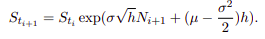
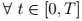
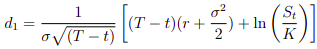
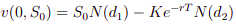
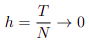
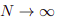

```{r setup, include=FALSE}
knitr::opts_chunk$set(echo = TRUE)
```
Les formules utilisées dans cette simulation ont été démontrées dans la version manuscrite du devoir de maison dans les questions correspondantes.

### Variables globales

```{r constantes}
S0 = 100
sigma = 0.2
mu = 0.03
r = 0.015
K = 97
T_ = 1
tabN = c(10, 100, 500, 1000, 5000, 10000)

M = 100 # Le nombre de simulations indépendantes pour vérifier la convergence de VT et phi(ST)
tabDeviation = c() # Pour afficher l'écart type pour vérifier la convergence
```

__Pour les affichages suivants des différentes fonctions crées, on fait le test avec N = 10, après on fera pour les différents N evoqués dans le devoir de maison.__

### Simulation de St

On utilise l'expression suivante pour simuler l'actif risqué par la formule de Black-Scholes.



La fonction est discreteSt

```{r Sti}
discreteSt = function(S0, sigma, N, mu, T_) {
  h = T_/N
  tabSt= c(S0)
  Ni = rnorm(N,0,1)
  for(i in 1:N) {
    tabSt[i+1] = tabSt[i]*exp(sigma*sqrt(h)*Ni[i] + (mu-((sigma^2)/2))*h)
  }
  return (tabSt)  
}
```
__On affiche le tableau contenant S0, Sti pour i = 1, ... N pour N = 10__
```{r Sti showSti}
discreteStTab = discreteSt(S0, sigma, tabN[1], mu, T_)
print(discreteStTab)
```

__Graphique de St POur N = 10__
```{r Sti plotSti}

plot(seq(0,T_,T_/tabN[1]),discreteStTab,type='l', lwd=2, xlab="La grille de pas T/N", ylab="St")

```

### Valeur du porte-feuille v(t, St)
En posant ,

On obtient la formule suivante demontrée dans mes copies du devoir de maison,

,  avec  et 

Ainsi pour t = 0,  avec  et 
```{r valueOption}
d1 = function(T_,t, K, x, sigma) {
  result=(log(x/K)+(r+sigma^2/2)*(T_-t))/(sigma*sqrt(T_-t))
  return (result)
}
Vt = function(T_,t, K, S, sigma) {
  d1_ = d1(T_,t, K, S, sigma)
  d2_ = d1_ - sigma*sqrt(T_-t)
  result=S*pnorm(d1_, 0,1)-K*exp(-r*(T_-t))*pnorm(d2_, 0,1)
  return(result);
}

```

### Calcul du grec 
On utilise la formule suivante demontrée,
 avec 
```{r grecDelta}
deltaGrec = function(T_,t, K, S, sigma) {
  d1_ = d1(T_,t, K, S, sigma)
  result=pnorm(d1_, 0,1)
  return(result);
}
```

### Discrétisation de v(t, St)
On utilise la formule de discrétisation de Vt donnée dans l'exercice,
 avec 

```{r discretisationOptionValue}
discretizationVt = function(S0, discreteStTab, K, T_, r, sigma, N) {
  #N = length(discreteStTab)
  #if (echeanceCall(discreteStTab[1], K) > 0) {
  grid = seq(0,T_,T/N)
  #}
  h = T_/N
  V0 = Vt(T_,0, K, S0, sigma)
  tabV = c(V0)
  #Sti = S0
  for (i in 1:N) {
    delta = deltaGrec(T_,grid[i], K, discreteStTab[i], sigma)
    differenceSt = discreteStTab[i+1] - discreteStTab[i]
    tabV[i+1] = (tabV[i]) + (delta*differenceSt) + (tabV[i]-delta*discreteStTab[i])*(exp(r*h) - 1)
  }
  return(tabV)
}
```

Affichage de la valeur du porte-feuille pour N = 10
```{r affichageDiscretisation}
tabV = discretizationVt(S0,discreteStTab, K, T_, r, sigma, tabN[1])
print(tabV)
```

__Graphique de Vt pour N = 10__
```{r Sti plotVti}

plot(seq(0,T_,T_/tabN[1]),tabV,type='l', lwd=2, xlab="La grille de pas T/N", ylab="Vt")

```

### Vérification de notre discrétisation telle que 
On sait que   quand 


__Fonction echéance__

```{r echeance}
echeanceCall = function(x, K) {
  result = c(x-K,0)
  return (max(result))
}
```

__Fonction qui simule indépendamment M fois  __
```{r fonctionVerif}
simulation = function(S0,K, T_, r, mu, sigma,N, M) {
  tabSimul = c()
  for(i in (1:M)) {
    discreteStTab = discreteSt(S0, sigma, N, mu, T_)
    val = discretizationVt(S0,discreteStTab, K, T_, r, sigma, N)
    VT =  val[length(val)]
    ST = discreteStTab[length(discreteStTab)]
    tabSimul[i] = VT - echeanceCall(ST, K)
  }
  return(tabSimul)
}
```

__Affichage de M simulations indépendantes pour N = 10__
```{r affichageSimulation}
tabSimul = simulation(S0,K, T_, r, mu, sigma,tabN[1], M)
print(tabSimul)
```

__Graphique des M simulations indépendantes pour N = 10__
```{r Sti plotTabSimul}
plot(seq(1,M,1),tabSimul,type='l', lwd=2, xlab="M valeurs", ylab="simulations")

```

__Deviation__
```{r deviation}
deviation = function(X) {
  return(sd(X))
}
```

__Affichage de l'écart-type__
```{r affichageDeviation}
devi = deviation(tabSimul)
print(devi)

tabDeviation[1] = devi
```
__C'est normal car N n'est pas assez grand pour que __ .

## Test pour différents N
__On remarque que plus N est grand,  converge vers 0 avec M = 100 simulations indépendantes de __

Ce qui est vérifié, __en effet  lorsque __

#### Pour N = 10
Déjà fait en haut

#### Pour N = 100

On discrétise St
```{r Sti showTestSti2}
discreteStTab = discreteSt(S0, sigma, tabN[2], mu, T_)
```

__Graphique de St Pour N = 100__
```{r Sti plotSti2}

plot(seq(0,T_,T_/tabN[2]),discreteStTab,type='l', lwd=2, xlab="La grille de pas T/N", ylab="St")

```

On discrétise Vt
```{r VtTestDiscretisation2}
tabV = discretizationVt(S0,discreteStTab, K, T_, r, sigma, tabN[2])

```

__Graphique de Vt pour N = 100__
```{r Sti plotVti2}

plot(seq(0,T_,T_/tabN[2]),tabV,type='l', lwd=2, xlab="La grille de pas T/N", ylab="Vt")

```

On fait M simulations de 
```{r simulationsTestDiscretisation2}
tabSimul = simulation(S0,K, T_, r, mu, sigma,tabN[2], M)

```

__Affichage des M simulations indépendantes pour N = 100__
```{r affichageSimulation2}
tabSimul = simulation(S0,K, T_, r, mu, sigma,tabN[2], M)
print(tabSimul)
```

__Graphique des M simulations indépendantes pour N = 100__
```{r Sti plotTabSimul2}
plot(seq(1,M,1),tabSimul,type='l', lwd=2, xlab="M valeurs", ylab="simulations")

```

__Affichage de l'écart-type__
```{r affichageTestDeviation2}
devi = deviation(tabSimul)
print(devi)

tabDeviation[2] = devi
```

#### Pour N = 500

On discrétise St
```{r Sti showTestSti3}
discreteStTab = discreteSt(S0, sigma, tabN[3], mu, T_)
```

__Graphique de St Pour N = 500__
```{r Sti plotSti3}

plot(seq(0,T_,T_/tabN[3]),discreteStTab,type='l', lwd=2, xlab="La grille de pas T/N", ylab="St")

```

On discrétise Vt
```{r VtTestDiscretisation3}
tabV = discretizationVt(S0,discreteStTab, K, T_, r, sigma, tabN[3])

```

__Graphique de Vt pour N = 500__
```{r Sti plotVti3}

plot(seq(0,T_,T_/tabN[3]),tabV,type='l', lwd=2, xlab="La grille de pas T/N", ylab="Vt")

```

On fait M simulations de 
```{r simulationsTestDiscretisation3}
tabSimul = simulation(S0,K, T_, r, mu, sigma,tabN[3], M)

```

__Affichage des M simulations indépendantes pour N = 500__
```{r affichageSimulation3}

tabSimul = simulation(S0,K, T_, r, mu, sigma,tabN[3], M)
print(tabSimul)
```

__Graphique des M simulations indépendantes pour N = 500__
```{r Sti plotTabSimul3}
plot(seq(1,M,1),tabSimul,type='l', lwd=2, xlab="M valeurs", ylab="simulations")

```

__Affichage de l'écart-type__
```{r affichageTestDeviation3}
devi = deviation(tabSimul)
print(devi)

tabDeviation[3] = devi
```

#### Pour N = 1000

On discrétise St
```{r Sti showTestSti4}
discreteStTab = discreteSt(S0, sigma, tabN[4], mu, T_)
```

__Graphique de St Pour N = 1000__
```{r Sti plotSti4}

plot(seq(0,T_,T_/tabN[4]),discreteStTab,type='l', lwd=2, xlab="La grille de pas T/N", ylab="St")

```

On discrétise Vt
```{r VtTestDiscretisation4}
tabV = discretizationVt(S0,discreteStTab, K, T_, r, sigma, tabN[4])

```

__Graphique de Vt pour N = 1000__
```{r Sti plotVti4}

plot(seq(0,T_,T_/tabN[4]),tabV,type='l', lwd=2, xlab="La grille de pas T/N", ylab="Vt")

```

On fait M simulations de 
```{r simulationsTestDiscretisation4}
tabSimul = simulation(S0,K, T_, r, mu, sigma,tabN[4], M)

```

__Affichage des M simulations indépendantes pour N = 1000__
```{r affichageSimulation4}

tabSimul = simulation(S0,K, T_, r, mu, sigma,tabN[4], M)
print(tabSimul)
```

__Graphique des M simulations indépendantes pour N = 1000__
```{r Sti plotTabSimul4}
plot(seq(1,M,1),tabSimul,type='l', lwd=2, xlab="M valeurs", ylab="simulations")

```

__Affichage de l'écart-type__
```{r affichageTestDeviation4}
devi = deviation(tabSimul)
print(devi)

tabDeviation[4] = devi
```

#### Pour N = 5000

On discrétise St
```{r Sti showTestSti5}
discreteStTab = discreteSt(S0, sigma, tabN[5], mu, T_)
```

__Graphique de St Pour N = 5000__
```{r Sti plotSti5}

plot(seq(0,T_,T_/tabN[5]),discreteStTab,type='l', lwd=2, xlab="La grille de pas T/N", ylab="St")

```

On discrétise Vt
```{r VtTestDiscretisation5}
tabV = discretizationVt(S0,discreteStTab, K, T_, r, sigma, tabN[5])

```

__Graphique de Vt pour N = 5000__
```{r Sti plotVti5}

plot(seq(0,T_,T_/tabN[5]),tabV,type='l', lwd=2, xlab="La grille de pas T/N", ylab="Vt")

```

On fait M simulations de 
```{r simulationsTestDiscretisation5}
tabSimul = simulation(S0,K, T_, r, mu, sigma,tabN[5], M)

```

__Affichage des M simulations indépendantes pour N = 5000__
```{r affichageSimulation5}

tabSimul = simulation(S0,K, T_, r, mu, sigma,tabN[5], M)
print(tabSimul)
```

__Graphique des M simulations indépendantes pour N = 5000__
```{r Sti plotTabSimul5}
plot(seq(1,M,1),tabSimul,type='l', lwd=2, xlab="M valeurs", ylab="simulations")

```

__Affichage de l'écart-type__
```{r affichageTestDeviation5}
devi = deviation(tabSimul)
print(devi)

tabDeviation[5] = devi
```

#### Pour N = 10000

On discrétise St
```{r Sti showTestSti6}
discreteStTab = discreteSt(S0, sigma, tabN[6], mu, T_)
```

__Graphique de St Pour N = 10000__
```{r Sti plotSti6}

plot(seq(0,T_,T_/tabN[6]),discreteStTab,type='l', lwd=2, xlab="La grille de pas T/N", ylab="St")

```

On discrétise Vt
```{r VtTestDiscretisation6}
tabV = discretizationVt(S0,discreteStTab, K, T_, r, sigma, tabN[6])

```

__Graphique de Vt pour N = 10000__
```{r Sti plotVti6}

plot(seq(0,T_,T_/tabN[6]),tabV,type='l', lwd=2, xlab="La grille de pas T/N", ylab="Vt")

```

On fait M simulations de 
```{r simulationsTestDiscretisation6}

tabSimul = simulation(S0,K, T_, r, mu, sigma,tabN[6], M)

```

__Affichage des M simulations indépendantes pour N = 10000__
```{r affichageSimulation6}

tabSimul = simulation(S0,K, T_, r, mu, sigma,tabN[6], M)
print(tabSimul)
```

__Graphique des M simulations indépendantes pour N = 10000__
```{r Sti plotTabSimul6}
plot(seq(1,M,1),tabSimul,type='l', lwd=2, xlab="M valeurs", ylab="simulations")

```

__Affichage de l'écart-type__
```{r affichageTestDeviation6}
devi = deviation(tabSimul)
print(devi)

tabDeviation[6] = devi
```

## Affichage des ecart-types précédents pour M simulations indépendantes en fonction de N
```{r Sti plotAllEcartypes}
#len = length(tabDeviation)
logTabDeviation = log(tabDeviation + 1)
Nmax = max(tabN)
plot(tabN,logTabDeviation,type='l', lwd=2, xlab="N", ylab="ecart-type")

```

**On remarque que plus N est grand, on a une decroissance assez importante de l'ecart-type**
