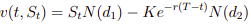

Dynamic Hedging Strategy in the Black and Scholes framework
================
Mamadou KANOUTE
12/11/2020

Les formules utilisées dans cette simulation ont été démontrées dans la
version manuscrite du devoir de maison dans les questions
correspondantes.

### Variables globales

``` r
S0 = 100
sigma = 0.2
mu = 0.03
r = 0.015
K = 97
T_ = 1
tabN = c(10, 100, 500, 1000, 5000, 10000)

M = 100 # Le nombre de simulations indépendantes pour vérifier la convergence de VT et phi(ST)
tabDeviation = c() # Pour afficher l'écart type pour vérifier la convergence
```

**Pour les affichages suivants des différentes fonctions crées, on fait
le test avec N = 10, après on fera pour les différents N evoqués dans le
devoir de maison.**

### Simulation de St

On utilise l’expression suivante pour simuler l’actif risqué par la
formule de Black-Scholes.


La fonction est discreteSt

``` r
discreteSt = function(S0, sigma, N, mu, T_) {
  h = T_/N
  tabSt= c(S0)
  Ni = rnorm(N,0,1)
  for(i in 1:N) {
    tabSt[i+1] = tabSt[i]*exp(sigma*sqrt(h)*Ni[i] + (mu-((sigma^2)/2))*h)
  }
  return (tabSt)  
}
```

**On affiche le tableau contenant S0, Sti pour i = 1, … N pour N = 10**

``` r
discreteStTab = discreteSt(S0, sigma, tabN[1], mu, T_)
print(discreteStTab)
```

    ##  [1] 100.00000 102.35162  97.98189  93.11436  84.81984  75.62972  72.53732
    ##  [8]  69.78721  62.45596  64.49665  60.33360

**Graphique de St POur N =
10**

``` r
plot(seq(0,T_,T_/tabN[1]),discreteStTab,type='l', lwd=2, xlab="La grille de pas T/N", ylab="St")
```

<!-- -->

### Valeur du porte-feuille v(t, St)

En posant ,

On obtient la formule suivante demontrée dans mes copies du devoir de
maison,

,  avec  et


Ainsi pour t = 0,  avec  et


``` r
d1 = function(T_,t, K, x, sigma) {
  result=(log(x/K)+(r+sigma^2/2)*(T_-t))/(sigma*sqrt(T_-t))
  return (result)
}
Vt = function(T_,t, K, S, sigma) {
  d1_ = d1(T_,t, K, S, sigma)
  d2_ = d1_ - sigma*sqrt(T_-t)
  result=S*pnorm(d1_, 0,1)-K*exp(-r*(T_-t))*pnorm(d2_, 0,1)
  return(result);
}
```

### Calcul du grec 

On utilise la formule suivante demontrée,  avec


``` r
deltaGrec = function(T_,t, K, S, sigma) {
  d1_ = d1(T_,t, K, S, sigma)
  result=pnorm(d1_, 0,1)
  return(result);
}
```

### Discrétisation de v(t, St)

On utilise la formule de discrétisation de Vt donnée dans l’exercice,
 avec 

``` r
discretizationVt = function(S0, discreteStTab, K, T_, r, sigma, N) {
  #N = length(discreteStTab)
  #if (echeanceCall(discreteStTab[1], K) > 0) {
  grid = seq(0,T_,T/N)
  #}
  h = T_/N
  V0 = Vt(T_,0, K, S0, sigma)
  tabV = c(V0)
  #Sti = S0
  for (i in 1:N) {
    delta = deltaGrec(T_,grid[i], K, discreteStTab[i], sigma)
    differenceSt = discreteStTab[i+1] - discreteStTab[i]
    tabV[i+1] = (tabV[i]) + (delta*differenceSt) + (tabV[i]-delta*discreteStTab[i])*(exp(r*h) - 1)
  }
  return(tabV)
}
```

Affichage de la valeur du porte-feuille pour N = 10

``` r
tabV = discretizationVt(S0,discreteStTab, K, T_, r, sigma, tabN[1])
print(tabV)
```

    ##  [1] 10.2102585 11.6087445  8.5805581  5.6635512  1.7838105 -0.3799745
    ##  [7] -0.5437985 -0.5857240 -0.6000468 -0.6009463 -0.6018484

**Graphique de Vt pour N =
10**

``` r
plot(seq(0,T_,T_/tabN[1]),tabV,type='l', lwd=2, xlab="La grille de pas T/N", ylab="Vt")
```

<!-- -->

### Vérification de notre discrétisation telle que 

On sait que  quand 

**Fonction echéance**

``` r
echeanceCall = function(x, K) {
  result = c(x-K,0)
  return (max(result))
}
```

**Fonction qui simule indépendamment M fois 
**

``` r
simulation = function(S0,K, T_, r, mu, sigma,N, M) {
  tabSimul = c()
  for(i in (1:M)) {
    discreteStTab = discreteSt(S0, sigma, N, mu, T_)
    val = discretizationVt(S0,discreteStTab, K, T_, r, sigma, N)
    VT =  val[length(val)]
    ST = discreteStTab[length(discreteStTab)]
    tabSimul[i] = VT - echeanceCall(ST, K)
  }
  return(tabSimul)
}
```

**Affichage de M simulations indépendantes pour N = 10**

``` r
tabSimul = simulation(S0,K, T_, r, mu, sigma,tabN[1], M)
print(tabSimul)
```

    ##   [1]  1.092752665  1.838880226  3.808178701  1.177345659 -0.457783776
    ##   [6]  2.006794542  1.351928893  0.894311154  0.361574695 -0.039234510
    ##  [11]  2.024850827 -0.478880148  2.818909554  2.052991395 -2.941992145
    ##  [16] -3.397238889 -1.422648039  0.288046506 -0.032407985  1.129477830
    ##  [21] -4.403853223 -0.165662742 -1.058485196 -2.734385714  3.224067013
    ##  [26] -1.026923625 -1.269838337 -0.305773517 -0.370099344  2.402174880
    ##  [31]  1.695361532 -1.204582843 -1.816057729 -1.262297745 -0.698247817
    ##  [36] -1.421918346 -0.252403961 -1.247412911 -1.289107433 -2.105759423
    ##  [41]  2.023844104 -0.424010131  0.006772979 -1.614218050  0.660689632
    ##  [46]  2.689456961  3.166854298  1.044846779 -0.088089754 -1.275457114
    ##  [51]  1.385003323  2.703335697  0.043816417 -1.239666225 -1.410568311
    ##  [56] -0.780821709 -0.166228525  2.249238187 -1.173044673  0.174164466
    ##  [61] -2.470607600 -1.751920009 -0.340055624  0.209032243 -2.095918806
    ##  [66]  0.383972425 -0.609752524 -4.385838909  1.635497428  1.004209971
    ##  [71] -1.113023446 -0.627966960  0.614255819  0.138976774 -0.403715730
    ##  [76] -3.395261666  1.152685190  3.346096475 -0.519133075  0.637666857
    ##  [81]  1.392150503  1.048356692 -1.411595909 -0.006093254 -1.865586592
    ##  [86]  4.871362620  0.844929950 -0.503368707 -2.363043982  1.034715767
    ##  [91] -0.443310831  3.151707281 -1.009878282 -0.657044812  0.347983262
    ##  [96]  0.374987520  0.566596476  4.928973328 -4.581974126  0.866784045

**Graphique des M simulations indépendantes pour N =
10**

``` r
plot(seq(1,M,1),tabSimul,type='l', lwd=2, xlab="M valeurs", ylab="simulations")
```

<!-- -->

**Deviation**

``` r
deviation = function(X) {
  return(sd(X))
}
```

**Affichage de l’écart-type**

``` r
devi = deviation(tabSimul)
print(devi)
```

    ## [1] 1.862157

``` r
tabDeviation[1] = devi
```

**C’est normal car N n’est pas assez grand pour que
** .

## Test pour différents N

**On remarque que plus N est grand,  converge
vers 0 avec M = 100 simulations indépendantes de
**

Ce qui est vérifié, **en effet  lorsque
**

#### Pour N = 10

Déjà fait en haut

#### Pour N = 100

On discrétise St

``` r
discreteStTab = discreteSt(S0, sigma, tabN[2], mu, T_)
```

**Graphique de St Pour N =
100**

``` r
plot(seq(0,T_,T_/tabN[2]),discreteStTab,type='l', lwd=2, xlab="La grille de pas T/N", ylab="St")
```

<!-- -->

On discrétise Vt

``` r
tabV = discretizationVt(S0,discreteStTab, K, T_, r, sigma, tabN[2])
```

**Graphique de Vt pour N =
100**

``` r
plot(seq(0,T_,T_/tabN[2]),tabV,type='l', lwd=2, xlab="La grille de pas T/N", ylab="Vt")
```

<!-- -->

On fait M simulations de 

``` r
tabSimul = simulation(S0,K, T_, r, mu, sigma,tabN[2], M)
```

**Affichage des M simulations indépendantes pour N = 100**

``` r
tabSimul = simulation(S0,K, T_, r, mu, sigma,tabN[2], M)
print(tabSimul)
```

    ##   [1] -0.332119463  0.487357006  0.059148563 -0.647601399 -1.183968930
    ##   [6]  1.413959109  0.273360771 -0.510476552  0.418846871  2.160617262
    ##  [11] -0.204979092  1.177331246 -0.135216682 -0.353406393  0.591926916
    ##  [16] -0.290196120  0.551339119 -0.133370016  0.006409354  0.049309579
    ##  [21]  0.779040010  0.272651128  1.439053527  0.890486036 -0.022309427
    ##  [26] -0.183080359 -0.044277296 -0.258525936  0.492906746 -0.079756873
    ##  [31]  0.043213012 -1.142340596 -0.679311802 -0.851164428 -1.266724103
    ##  [36] -0.519334786  0.173652175 -0.471395066  0.474240626 -0.474861667
    ##  [41]  0.711055635 -0.284699465 -0.895032679  0.193309407  0.121138192
    ##  [46]  0.823813410  0.047994548  0.046888141 -1.013534108  0.322327358
    ##  [51]  0.746380206  0.792228340 -0.587945606 -0.408313992 -1.198534084
    ##  [56]  0.515870821  0.565070679  0.262552763 -0.062923161  0.207648887
    ##  [61]  0.340081173  0.743331378 -0.609749576  0.090922509 -0.128048260
    ##  [66] -0.434279938 -0.407160677 -1.438059697  0.816622195 -0.931351451
    ##  [71]  0.651985990  1.259725264 -0.054907868 -0.115916082  0.692800979
    ##  [76] -0.770918561 -1.230773945 -0.385637137 -0.025729861 -0.198605983
    ##  [81]  0.365258718  0.436968901  0.274121317 -0.209676951 -0.170535709
    ##  [86]  0.355743471 -1.560718116  0.309472394  0.072138936  0.361565840
    ##  [91]  0.462765092 -0.101666114  0.171286200 -0.606836938  0.624562417
    ##  [96]  0.005146940 -1.239388187  0.120522002 -0.130049839 -0.440825793

**Graphique des M simulations indépendantes pour N =
100**

``` r
plot(seq(1,M,1),tabSimul,type='l', lwd=2, xlab="M valeurs", ylab="simulations")
```

<!-- -->

**Affichage de l’écart-type**

``` r
devi = deviation(tabSimul)
print(devi)
```

    ## [1] 0.663669

``` r
tabDeviation[2] = devi
```

#### Pour N = 500

On discrétise St

``` r
discreteStTab = discreteSt(S0, sigma, tabN[3], mu, T_)
```

**Graphique de St Pour N =
500**

``` r
plot(seq(0,T_,T_/tabN[3]),discreteStTab,type='l', lwd=2, xlab="La grille de pas T/N", ylab="St")
```

<!-- -->

On discrétise Vt

``` r
tabV = discretizationVt(S0,discreteStTab, K, T_, r, sigma, tabN[3])
```

**Graphique de Vt pour N =
500**

``` r
plot(seq(0,T_,T_/tabN[3]),tabV,type='l', lwd=2, xlab="La grille de pas T/N", ylab="Vt")
```

<!-- -->

On fait M simulations de 

``` r
tabSimul = simulation(S0,K, T_, r, mu, sigma,tabN[3], M)
```

**Affichage des M simulations indépendantes pour N = 500**

``` r
tabSimul = simulation(S0,K, T_, r, mu, sigma,tabN[3], M)
print(tabSimul)
```

    ##   [1]  0.8623762959  0.2490524779  0.3105987886  0.1442249704 -0.0018961650
    ##   [6] -0.0644058430 -0.1129903754 -0.3150208615 -0.2298452785  0.1386253051
    ##  [11]  0.3323143121  0.1301751135 -0.2383610798  0.0297674885 -0.0521218169
    ##  [16] -0.4562512531  0.1694529457  0.2260802885  0.0595177077 -0.6639105357
    ##  [21]  0.0275123863  0.3812220991  0.0990294924  0.0716170802 -0.0240929969
    ##  [26] -0.0457676651  0.0814146658  0.3284906829 -0.0452769544  0.1176956968
    ##  [31]  0.3606797760  0.0968108939 -0.2406309329 -0.1204214290  0.3359779684
    ##  [36]  0.2942061739  0.0879738779  0.3127673953  0.2142157806  0.4021440023
    ##  [41]  0.2016263437 -0.0060491420  0.0384052420  0.0287034841  0.1788787711
    ##  [46] -0.0007919931  0.1149690466 -0.2282155303 -0.0370730545 -0.1997699172
    ##  [51] -0.0665911102  0.4620244501 -0.1788671793 -0.4711820655  0.1602812663
    ##  [56]  0.4811993639 -0.0403314500 -0.0518962517  0.0575168879  0.7192552215
    ##  [61] -0.3705649373 -0.0140757109  0.0272611460 -0.3458475511  0.1552389250
    ##  [66]  0.4556520098  0.2133763042 -0.1983433262  0.4530675242  0.1650645812
    ##  [71]  0.2513566868  0.2054084773  0.0122892561  0.3125773368 -0.4581171925
    ##  [76] -0.0454795316 -0.0922761729 -0.1609885939  0.3785498531  0.0049722853
    ##  [81]  0.0689909025  0.1047358708 -0.0760670221  0.0080454130 -0.2586327338
    ##  [86]  0.0924592718 -0.2252065550 -0.1442456989  0.2781932909 -0.1532150755
    ##  [91] -0.0334366389  0.5392844782  0.4938376160  0.2787763887 -0.1453710871
    ##  [96] -0.0581386490  0.5066887895  0.1791957625  0.0619474905  0.3501069605

**Graphique des M simulations indépendantes pour N =
500**

``` r
plot(seq(1,M,1),tabSimul,type='l', lwd=2, xlab="M valeurs", ylab="simulations")
```

<!-- -->

**Affichage de l’écart-type**

``` r
devi = deviation(tabSimul)
print(devi)
```

    ## [1] 0.2598596

``` r
tabDeviation[3] = devi
```

#### Pour N = 1000

On discrétise St

``` r
discreteStTab = discreteSt(S0, sigma, tabN[4], mu, T_)
```

**Graphique de St Pour N =
1000**

``` r
plot(seq(0,T_,T_/tabN[4]),discreteStTab,type='l', lwd=2, xlab="La grille de pas T/N", ylab="St")
```

<!-- -->

On discrétise Vt

``` r
tabV = discretizationVt(S0,discreteStTab, K, T_, r, sigma, tabN[4])
```

**Graphique de Vt pour N =
1000**

``` r
plot(seq(0,T_,T_/tabN[4]),tabV,type='l', lwd=2, xlab="La grille de pas T/N", ylab="Vt")
```

<!-- -->

On fait M simulations de 

``` r
tabSimul = simulation(S0,K, T_, r, mu, sigma,tabN[4], M)
```

**Affichage des M simulations indépendantes pour N = 1000**

``` r
tabSimul = simulation(S0,K, T_, r, mu, sigma,tabN[4], M)
print(tabSimul)
```

    ##   [1] -0.0598021091 -0.1040466002  0.1416897725 -0.1479416575  0.2383515127
    ##   [6]  0.0571782532 -0.1044155246  0.2182762020  0.2483415155  0.3182841326
    ##  [11]  0.1018950050 -0.2501473842 -0.4117824285 -0.1982778044  0.0099646378
    ##  [16]  0.1412683886  0.1473670945  0.0069589126  0.2778483128 -0.0832988329
    ##  [21]  0.0000229938  0.0973369390  0.3167153131  0.0272005978 -0.2674945457
    ##  [26] -0.1768934047  0.1579224628  0.0465287686 -0.0134555950 -0.2674602290
    ##  [31] -0.3489001917 -0.1916734780  0.0256709120  0.1025985441  0.0494316428
    ##  [36]  0.1568946576  0.0409530310  0.0384998481  0.1077291490  0.1036203399
    ##  [41]  0.0576687980 -0.0084657761 -0.0785762547  0.0008097064  0.0989859317
    ##  [46] -0.0483054558 -0.1206099151 -0.0817271746 -0.0197056602  0.0865949299
    ##  [51] -0.2305709376  0.1303723527  0.0740344583  0.1532563377  0.1457221966
    ##  [56]  0.0209069556  0.0169643811  0.0823966409  0.0090636608  0.2494763478
    ##  [61]  0.1100706804  0.0768886371  0.1343212908 -0.3311511946  0.1461246400
    ##  [66]  0.0804326325  0.1570083620  0.1560862546  0.2338649956 -0.5051728772
    ##  [71]  0.0951570172  0.0374750022 -0.4112792393 -0.4306404513 -0.3110778239
    ##  [76] -0.1062077131 -0.1261861175 -0.3655729738 -0.1138972191 -0.3095278725
    ##  [81] -0.3033368832 -0.0130732582 -0.2029352067  0.2217407436  0.1266741527
    ##  [86] -0.1618023467  0.0923551977 -0.0663104404 -0.0019779293 -0.1237429218
    ##  [91] -0.0204242875  0.0125384497  0.2337141348  0.0633589494  0.4594991251
    ##  [96]  0.8946021734  0.0317454625  0.0206037943  0.1987473201  0.0610001506

**Graphique des M simulations indépendantes pour N =
1000**

``` r
plot(seq(1,M,1),tabSimul,type='l', lwd=2, xlab="M valeurs", ylab="simulations")
```

<!-- -->

**Affichage de l’écart-type**

``` r
devi = deviation(tabSimul)
print(devi)
```

    ## [1] 0.2046559

``` r
tabDeviation[4] = devi
```

#### Pour N = 5000

On discrétise St

``` r
discreteStTab = discreteSt(S0, sigma, tabN[5], mu, T_)
```

**Graphique de St Pour N =
5000**

``` r
plot(seq(0,T_,T_/tabN[5]),discreteStTab,type='l', lwd=2, xlab="La grille de pas T/N", ylab="St")
```

<!-- -->

On discrétise Vt

``` r
tabV = discretizationVt(S0,discreteStTab, K, T_, r, sigma, tabN[5])
```

**Graphique de Vt pour N =
5000**

``` r
plot(seq(0,T_,T_/tabN[5]),tabV,type='l', lwd=2, xlab="La grille de pas T/N", ylab="Vt")
```

<!-- -->

On fait M simulations de 

``` r
tabSimul = simulation(S0,K, T_, r, mu, sigma,tabN[5], M)
```

**Affichage des M simulations indépendantes pour N = 5000**

``` r
tabSimul = simulation(S0,K, T_, r, mu, sigma,tabN[5], M)
print(tabSimul)
```

    ##   [1]  0.145092891  0.078654240 -0.052985633 -0.040300360  0.017665139
    ##   [6]  0.057781687  0.088293603 -0.005199336  0.053096519 -0.016940675
    ##  [11] -0.013765653 -0.153213248 -0.056503209  0.029680718 -0.147599974
    ##  [16]  0.133576462  0.057019170  0.058396534  0.088890327 -0.029629093
    ##  [21] -0.055631614 -0.062302309 -0.143010083  0.014461747 -0.012819286
    ##  [26] -0.015515450  0.055945170 -0.001471626 -0.118604022 -0.040657798
    ##  [31] -0.027061544  0.047736037  0.138779493 -0.015002752  0.007810880
    ##  [36]  0.053554559  0.036570383  0.038915749  0.022978687  0.043628347
    ##  [41] -0.023454276 -0.022305194 -0.210558149 -0.059398258 -0.008298746
    ##  [46]  0.204737938  0.056365608 -0.034206775 -0.113332419 -0.008375047
    ##  [51] -0.127035568  0.015384209  0.041209943  0.015956013  0.213407311
    ##  [56] -0.182089056 -0.082609048 -0.017109295 -0.100370886  0.088256140
    ##  [61]  0.098736208 -0.092793300 -0.194816978  0.038692650 -0.161922932
    ##  [66] -0.083966031 -0.022360933  0.052862189 -0.008019757  0.057821783
    ##  [71]  0.098548371 -0.155798624  0.183265867 -0.047908081  0.092310470
    ##  [76]  0.189609200 -0.099444477 -0.019560121 -0.066439746 -0.022264884
    ##  [81] -0.028633772  0.034917193  0.048743477  0.082391159 -0.031985546
    ##  [86]  0.055512578  0.050396693  0.205579312 -0.244849497 -0.012501115
    ##  [91]  0.058845383 -0.221579222 -0.062220423 -0.047545307 -0.045598887
    ##  [96]  0.011928381  0.069420152 -0.033881962  0.007463093  0.044089500

**Graphique des M simulations indépendantes pour N =
5000**

``` r
plot(seq(1,M,1),tabSimul,type='l', lwd=2, xlab="M valeurs", ylab="simulations")
```

<!-- -->

**Affichage de l’écart-type**

``` r
devi = deviation(tabSimul)
print(devi)
```

    ## [1] 0.09278109

``` r
tabDeviation[5] = devi
```

#### Pour N = 10000

On discrétise St

``` r
discreteStTab = discreteSt(S0, sigma, tabN[6], mu, T_)
```

**Graphique de St Pour N =
10000**

``` r
plot(seq(0,T_,T_/tabN[6]),discreteStTab,type='l', lwd=2, xlab="La grille de pas T/N", ylab="St")
```

<!-- -->

On discrétise Vt

``` r
tabV = discretizationVt(S0,discreteStTab, K, T_, r, sigma, tabN[6])
```

**Graphique de Vt pour N =
10000**

``` r
plot(seq(0,T_,T_/tabN[6]),tabV,type='l', lwd=2, xlab="La grille de pas T/N", ylab="Vt")
```

<!-- -->

On fait M simulations de 

``` r
tabSimul = simulation(S0,K, T_, r, mu, sigma,tabN[6], M)
```

**Affichage des M simulations indépendantes pour N = 10000**

``` r
tabSimul = simulation(S0,K, T_, r, mu, sigma,tabN[6], M)
print(tabSimul)
```

    ##   [1]  0.0134705179  0.0591785905  0.0030786428 -0.0003388448 -0.1017649739
    ##   [6] -0.0084258703 -0.1118753217 -0.0356061943 -0.0719791792  0.0722820517
    ##  [11] -0.0458632778 -0.1423669261 -0.0750158348 -0.0248473006 -0.0669690809
    ##  [16] -0.0128083422 -0.0634625204 -0.0548033623  0.0428176826 -0.0722900705
    ##  [21]  0.0688930612  0.0363860320  0.0330595535  0.0289056487 -0.0091194621
    ##  [26]  0.0150090668 -0.0176821421 -0.0198942330 -0.0735241565  0.0497317405
    ##  [31]  0.0832085735 -0.0385079077  0.0171439224 -0.0538629162 -0.0189270127
    ##  [36]  0.0200121705  0.0202111231 -0.0988700336 -0.0716188065  0.1189844215
    ##  [41] -0.0172091610 -0.0008851674 -0.0072087539  0.1031207491  0.0562680221
    ##  [46]  0.1821647233 -0.0296212881 -0.0126463071  0.0680806222 -0.0231216473
    ##  [51] -0.0825326015 -0.0302671672 -0.0925283343 -0.0061496025 -0.1009661854
    ##  [56]  0.0332120789 -0.0180477132 -0.2006327047  0.0132530813  0.0573789992
    ##  [61] -0.1764305354 -0.0243748988 -0.0410237940 -0.0505963467 -0.0024519349
    ##  [66] -0.0011836828 -0.0502216968  0.0255603669  0.1274431763  0.0897480858
    ##  [71]  0.0350245744  0.0373031552  0.0183868975  0.0531120944 -0.0126378953
    ##  [76]  0.0305250978 -0.0254769690  0.0505800560 -0.1472828781 -0.1011348568
    ##  [81] -0.0514951878 -0.0541844794  0.0035763052  0.0631180524 -0.0714717408
    ##  [86]  0.0267526765 -0.0754449061 -0.0830198186 -0.0235881714 -0.1257649700
    ##  [91] -0.0138390826  0.0959150487 -0.0424351823 -0.0251421498 -0.0241222199
    ##  [96] -0.0221734842 -0.0434504441  0.0049714858 -0.0729099305  0.0134081061

**Graphique des M simulations indépendantes pour N =
10000**

``` r
plot(seq(1,M,1),tabSimul,type='l', lwd=2, xlab="M valeurs", ylab="simulations")
```

<!-- -->

**Affichage de l’écart-type**

``` r
devi = deviation(tabSimul)
print(devi)
```

    ## [1] 0.06513664

``` r
tabDeviation[6] = devi
```

## Affichage des ecart-types précédents pour M simulations indépendantes en fonction de N

``` r
#len = length(tabDeviation)
logTabDeviation = log(tabDeviation + 1)
Nmax = max(tabN)
plot(tabN,logTabDeviation,type='l', lwd=2, xlab="N", ylab="ecart-type")
```

<!-- -->

**On remarque que plus N est grand, on a une decroissance assez
importante de l’ecart-type**
