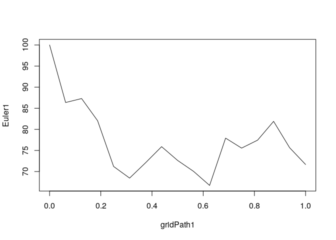
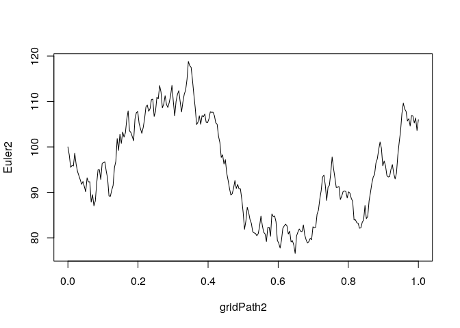
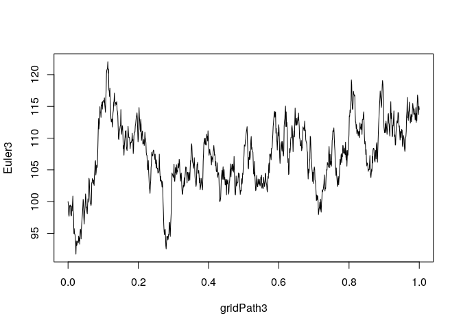
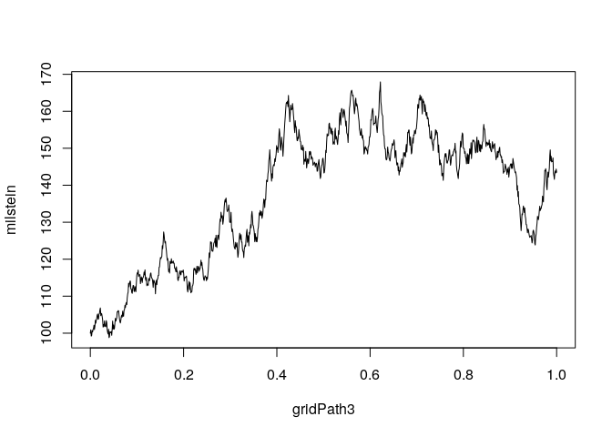
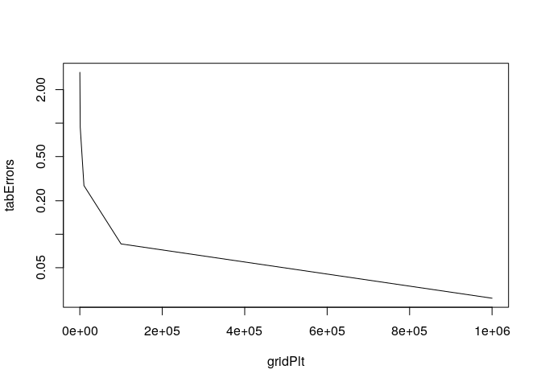
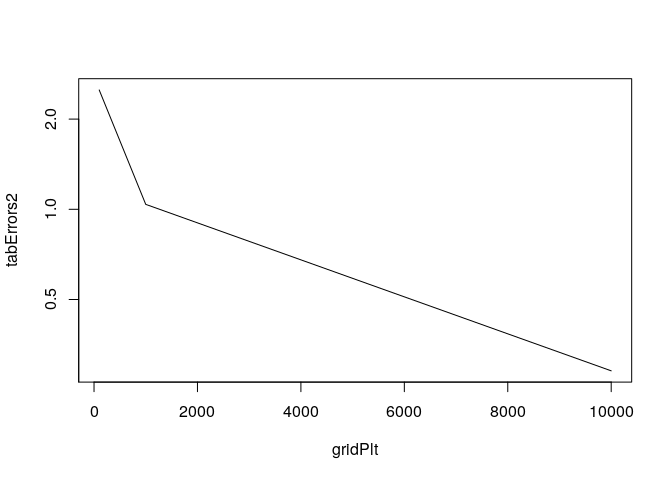

Simulations: Schema d’Euler, Milstein, Monte-Carlo avec différences
finies, flow technique, calcul Malliavian)
================
Mamadou KANOUTE
11/01/2021

## Constantes prises dans la feuille de Tp Section 2

``` r
T = 1
N = 100
sigma = 0.35
# r = 0.02
b = 0.02
x = 100
```

# Exerice 1

## 2 Schéma d’Euler

``` r
simEuler = function(x, b, sigma, T, N) {
  #h = T/N
  h = T/N
  X = c(x)
  for (i in 2:(N+1)) {
    Wti = sqrt(h)*rnorm(1,0,1)
    X[i] = X[i-1] + b*X[i-1]*h + sigma*X[i-1]*Wti
  }
  return (X)
}
```

**Pour h = 2^{-4}**

``` r
N1 = 2^4

Euler1 = simEuler(x, b, sigma, T, N1)
h1 = T/N1
gridPath1 = seq(0,T, by=h1)
plot(gridPath1, Euler1, type="l")
```

<!-- -->

**Pour h = 2^{-8}**

``` r
N2 = 2^8

Euler2 = simEuler(x, b, sigma, T, N2)
h2 = T/N2
gridPath2 = seq(0,T, by=h2)
plot(gridPath2, Euler2, type="l")
```

<!-- -->

**Pour h = 2^{-10}**

``` r
N3 = 2^10

Euler3 = simEuler(x, b, sigma, T, N3)
h3 = T/N3
gridPath3 = seq(0,T, by=h3)
plot(gridPath3, Euler3, type="l")
```

<!-- -->

## Schéma de Milstein

``` r
simMilstein = function(x, b, sigma, T, N) {
  h = T/N
  X = c(x)
  for (i in 2:(N+1)) {
    Wti = sqrt(h)*rnorm(1,0,1)
    modifMils = 1/2*(sigma^2)*X[i-1]*((Wti^2) - h)
    X[i] = X[i-1] + b*X[i-1]*h + sigma*X[i-1]*Wti + modifMils
  }
  return (X)
}
```

**Pour h = 2^{-10}**

``` r
N3 = 2^10
h3 = T/N3
gridPath3 = seq(0,T, by=h3)

milstein = simMilstein(x, b, sigma, T, N3)

plot(gridPath3, milstein, type="l")
```

<!-- -->

## 4 Comparaison de E(X\_1) au différentes méthodes de discrétisation

``` r
# Euler = simEuler(x, r, sigma, T, 1/h1, h1)

E_n_N = function(x, b, sigma, N, n, type="Euler") {
  somme = 0
  tmp = 0
  h = 1/N
  # print(n)
  for (i in 1:n) {
     if(type == "Euler") {
       euler = simEuler(x, b, sigma, 1, N)
       tmp = euler[length(euler)]
     } else {
       milstein = simMilstein(x, b, sigma, 1, N)
       tmp = milstein[length(milstein)]
     }
    somme = somme + tmp
  }
  somme = somme / n
  return (somme)
}


errorSim = function(m, x, b, sigma, N, n, type="Euler") {
 tab = c()
 diff = 0
 esperance_X1 = x*exp(b)
  for(i in 1:m) {
    sim_E_n_M = E_n_N(x, b, sigma, N, n, type)
    diff = diff + abs(sim_E_n_M - esperance_X1)
  }
 res = diff/m
 return (res)
}
```

## Tracée de la courbe pour le schéma d’Euler

Pour 1000 000 ça prenait des heures j’ai enrégistré les valeurs obtenues
que j’importe pour l’affichage.

On utilise les paramètres supplémentaires suivants:

`N = 2^6, m = 100 n1 = 10^2, n2 = 10^3, n3 = 10^4, n4 = 10^5 et n5
= 10^6`

``` r
m = 100
N = 2^6

n1 = 10^2
n2 = 10^3
n3 = 10^4
n4 = 10^5
n5 = 10^6

# tabErrors = c()

# error1 = errorSim(m, x, b, sigma, N, n)
# tabErrors[1] = errorSim(m, x, b, sigma, N, n1)
# tabErrors[2] = errorSim(m, x, b, sigma, N, n2)
# tabErrors[3] = errorSim(m, x, b, sigma, N, n3)
# tabErrors[4] = errorSim(m, x, b, sigma, N, n4)
# tabErrors[5] = errorSim(m, x, b, sigma, N, n5)

# sim_E_n_M = E_n_N(x, b, sigma, N, n, "Euler")

# save(tabErrors, file="tabErrors.RData")

gridPlt = c(100,1000,10000,100000,1000000)
load("/home/boua/Documents/Tps/2020_2021/Finance numérique/TP2/tabErrors.RData")
plot(gridPlt, tabErrors, type="l", log='y')
```

<!-- -->

On voit que l’approximation est mieux quand n augmente. Plus n est grand
plus on approxime bien.

## Tracée de courbe pour le schéma de Milstein

Mêmes paramètres que précédemment

``` r
m = 100
N = 2^6

n1 = 10^2
n2 = 10^3
n3 = 10^4
n4 = 10^5
n5 = 10^6

# tabErrors2 = c()
# 
# tabErrors2[1] = errorSim(m, x, b, sigma, N, n1, "Milstein")
# tabErrors2[2] = errorSim(m, x, b, sigma, N, n2, "Milstein")
# tabErrors2[3] = errorSim(m, x, b, sigma, N, n3, "Milstein")
# tabErrors2[4] = errorSim(m, x, b, sigma, N, n4, "Milstein")
# tabErrors2[5] = errorSim(m, x, b, sigma, N, n5, "Milstein")

# save(tabErrors2, file="tabErrors2.RData")
load("/home/boua/Documents/Tps/2020_2021/Finance numérique/TP2/tabErrors2.RData")
gridPlt = c(n1, n2, n3)
plot(gridPlt, tabErrors2, type="l", log='y')
```

<!-- -->

**On voit qu’à partir d’un certain on a convergence et ce n est plut
petit que celui d’Euler**.

### CONCLUSION

On conclut que:  
**La quantité de n qu’il faut faut pour avoir convergence avec le schéma
d’Euler est assez important contrairement au schéma de Milstein.**

**Ce qui permet de confirmer la théorie où on discrétise l’intégrale
stochastique pour augmenter la vitesse de convergence.**

# Exercice 2

## Fonction Payoff

``` r
payoffFunc = function(x, K, type="Call") {
  res = 0
  if(type == "Call"){
    res = max(x-K, 0)
  } else if(type == "Put") {
    res = max(K-x, 0)
  }
  return (res)
}
```

## Estimation de la variance et intervalle de confiance

``` r
estimVar = function(tabEchantillon) {
  n = length(tabEchantillon)
  res = 0
  moyenne = mean(tabEchantillon)
  for(i in 1:n) {
    res = res + ((tabEchantillon[i] - moyenne)^2)
  }
  res = res/(n-1)
}


intervalle_confiance = function(tabEchantillon) {
    n = length(tabEchantillon)
    varEst = estimVar(tabEchantillon)
    res = 1.96*sqrt(varEst)/sqrt(n)
    moyenne = mean(tabEchantillon)
    bornInf = moyenne - res
    bornSup = moyenne + res
    
    return(list(bornInf = bornInf, bornSup = bornSup, res = res))
}
```

# Différences finies

Ici on fait la simulation avec:  
`M = 1000, epsilon = 0.2`

## Fonction qui calcule le modèle de Black-Scholes

``` r
Black_ScholesFunc = function(x, b, sigma, WT, T) {
  
  # WT = sqrt(T)*W1
  sigma_ = (sigma^2)/2
  res = x*exp(sigma*WT + (b - sigma_)*T)
  return (res)
}
```

## Avec les mêmes réalisations gaussiennes sous les espérances

``` r
simulateDelta = function(x, K, b, sigma, T) {
  M = 1000
  N = 100
  epsilon = 2*sqrt(T/N)
  # print(epsilon)
  denominateur = 2*M*epsilon
  somme = 0
  for(i in 1:M) {
    WT = rnorm(1,0,T)
    
    Black_Scholes1 = Black_ScholesFunc(x + epsilon, b, sigma, WT, T)
    payoff1 = payoffFunc(Black_Scholes1, K, "Call")    
    
    Black_Scholes2 = Black_ScholesFunc(x - epsilon, b, sigma, WT, T)
    payoff2 = payoffFunc(Black_Scholes2, K, "Call")
    
    somme = somme + (payoff1 - payoff2)*exp(-b*T)
  }
  somme = somme/denominateur
  return (somme)
}

simulateGamma = function(x, K, b, sigma, T) {
  
  M = 1000
  somme = 0
  N = 100
  epsilon = 2*sqrt(T/N)  
  denominateur = M*epsilon^2
  
  for(i in 1:M) {

    WT = rnorm(1,0,T)
    
    Black_Scholes1 = Black_ScholesFunc(x + epsilon, b, sigma, WT, T)
    payoff1 = payoffFunc(Black_Scholes1, K, "Call")    
    
    Black_Scholes2 = Black_ScholesFunc(x, b, sigma, WT, T)
    payoff2 = payoffFunc(Black_Scholes2, K, "Call")   
       
    Black_Scholes3 = Black_ScholesFunc(x - epsilon, b, sigma, WT, T)
    payoff3 = payoffFunc(Black_Scholes3, K, "Call")    
    
    somme = somme + payoff1 - 2*payoff2 + payoff3
    
  }
  somme = somme/denominateur
  return (somme)
}


simulateManyDeltaSameWt = function(x, K, b, sigma, T, m) {
  tabSim = c()
  for(i in 1:m) {
    tabSim[i] = simulateDelta(x, K, b, sigma, T)
  }
  return(tabSim)
}
```

## Avec des réalisations gaussiennes indépendantes sous chaque espérance

``` r
simulateDeltaIndep = function(x, K, b, sigma, T) {
  M = 1000
  N = 100
  epsilon = 2*sqrt(T/N)
  # print(epsilon)
  denominateur = 2*M*epsilon
  somme = 0
  for(i in 1:M) {
    WT1 = rnorm(1,0,T)
      
    Black_Scholes1 = Black_ScholesFunc(x + epsilon, b, sigma, WT1, T)
    payoff1 = payoffFunc(Black_Scholes1, K, "Call")    
    
    WT2 = rnorm(1,0,T)
    Black_Scholes2 = Black_ScholesFunc(x - epsilon, b, sigma, WT2, T)
    payoff2 = payoffFunc(Black_Scholes2, K, "Call")
    
    somme = somme + (payoff1 - payoff2)
  }
  somme = somme/denominateur
  return (somme)
}

simulateGammaIndep = function(x, K, b, sigma, T) {
  
  M = 1000
  somme = 0
  N = 100
  epsilon = 2*sqrt(T/N)  
  denominateur = M*epsilon^2
  
  for(i in 1:M) {

    WT1 = rnorm(1,0,T)
    
    Black_Scholes1 = Black_ScholesFunc(x + epsilon, b, sigma, WT1, T)
    payoff1 = payoffFunc(Black_Scholes1, K, "Call")    
    
    WT2 = rnorm(1,0,T)
    Black_Scholes2 = Black_ScholesFunc(x, b, sigma, WT2, T)
    payoff2 = payoffFunc(Black_Scholes2, K, "Call")   
    
    WT3 = rnorm(1,0,T)
    Black_Scholes3 = Black_ScholesFunc(x - epsilon, b, sigma, WT3, T)
    payoff3 = payoffFunc(Black_Scholes3, K, "Call")    
    
    somme = somme + payoff1 - 2*payoff2 + payoff3
    
  }
  somme = somme/denominateur
  return (somme)
}


simulateManyDeltaIndepWT = function(x, K, b, sigma, T, m) {
  tabSim = c()
  for(i in 1:m) {
    tabSim[i] = simulateDeltaIndep(x, K, b, sigma, T)
  }
  return(tabSim)
}
```

## Comparaison de la variance de ces deux approches

**Comparaison des variances après 1000 simulations indépendantes des
deux Delta: avec les mêmes gaussiennes sous les espérances ou des
gaussiennes indépendantes sous chaque espérance**

``` r
K = 100
tabEchantillonSame = simulateManyDeltaSameWt(x, K, b, sigma, T,1000)
tabEchantillonIndep = simulateManyDeltaIndepWT(x, K, b, sigma, T,1000)

varSame = estimVar(tabEchantillonSame)
varIndep = estimVar(tabEchantillonIndep)

print("La variance avec les mêmes réalisations sous les espérances")
```

    ## [1] "La variance avec les mêmes réalisations sous les espérances"

``` r
print(varSame)
```

    ## [1] 0.0004653955

``` r
print("La variance avec desz réalisations indépendantes sous chaque espérance")
```

    ## [1] "La variance avec desz réalisations indépendantes sous chaque espérance"

``` r
print(varIndep)
```

    ## [1] 8.519389

``` r
var1 = min(varSame, varIndep)
```

**On remarque que la variance de la réalisation des mêmes gaussiennes
sous l’espérance est la plus petite**  
**Celle avec des gaussiennes indépendantes est assez grande**  
**On utilisera celle avec la plus petite variance pour comparer
l’estimateur de cette méthode par rapport aux autres méthodes**

## Simulation delta et gamma pour la méthode des différences finies

``` r
gamma1 = simulateGamma(x, K, b, sigma, T)

delta1 = simulateDelta(x, K, b, sigma, T)

print("Delta simulée")
```

    ## [1] "Delta simulée"

``` r
print(delta1)
```

    ## [1] 0.5586113

``` r
print("Gamma simulée")
```

    ## [1] "Gamma simulée"

``` r
print(gamma1)
```

    ## [1] 0.003955208

# 2 Estimation by flow technique

`M=1000`

## Fonction Simulate\_Hedge\_Flow

``` r
Simulate_Hedge_Flow = function(x, K, b, sigma, T) {
  M = 1000
  somme = 0
  for (i in 1:M) {
    WT = rnorm(1,0, T)
    sigma_ = (sigma^2)/2
    somme = somme + exp(sigma*WT + (b-sigma_)*T)
  }
  somme = somme / M
  return(somme)
}


simulateMany_Hedge_Flow = function(x, K, b, sigma, T, m) {
  tabSim = c()
  for(i in 1:m) {
    tabSim[i] = Simulate_Hedge_Flow(x, K, b, sigma, T)
  }
  return(tabSim)
}
```

## Simulation de delta et sa variance pour cette méthode(Flow technique)

``` r
delta2 = Simulate_Hedge_Flow(x, K, b, sigma, T)
tabEchantillon2 =  simulateMany_Hedge_Flow(x, K, b, sigma, T, 1000)
var2 = estimVar(tabEchantillon2)
print(var2)
```

    ## [1] 0.0001323238

**La comparaison des variances est faite un peu plus bas**

## 3 Malliavin

### Fonction Simulate\_Hedge\_Malliavin

``` r
Simulate_Hedge_Malliavin = function(x, K, b, sigma, T) {
  M = 1000
  somme = 0
  for (i in 1:M) {
    WT = rnorm(1,0, T)
    Black_Scholes = Black_ScholesFunc(x, b, sigma, WT, T)
    payoff = payoffFunc(Black_Scholes, K, "Call") 
    somme = somme + ((payoff*WT)/(x*sigma*T))
  }
  somme = somme/M
  return (somme)
}

simulateMany_Hedge_Malliavin = function(x, K, b, sigma, T, m) {
  tabSim = c()
  for(i in 1:m) {
    tabSim[i] = Simulate_Hedge_Malliavin(x, K, b, sigma, T)
  }
  return(tabSim)
}
```

## On simule le delta et on calcule la variance

On simule le delta obtenu par le calcul de calcul de malliavin

``` r
delta3 = Simulate_Hedge_Malliavin(x, K, b, sigma, T)
tabEchantillon3 =  simulateMany_Hedge_Malliavin(x, K, b, sigma, T, 1000)
var3 = estimVar(tabEchantillon3)
```

## Comparaison en terme de variance des trois estimateurs

``` r
print("La variance de la méthode de différences finies")
```

    ## [1] "La variance de la méthode de différences finies"

``` r
print(var1)
```

    ## [1] 0.0004653955

``` r
cat("\n")
```

``` r
print("La variance de la méthode de fow technique")
```

    ## [1] "La variance de la méthode de fow technique"

``` r
print(var2)
```

    ## [1] 0.0001323238

``` r
cat("\n")
```

``` r
print("La variance de la méthode du calcul de Malliavin")
```

    ## [1] "La variance de la méthode du calcul de Malliavin"

``` r
print(var3)
```

    ## [1] 0.002622276

**On remarque la méthode du calcul de malliavin a une plus grosse
variance par rapport aux deux autres méthtodes**
