Projet MAL1
======
Par Mamadou KANOUTE

Dans ce notebook j'ai testé différents classifieurs vus en cours dans la librairie sklearn.

L'objectif du tp était une classification binaire sur les `digits dataset` en prenant les **X** des deux classes choisies.

J'ai choisi les classes **2** et **8** parmi les 10 classes pour une classification binaire .

Pour chaque classifieur je fais un test sur les paramètres par défauts, ensuite je cherche à calibrer le modèle en cherchant les meilleurs paramètres.

**Liste des classifieurs:**

1. `Naives Bayes`
2. `LDA`
3. `QDA`
4. `Logisitc Regression`
5. `K-Nearest Neighbors`
6. `Decision Tree`
7. `Méthodes d'ensemble`
    - Bagging
    - Random Forest
    - Adaboost
    - Gradient Boost
8. `Stacking`

Comme j'utilise à peu près les mêmes codes pour chaque classifieur, j'ai fait des fonctions qui affichent les performances, cherchent les meilleurs paramètres, ... pour un modèle donné

# Traitement de données


```python
import numpy as np
from sklearn import datasets
import math
```


```python
digits = datasets.load_digits()
```


```python

X=digits.data;
y=digits.target;
obs=X[10,:]; label=y[10];
image=np.array(obs, dtype='uint8').reshape(8,8);
#plt.imshow(image, cmap='gray')
```

Fonction qui retourne les X et y en fonctions des classes passées en paramètre


```python
def choiceClass(class1, class2):
    indexClass1 = np.where(y==class1)[0]
    indexClass2 = np.where(y==class2)[0]
    Xclass1 = X[indexClass1]
    Xclass2 = X[indexClass2]
    inputs = np.concatenate([Xclass1, Xclass2])
    outputs = np.hstack((y[indexClass1], y[indexClass2]))
    #results = np.ones(2)
    #results[0] = inputs
    #results[1] = outputs
    return inputs, outputs
```

Je choisis les deux classes


```python
class1 = 2
class2 = 8

inputs, outputs = choiceClass(class1, class2)
```


```python
print(inputs)
print(outputs)
```

    [[ 0.  0.  0. ... 16.  9.  0.]
     [ 0.  0.  5. ... 13. 12.  4.]
     [ 0.  0.  8. ... 12. 13.  1.]
     ...
     [ 0.  0.  5. ...  3.  0.  0.]
     [ 0.  0.  1. ...  6.  0.  0.]
     [ 0.  0. 10. ... 12.  1.  0.]]
    [2 2 2 2 2 2 2 2 2 2 2 2 2 2 2 2 2 2 2 2 2 2 2 2 2 2 2 2 2 2 2 2 2 2 2 2 2
     2 2 2 2 2 2 2 2 2 2 2 2 2 2 2 2 2 2 2 2 2 2 2 2 2 2 2 2 2 2 2 2 2 2 2 2 2
     2 2 2 2 2 2 2 2 2 2 2 2 2 2 2 2 2 2 2 2 2 2 2 2 2 2 2 2 2 2 2 2 2 2 2 2 2
     2 2 2 2 2 2 2 2 2 2 2 2 2 2 2 2 2 2 2 2 2 2 2 2 2 2 2 2 2 2 2 2 2 2 2 2 2
     2 2 2 2 2 2 2 2 2 2 2 2 2 2 2 2 2 2 2 2 2 2 2 2 2 2 2 2 2 8 8 8 8 8 8 8 8
     8 8 8 8 8 8 8 8 8 8 8 8 8 8 8 8 8 8 8 8 8 8 8 8 8 8 8 8 8 8 8 8 8 8 8 8 8
     8 8 8 8 8 8 8 8 8 8 8 8 8 8 8 8 8 8 8 8 8 8 8 8 8 8 8 8 8 8 8 8 8 8 8 8 8
     8 8 8 8 8 8 8 8 8 8 8 8 8 8 8 8 8 8 8 8 8 8 8 8 8 8 8 8 8 8 8 8 8 8 8 8 8
     8 8 8 8 8 8 8 8 8 8 8 8 8 8 8 8 8 8 8 8 8 8 8 8 8 8 8 8 8 8 8 8 8 8 8 8 8
     8 8 8 8 8 8 8 8 8 8 8 8 8 8 8 8 8 8]


Je définis deux dictionnaires **estimatorsParDefaut**  et **estimatorsParametres**.

Ils servent respectivement à stocker au fur et à mesure les différents classifieurs avec des paramètres par défaut et des modèles calibrés.


```python
estimatorsParDefaut = {}
estimatorsParametres = {}
```

## PCA pour la visualisation

J'utilise PCA qui me permet de voir la corrélation entre nos deux classes et d'avoir intuitivement une idée des différentes performances à atteindre


```python
from sklearn.decomposition import PCA
import matplotlib.pyplot as plt
```


```python

def showPCA(inputs, outputs):
    pca = PCA(n_components=2, svd_solver="randomized")
    proj = pca.fit_transform(inputs)
    #print(proj[:, 0])
    plt.scatter(proj[:, 0], proj[:, 1], c=outputs)
    plt.colorbar();
    return proj
```

##### Décisions Boundaries en fonction de la PCA


```python

def transformClass(arr):
    #print(class1)
    tab = np.zeros(len(arr))
    for i in range(len(arr)):
        if (arr[i] == class1):
            tab[i] = 0
        else:
            tab[i] = 1
    return tab

def createNewInput(
    x_min,
    x_max,
    y_min,
    y_max,
    ):
    Neval = 15
    h1 = (x_max - x_min) / Neval
    h2 = (y_max - y_min) / Neval
    mesh = np.meshgrid(np.arange(x_min, x_max, h1), np.arange(y_min,
                       y_max, h2))
    return mesh


def min_max(x):
    (x_min, x_max) = (min(x), max(x))
    (frac1, whole1) = math.modf(x_min)
    (frac2, whole2) = math.modf(x_max)
    incr1 = 0
    incr2 = 0
    if frac1 != 0:
        if x_min < 0:
            incr1 = -1
        else:
            incr1 = 1
    if frac2 != 0:
        if x_max < 0:
            incr2 = -1
        else:
            incr2 = 1
    x_min = whole1 + incr1
    x_max = whole2 + incr2
    min_max = np.ones(2)
    min_max[0] = int(x_min)
    min_max[1] = int(x_max)
    return min_max

def showDecisionBoundaries(proj, model, outputs, classif):
    titleDict = {
        'gnb': 'Naives Bayes',
        'lda': 'LDA',
        'qda': 'QDA',
        'lr': 'Logistic Regression',
        'knn': 'KNN',
        'tree': 'Tree',
        'bag': 'bagging',
        'rf': 'Random Forest',
        'ab': 'AdaBoost',
        'gb': 'Gradient Boost',
        'stack': 'Stacking'
        
    }

    x_min,x_max = min_max(proj[:, 0])
    y_min,y_max = min_max(proj[:, 1])
    
    (xNew, yNew) = createNewInput(x_min, x_max, y_min, y_max)
    
    testTab = np.c_[xNew.ravel(), yNew.ravel()]    
    modelfit = model.fit(proj, outputs)
    y_pred2 = modelfit.predict(testTab)      
    Z = y_pred2.reshape(xNew.shape)
    figure = plt.figure(figsize=(10,3));

    #categories = transformClass(outputs)
    ax = plt.subplot(1,3,1)
    ax.scatter(proj[:, 0],proj[:, 1], c=outputs)
    ax.set_title('PCA')
    ax.set_xlabel('x1')
    ax.set_ylabel('x2')
       
    ax = plt.subplot(1,3,2)
    ax.scatter(xNew,yNew,c='gray',marker='x')
    ax.set_title('New inputs')
    ax.set_xlabel('x1')
    ax.set_ylabel('x2')

    ax = plt.subplot(1,3,3)
    title = titleDict[classif]
    ax.set_title(title +' C.Decision boudaries')
    cm = plt.cm.RdBu
    ax.contourf(xNew,yNew, Z, cmap=cm, alpha=.8);
    ax.scatter(xNew,yNew,c='gray',marker='x')
```


```python
proj = showPCA(inputs, outputs)
print(proj.shape)
```

    (351, 2)


    
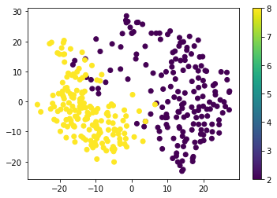
    


## Quelques fonctions utiles à utiliser presque partout

### Mesures performances


```python
from sklearn.naive_bayes import GaussianNB
from sklearn import metrics
```


```python
def allMesuresPerformances(y_test, y_pred):
    y_test = transformClass(y_test)
    y_pred = transformClass(y_pred)
    print ('Accuracy', metrics.accuracy_score(y_test, y_pred))
    print ('precision', metrics.precision_score(y_test, y_pred,
           average='weighted'))
    print ('recall', metrics.recall_score(y_test, y_pred,
           average='micro'))
    print ('f1 score', metrics.f1_score(y_test, y_pred,
           average='micro'))
    print("Matrice de confusion", metrics.confusion_matrix(y_test, y_pred))

def courbe_Roc(y_test, y_pred):
    #y_proba = transformClass(gnbfit.predict_proba(X_test)[:,1])
    y_pred = transformClass(y_pred)
    y_test = transformClass(y_test)
    #y_pred = transformClass(y_pred)
    fpr, tpr, thresholds = metrics.roc_curve(y_test, y_pred, pos_label=None)
    figure = plt.figure(figsize=(4,2))
    plt.plot(fpr, tpr, linewidth = 2)
    plt.title('Naive Bayes Roc curve')
    plt.xlabel('fpr')
    plt.ylabel('tpr')
    plt.plot(tpr, tpr, "k--", linewidth = 2)
    plt.grid(linestyle="dashed")
    plt.show()

    auc = metrics.roc_auc_score(y_test, y_pred)
    print(auc)
    


#allData(model, inputs, outputs)


def getAllEstimators(estimators):
    tabEst = []
    for est in estimators:
        tabEst.append((est, estimators[est]))
    return tabEst
    
```

### Validation croisée


```python
from sklearn.model_selection import train_test_split
```


```python
def cross_val(estimators, inputs, outputs, k):
    X_train, X_test, y_train, y_test = train_test_split(inputs, outputs, test_size=1/k, random_state=0)
    for esti in estimators:
        print("Performances de " + esti + ": ")
        #cross_val(estimators[est], inputs, outputs, k)
        model = estimators[esti]
        modelfit=model.fit(X_train, y_train);
        y_pred = modelfit.predict(X_test)
        allMesuresPerformances(y_test, y_pred)
        print("===================================")
    #allMesuresPerformances(y_test, y_pred)
    #E_test=(y_test != y_pred).sum()/len(y_test)
    #print("Error on the test data set %5.2f->",E_test)
    #return y_test, y_pred
```

### Affiche les performances des différénts classifieurs au fur et à mesure


```python
def allData(model, inputs, outputs):
    modelfit=model.fit(inputs, outputs)
    y_pred = modelfit.predict(inputs)
    allMesuresPerformances(outputs, y_pred)
    #return y_pred

def showPerformanceEstimators(estimators, inputs, outputs):
    print("Test sur toutes les données")
    print("\n")
    for est in estimators:
        print("Performances de " + est + ": ")
        allData(estimators[est], inputs, outputs)
        print("===================================")
        #print(est, estimators[est])


        
#def showPerformanceEstimators2(estimators, inputs, outputs, k): 
#    print("Validation croisée")
#    print("\n")
#    for est in estimators:
#        print("Performances de " + est + ": ")
#        cross_val(estimators[est], inputs, outputs, k)
#        print("===================================")
```

# 1. Gaussian Naive Bayes

### Test sur toutes les données


```python
gnb = GaussianNB()
estimatorsParametres['GaussianNB'] = gnb
estimatorsParDefaut['GaussianNB'] = gnb
showPerformanceEstimators(estimatorsParDefaut, inputs, outputs)
#allData(gnb, inputs, outputs)
```

    Test sur toutes les données
    
    
    Performances de GaussianNB: 
    Accuracy 0.8490028490028491
    precision 0.8787482992219539
    recall 0.8490028490028491
    f1 score 0.8490028490028491
    Matrice de confusion [[126  51]
     [  2 172]]
    ===================================


### Decision Boundaries en fonction du PCA


```python
showDecisionBoundaries(proj, gnb, outputs, 'gnb')
```


    
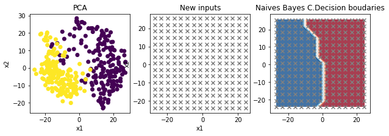
    


### Validation croisée


```python
k = 3
cross_val(estimatorsParDefaut, inputs, outputs, k)
```

    Performances de GaussianNB: 
    Accuracy 0.7521367521367521
    precision 0.7936676431541643
    recall 0.7521367521367521
    f1 score 0.752136752136752
    Matrice de confusion [[37 25]
     [ 4 51]]
    ===================================


### kfold


```python
from sklearn.model_selection import KFold
```

Je crée une fonction qui transforme en 0 et 1 les différentes classes pour résoudre le problème de pos_label de metrics.accuracy, ...


```python
def transformToArray(dictionnaire):
    tab = []
    for item in dictionnaire:
        tab.append(dictionnaire[item])

    return tab
```

Fonction k_fold des différents métrics


```python
def k_fold(model, inputs, outputs, k):
    
    kf = KFold(n_splits=k, shuffle=True)
    results = list()
    tmp = list
    incr = 1
    tmp = {}
    tmp["train_accuracy"] = []
    tmp["test_accuracy"] = []
    tmp["train_precision"] = []
    tmp["test_precision"] = []
    tmp["train_recall"] = []
    tmp["test_recall"] = []
    tmp["train_f1"] = []
    tmp["test_f1"] = []
    tmp["train_auc"] = []
    tmp["test_auc"] = []
    labels = ["train_accuracy", "test_accuracy", "train_precision", "test_precision", 
              "train_recall", "test_recall", "train_f1", "test_f1", "train_auc", "test_auc"
             ]
    for train_index, test_index in kf.split(inputs):
        X_train, X_test = inputs[train_index], inputs[test_index]
        y_train, y_test = outputs[train_index], outputs[test_index]
        modelfit= model.fit(X_train, y_train)
        y_pred = transformClass(modelfit.predict(X_train))
        y_pred_test = transformClass(modelfit.predict(X_test))
        y_train = transformClass(y_train)
        y_test = transformClass(y_test)
        train_acc = metrics.accuracy_score(y_train, y_pred)
        test_acc = metrics.accuracy_score(y_test, y_pred_test)
        tmp["train_accuracy"].append(train_acc)
        tmp["test_accuracy"].append(test_acc)
        train_precision = metrics.precision_score(y_train, y_pred)
        test_precision = metrics.precision_score(y_test, y_pred_test)
        tmp["train_precision"].append(train_precision)
        tmp["test_precision"].append(test_precision)
        train_recall = metrics.recall_score(y_train, y_pred)
        test_recall = metrics.recall_score(y_test, y_pred_test)
        tmp["train_recall"].append(train_recall)
        tmp["test_recall"].append(test_recall)
        train_f1 = metrics.f1_score(y_train, y_pred)
        test_f1 = metrics.f1_score(y_test, y_pred_test)
        tmp["train_f1"].append(train_f1)
        tmp["test_f1"].append(test_f1)
        fpr, tpr, thresholds = metrics.roc_curve(y_train, y_pred)
        train_auc = metrics.auc(fpr, tpr)
        fpr2, tpr2, thresholds2 = metrics.roc_curve(y_test, y_pred_test)
        test_auc = metrics.auc(fpr2, tpr2)    
        tmp["train_auc"].append(train_auc)
        tmp["test_auc"].append(test_auc)
    results = transformToArray(tmp)
    figure = plt.figure(figsize=(15,8));
    plt.boxplot(results, labels=[r for r in labels])  
```


```python
k = 3
gnb = GaussianNB();
k_fold(gnb, inputs, outputs, k)
```


    
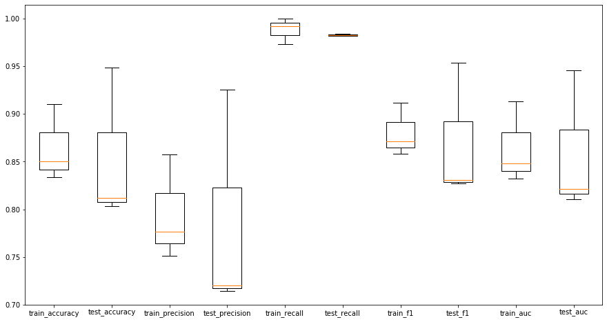
    


# 2. Discriminant Analysis

## Linear Discriminant Analysis


```python
from sklearn.discriminant_analysis import LinearDiscriminantAnalysis
```

### Sur toutes les données


```python
lda = LinearDiscriminantAnalysis()
estimatorsParametres['LDA'] = lda
estimatorsParDefaut['LDA'] = lda
showPerformanceEstimators(estimatorsParDefaut, inputs, outputs)
```

    Test sur toutes les données
    
    
    Performances de GaussianNB: 
    Accuracy 0.8490028490028491
    precision 0.8787482992219539
    recall 0.8490028490028491
    f1 score 0.8490028490028491
    Matrice de confusion [[126  51]
     [  2 172]]
    ===================================
    Performances de LDA: 
    Accuracy 1.0
    precision 1.0
    recall 1.0
    f1 score 1.0
    Matrice de confusion [[177   0]
     [  0 174]]
    ===================================


### Decision Boundaries en fonction du PCA


```python
showDecisionBoundaries(proj, lda, outputs, 'lda')
```


    
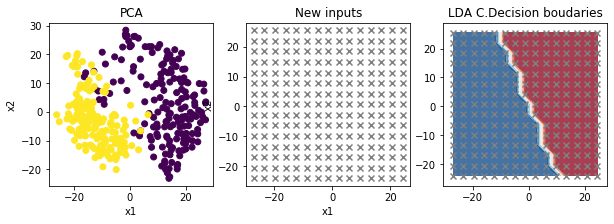
    


### Validation croisée


```python
k = 2
cross_val(estimatorsParDefaut, inputs, outputs, k)
```

    Performances de GaussianNB: 
    Accuracy 0.8352272727272727
    precision 0.8654082404082405
    recall 0.8352272727272727
    f1 score 0.8352272727272727
    Matrice de confusion [[63 27]
     [ 2 84]]
    ===================================
    Performances de LDA: 
    Accuracy 0.9943181818181818
    precision 0.9943834900731452
    recall 0.9943181818181818
    f1 score 0.9943181818181818
    Matrice de confusion [[89  1]
     [ 0 86]]
    ===================================


### kfold


```python
k = 2
k_fold(lda, inputs, outputs, k)
```


    
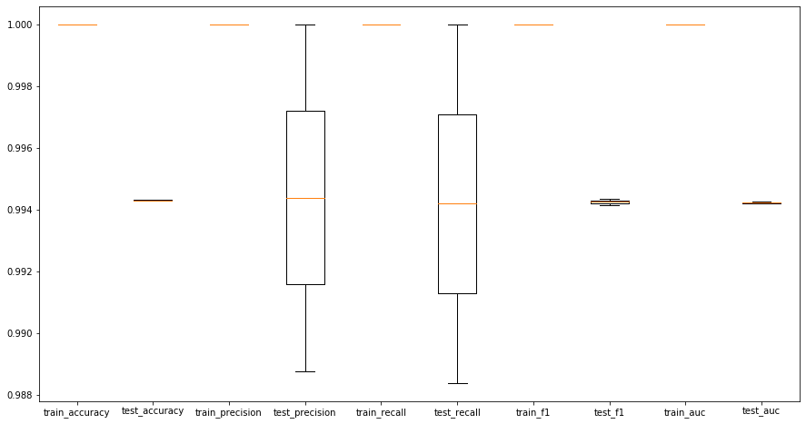
    


## Quadratic Discriminant Analysis


```python
from sklearn.discriminant_analysis import QuadraticDiscriminantAnalysis
```

### Sur toutes les données


```python
qda = QuadraticDiscriminantAnalysis()
estimatorsParametres['QDA'] = qda
estimatorsParDefaut['QDA'] = qda
showPerformanceEstimators(estimatorsParDefaut, inputs, outputs)
```

    Test sur toutes les données
    
    
    Performances de GaussianNB: 
    Accuracy 0.8490028490028491
    precision 0.8787482992219539
    recall 0.8490028490028491
    f1 score 0.8490028490028491
    Matrice de confusion [[126  51]
     [  2 172]]
    ===================================
    Performances de LDA: 
    Accuracy 1.0
    precision 1.0
    recall 1.0
    f1 score 1.0
    Matrice de confusion [[177   0]
     [  0 174]]
    ===================================
    Performances de QDA: 
    Accuracy 0.9943019943019943
    precision 0.9943667443667443
    recall 0.9943019943019943
    f1 score 0.9943019943019943
    Matrice de confusion [[175   2]
     [  0 174]]
    ===================================


    /opt/anaconda3/lib/python3.7/site-packages/sklearn/discriminant_analysis.py:691: UserWarning: Variables are collinear
      warnings.warn("Variables are collinear")


### Decision Boundaries en fonction du PCA


```python
showDecisionBoundaries(proj, qda, outputs, 'qda')
```


    
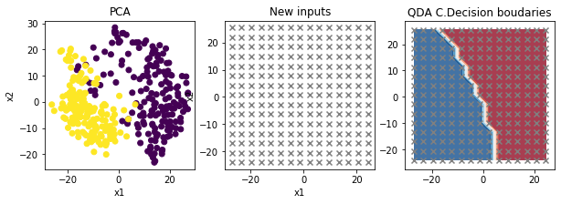
    


### Validation croisée


```python
k = 3
cross_val(estimatorsParDefaut, inputs, outputs, k)
```

    Performances de GaussianNB: 
    Accuracy 0.7521367521367521
    precision 0.7936676431541643
    recall 0.7521367521367521
    f1 score 0.752136752136752
    Matrice de confusion [[37 25]
     [ 4 51]]
    ===================================
    Performances de LDA: 
    Accuracy 1.0
    precision 1.0
    recall 1.0
    f1 score 1.0
    Matrice de confusion [[62  0]
     [ 0 55]]
    ===================================
    Performances de QDA: 
    Accuracy 0.8803418803418803
    precision 0.8884818884818885
    recall 0.8803418803418803
    f1 score 0.8803418803418802
    Matrice de confusion [[51 11]
     [ 3 52]]
    ===================================


    /opt/anaconda3/lib/python3.7/site-packages/sklearn/discriminant_analysis.py:691: UserWarning: Variables are collinear
      warnings.warn("Variables are collinear")


### kfold


```python
k = 3
k_fold(qda, inputs, outputs, k)
```

    /opt/anaconda3/lib/python3.7/site-packages/sklearn/discriminant_analysis.py:691: UserWarning: Variables are collinear
      warnings.warn("Variables are collinear")
    /opt/anaconda3/lib/python3.7/site-packages/sklearn/discriminant_analysis.py:691: UserWarning: Variables are collinear
      warnings.warn("Variables are collinear")
    /opt/anaconda3/lib/python3.7/site-packages/sklearn/discriminant_analysis.py:691: UserWarning: Variables are collinear
      warnings.warn("Variables are collinear")


    
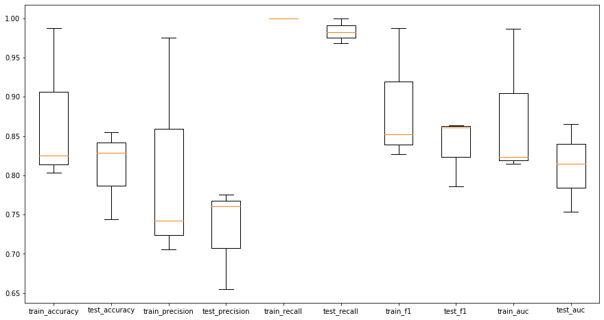
    


# Régression logistique


```python
from sklearn.linear_model import LogisticRegression
```

### Sur toutes les données


```python
LR = LogisticRegression(random_state=0)
estimatorsParametres['LogisticRegression'] = LR
estimatorsParDefaut['LogisticRegression'] = LR
showPerformanceEstimators(estimatorsParDefaut, inputs, outputs)
```

    Test sur toutes les données
    
    
    Performances de GaussianNB: 
    Accuracy 0.8490028490028491
    precision 0.8787482992219539
    recall 0.8490028490028491
    f1 score 0.8490028490028491
    Matrice de confusion [[126  51]
     [  2 172]]
    ===================================
    Performances de LDA: 
    Accuracy 1.0
    precision 1.0
    recall 1.0
    f1 score 1.0
    Matrice de confusion [[177   0]
     [  0 174]]
    ===================================
    Performances de QDA: 
    Accuracy 0.9943019943019943
    precision 0.9943667443667443
    recall 0.9943019943019943
    f1 score 0.9943019943019943
    Matrice de confusion [[175   2]
     [  0 174]]
    ===================================
    Performances de LogisticRegression: 
    Accuracy 1.0
    precision 1.0
    recall 1.0
    f1 score 1.0
    Matrice de confusion [[177   0]
     [  0 174]]
    ===================================


    /opt/anaconda3/lib/python3.7/site-packages/sklearn/discriminant_analysis.py:691: UserWarning: Variables are collinear
      warnings.warn("Variables are collinear")


### Decision Boundaries en fonction du PCA


```python
showDecisionBoundaries(proj, LR, outputs, 'lr')
```


    
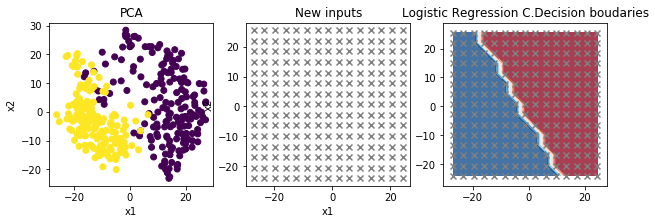
    


### Validation croisée


```python
k = 3
cross_val(estimatorsParDefaut, inputs, outputs, k)
```

    Performances de GaussianNB: 
    Accuracy 0.7521367521367521
    precision 0.7936676431541643
    recall 0.7521367521367521
    f1 score 0.752136752136752
    Matrice de confusion [[37 25]
     [ 4 51]]
    ===================================
    Performances de LDA: 
    Accuracy 1.0
    precision 1.0
    recall 1.0
    f1 score 1.0
    Matrice de confusion [[62  0]
     [ 0 55]]
    ===================================
    Performances de QDA: 
    Accuracy 0.8803418803418803
    precision 0.8884818884818885
    recall 0.8803418803418803
    f1 score 0.8803418803418802
    Matrice de confusion [[51 11]
     [ 3 52]]
    ===================================
    Performances de LogisticRegression: 
    Accuracy 1.0
    precision 1.0
    recall 1.0
    f1 score 1.0
    Matrice de confusion [[62  0]
     [ 0 55]]
    ===================================


    /opt/anaconda3/lib/python3.7/site-packages/sklearn/discriminant_analysis.py:691: UserWarning: Variables are collinear
      warnings.warn("Variables are collinear")
    /opt/anaconda3/lib/python3.7/site-packages/sklearn/linear_model/_logistic.py:940: ConvergenceWarning: lbfgs failed to converge (status=1):
    STOP: TOTAL NO. of ITERATIONS REACHED LIMIT.
    
    Increase the number of iterations (max_iter) or scale the data as shown in:
        https://scikit-learn.org/stable/modules/preprocessing.html
    Please also refer to the documentation for alternative solver options:
        https://scikit-learn.org/stable/modules/linear_model.html#logistic-regression
      extra_warning_msg=_LOGISTIC_SOLVER_CONVERGENCE_MSG)


### kfold


```python
k = 3
k_fold(LR, inputs, outputs, k)
```

    /opt/anaconda3/lib/python3.7/site-packages/sklearn/linear_model/_logistic.py:940: ConvergenceWarning: lbfgs failed to converge (status=1):
    STOP: TOTAL NO. of ITERATIONS REACHED LIMIT.
    
    Increase the number of iterations (max_iter) or scale the data as shown in:
        https://scikit-learn.org/stable/modules/preprocessing.html
    Please also refer to the documentation for alternative solver options:
        https://scikit-learn.org/stable/modules/linear_model.html#logistic-regression
      extra_warning_msg=_LOGISTIC_SOLVER_CONVERGENCE_MSG)


    
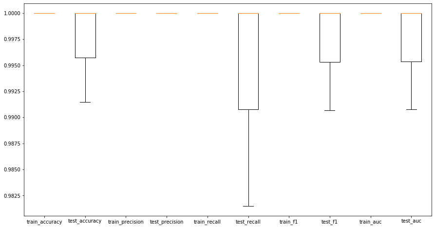
    


# KNN


```python
from sklearn.neighbors import KNeighborsClassifier
```

## Avec des paramètres par défaut

### Test sur toutes les données


```python
kNN = KNeighborsClassifier(n_neighbors=3)
estimatorsParDefaut['kNN'] = kNN
showPerformanceEstimators(estimatorsParDefaut, inputs, outputs)
```

    Test sur toutes les données
    
    
    Performances de GaussianNB: 
    Accuracy 0.8490028490028491
    precision 0.8787482992219539
    recall 0.8490028490028491
    f1 score 0.8490028490028491
    Matrice de confusion [[126  51]
     [  2 172]]
    ===================================
    Performances de LDA: 
    Accuracy 1.0
    precision 1.0
    recall 1.0
    f1 score 1.0
    Matrice de confusion [[177   0]
     [  0 174]]
    ===================================
    Performances de QDA: 
    Accuracy 0.9943019943019943
    precision 0.9943667443667443
    recall 0.9943019943019943
    f1 score 0.9943019943019943
    Matrice de confusion [[175   2]
     [  0 174]]
    ===================================
    Performances de LogisticRegression: 
    Accuracy 1.0
    precision 1.0
    recall 1.0
    f1 score 1.0
    Matrice de confusion [[177   0]
     [  0 174]]
    ===================================
    Performances de kNN: 
    Accuracy 1.0
    precision 1.0
    recall 1.0
    f1 score 1.0
    Matrice de confusion [[177   0]
     [  0 174]]
    ===================================


    /opt/anaconda3/lib/python3.7/site-packages/sklearn/discriminant_analysis.py:691: UserWarning: Variables are collinear
      warnings.warn("Variables are collinear")


### Decision Boundaries en fonction du PCA


```python
showDecisionBoundaries(proj, kNN, outputs, 'knn')
```


    
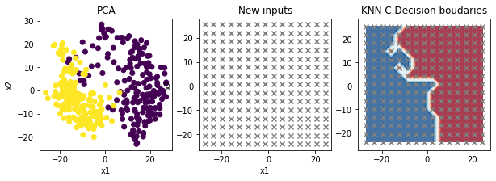
    


### Valication croisée


```python
cross_val(estimatorsParDefaut, inputs, outputs, k)
```

    Performances de GaussianNB: 
    Accuracy 0.7521367521367521
    precision 0.7936676431541643
    recall 0.7521367521367521
    f1 score 0.752136752136752
    Matrice de confusion [[37 25]
     [ 4 51]]
    ===================================
    Performances de LDA: 
    Accuracy 1.0
    precision 1.0
    recall 1.0
    f1 score 1.0
    Matrice de confusion [[62  0]
     [ 0 55]]
    ===================================
    Performances de QDA: 
    Accuracy 0.8803418803418803
    precision 0.8884818884818885
    recall 0.8803418803418803
    f1 score 0.8803418803418802
    Matrice de confusion [[51 11]
     [ 3 52]]
    ===================================
    Performances de LogisticRegression: 
    Accuracy 1.0
    precision 1.0
    recall 1.0
    f1 score 1.0
    Matrice de confusion [[62  0]
     [ 0 55]]
    ===================================
    Performances de kNN: 
    Accuracy 1.0
    precision 1.0
    recall 1.0
    f1 score 1.0
    Matrice de confusion [[62  0]
     [ 0 55]]
    ===================================


    /opt/anaconda3/lib/python3.7/site-packages/sklearn/discriminant_analysis.py:691: UserWarning: Variables are collinear
      warnings.warn("Variables are collinear")
    /opt/anaconda3/lib/python3.7/site-packages/sklearn/linear_model/_logistic.py:940: ConvergenceWarning: lbfgs failed to converge (status=1):
    STOP: TOTAL NO. of ITERATIONS REACHED LIMIT.
    
    Increase the number of iterations (max_iter) or scale the data as shown in:
        https://scikit-learn.org/stable/modules/preprocessing.html
    Please also refer to the documentation for alternative solver options:
        https://scikit-learn.org/stable/modules/linear_model.html#logistic-regression
      extra_warning_msg=_LOGISTIC_SOLVER_CONVERGENCE_MSG)


## Avec des paramètres choisis

### Avec grid Search


```python
from sklearn.model_selection import GridSearchCV
```

Je crée une fonction qui prend en paramètre: 
* un modèle
* un tableau de paramètres sur lesquels je cherche les bonnes valeurs
* les données X et les classes associées Y

Et renvoie les meilleurs paramètres pour n'importe quel modèle et paramètres


```python

def getGoodPArams(model, params, X, Y, cross_val=3):
    grid = GridSearchCV(model,param_grid=params,cv=cross_val,n_jobs=-1,verbose = 2)
    grid.fit(X, Y) 
    print('Résultat de la grid search :', grid.best_score_, grid.best_params_)
    return grid.best_estimator_, grid.best_params_
```


```python
kNN = KNeighborsClassifier()
k = 3 
paramsAChoisir = {
    'n_neighbors' : [1,2,3,4,5,10,15,20,25,30,35,40,45,50],
    'metric': ["euclidean", "manhattan", "chebyshev", "minkowski", "wminkowski", "seuclidean", "mahalanobis"]
}

bestEstimator, bestParams = getGoodPArams(kNN, paramsAChoisir, inputs, outputs, k)
```

    Fitting 3 folds for each of 98 candidates, totalling 294 fits


    [Parallel(n_jobs=-1)]: Using backend LokyBackend with 8 concurrent workers.
    [Parallel(n_jobs=-1)]: Done  25 tasks      | elapsed:    1.4s


    Résultat de la grid search : 0.9800569800569802 {'metric': 'euclidean', 'n_neighbors': 3}


    [Parallel(n_jobs=-1)]: Done 294 out of 294 | elapsed:    1.7s finished


J' ajoute l'estimateur obtenu dans la liste des estimateurs calibrés pour les prochains tests


```python
estimatorsParametres['kNN'] = bestEstimator
```

### Test sur toutes les données


```python
showPerformanceEstimators(estimatorsParametres, inputs, outputs)
```

    Test sur toutes les données
    
    
    Performances de GaussianNB: 
    Accuracy 0.8490028490028491
    precision 0.8787482992219539
    recall 0.8490028490028491
    f1 score 0.8490028490028491
    Matrice de confusion [[126  51]
     [  2 172]]
    ===================================
    Performances de LDA: 
    Accuracy 1.0
    precision 1.0
    recall 1.0
    f1 score 1.0
    Matrice de confusion [[177   0]
     [  0 174]]
    ===================================
    Performances de QDA: 
    Accuracy 0.9943019943019943
    precision 0.9943667443667443
    recall 0.9943019943019943
    f1 score 0.9943019943019943
    Matrice de confusion [[175   2]
     [  0 174]]
    ===================================
    Performances de LogisticRegression: 
    Accuracy 1.0
    precision 1.0
    recall 1.0
    f1 score 1.0
    Matrice de confusion [[177   0]
     [  0 174]]
    ===================================
    Performances de kNN: 
    Accuracy 1.0
    precision 1.0
    recall 1.0
    f1 score 1.0
    Matrice de confusion [[177   0]
     [  0 174]]
    ===================================


    /opt/anaconda3/lib/python3.7/site-packages/sklearn/discriminant_analysis.py:691: UserWarning: Variables are collinear
      warnings.warn("Variables are collinear")


### Decision Boundaries en fonction du PCA


```python
showDecisionBoundaries(proj, bestEstimator, outputs, 'knn')
```


    

    


### Validation croisée


```python
cross_val(estimatorsParametres, inputs, outputs, k)
```

    Performances de GaussianNB: 
    Accuracy 0.7521367521367521
    precision 0.7936676431541643
    recall 0.7521367521367521
    f1 score 0.752136752136752
    Matrice de confusion [[37 25]
     [ 4 51]]
    ===================================
    Performances de LDA: 
    Accuracy 1.0
    precision 1.0
    recall 1.0
    f1 score 1.0
    Matrice de confusion [[62  0]
     [ 0 55]]
    ===================================
    Performances de QDA: 
    Accuracy 0.8803418803418803
    precision 0.8884818884818885
    recall 0.8803418803418803
    f1 score 0.8803418803418802
    Matrice de confusion [[51 11]
     [ 3 52]]
    ===================================
    Performances de LogisticRegression: 
    Accuracy 1.0
    precision 1.0
    recall 1.0
    f1 score 1.0
    Matrice de confusion [[62  0]
     [ 0 55]]
    ===================================
    Performances de kNN: 
    Accuracy 1.0
    precision 1.0
    recall 1.0
    f1 score 1.0
    Matrice de confusion [[62  0]
     [ 0 55]]
    ===================================


    /opt/anaconda3/lib/python3.7/site-packages/sklearn/discriminant_analysis.py:691: UserWarning: Variables are collinear
      warnings.warn("Variables are collinear")
    /opt/anaconda3/lib/python3.7/site-packages/sklearn/linear_model/_logistic.py:940: ConvergenceWarning: lbfgs failed to converge (status=1):
    STOP: TOTAL NO. of ITERATIONS REACHED LIMIT.
    
    Increase the number of iterations (max_iter) or scale the data as shown in:
        https://scikit-learn.org/stable/modules/preprocessing.html
    Please also refer to the documentation for alternative solver options:
        https://scikit-learn.org/stable/modules/linear_model.html#logistic-regression
      extra_warning_msg=_LOGISTIC_SOLVER_CONVERGENCE_MSG)


k fold de notre estimateur calibré

### kfold


```python
k = 3
k_fold(bestEstimator, inputs, outputs, k)
```


    
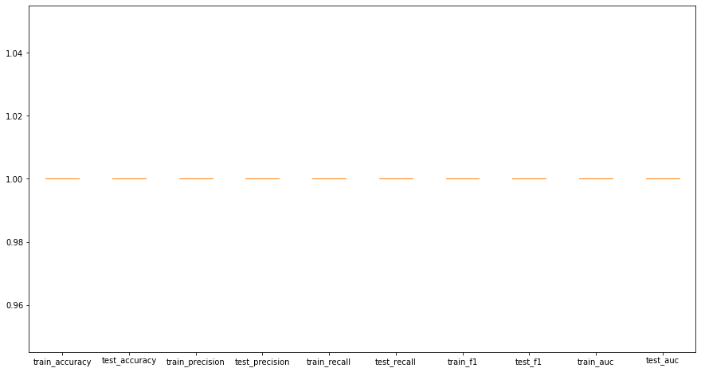
    


# 3. Decision tree


```python
from sklearn import tree
```

## Avec des paramètres par défaut

### Test sur toutes les données


```python
tree_ = tree.DecisionTreeClassifier(min_samples_split=10, min_samples_leaf=10)
estimatorsParDefaut['tree'] = tree_
showPerformanceEstimators(estimatorsParDefaut, inputs, outputs)
```

    Test sur toutes les données
    
    
    Performances de GaussianNB: 
    Accuracy 0.8490028490028491
    precision 0.8787482992219539
    recall 0.8490028490028491
    f1 score 0.8490028490028491
    Matrice de confusion [[126  51]
     [  2 172]]
    ===================================
    Performances de LDA: 
    Accuracy 1.0
    precision 1.0
    recall 1.0
    f1 score 1.0
    Matrice de confusion [[177   0]
     [  0 174]]
    ===================================
    Performances de QDA: 
    Accuracy 0.9943019943019943
    precision 0.9943667443667443
    recall 0.9943019943019943
    f1 score 0.9943019943019943
    Matrice de confusion [[175   2]
     [  0 174]]
    ===================================
    Performances de LogisticRegression: 
    Accuracy 1.0
    precision 1.0
    recall 1.0
    f1 score 1.0
    Matrice de confusion [[177   0]
     [  0 174]]
    ===================================
    Performances de kNN: 
    Accuracy 1.0
    precision 1.0
    recall 1.0
    f1 score 1.0
    Matrice de confusion [[177   0]
     [  0 174]]
    ===================================
    Performances de tree: 
    Accuracy 0.9544159544159544
    precision 0.9565748468974276
    recall 0.9544159544159544
    f1 score 0.9544159544159544
    Matrice de confusion [[163  14]
     [  2 172]]
    ===================================


    /opt/anaconda3/lib/python3.7/site-packages/sklearn/discriminant_analysis.py:691: UserWarning: Variables are collinear
      warnings.warn("Variables are collinear")


### Decision Boundaries en fonction du PCA


```python
showDecisionBoundaries(proj, tree_, outputs, 'tree')
```


    
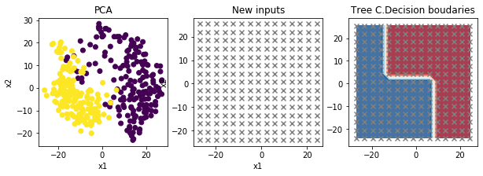
    


### Valication croisée


```python
cross_val(estimatorsParDefaut, inputs, outputs, k)
```

    Performances de GaussianNB: 
    Accuracy 0.7521367521367521
    precision 0.7936676431541643
    recall 0.7521367521367521
    f1 score 0.752136752136752
    Matrice de confusion [[37 25]
     [ 4 51]]
    ===================================
    Performances de LDA: 
    Accuracy 1.0
    precision 1.0
    recall 1.0
    f1 score 1.0
    Matrice de confusion [[62  0]
     [ 0 55]]
    ===================================
    Performances de QDA: 
    Accuracy 0.8803418803418803
    precision 0.8884818884818885
    recall 0.8803418803418803
    f1 score 0.8803418803418802
    Matrice de confusion [[51 11]
     [ 3 52]]
    ===================================
    Performances de LogisticRegression: 
    Accuracy 1.0
    precision 1.0
    recall 1.0
    f1 score 1.0
    Matrice de confusion [[62  0]
     [ 0 55]]
    ===================================
    Performances de kNN: 
    Accuracy 1.0
    precision 1.0
    recall 1.0
    f1 score 1.0
    Matrice de confusion [[62  0]
     [ 0 55]]
    ===================================
    Performances de tree: 
    Accuracy 0.9145299145299145
    precision 0.914842364134817
    recall 0.9145299145299145
    f1 score 0.9145299145299145
    Matrice de confusion [[58  4]
     [ 6 49]]
    ===================================


    /opt/anaconda3/lib/python3.7/site-packages/sklearn/discriminant_analysis.py:691: UserWarning: Variables are collinear
      warnings.warn("Variables are collinear")
    /opt/anaconda3/lib/python3.7/site-packages/sklearn/linear_model/_logistic.py:940: ConvergenceWarning: lbfgs failed to converge (status=1):
    STOP: TOTAL NO. of ITERATIONS REACHED LIMIT.
    
    Increase the number of iterations (max_iter) or scale the data as shown in:
        https://scikit-learn.org/stable/modules/preprocessing.html
    Please also refer to the documentation for alternative solver options:
        https://scikit-learn.org/stable/modules/linear_model.html#logistic-regression
      extra_warning_msg=_LOGISTIC_SOLVER_CONVERGENCE_MSG)


## Avec des paramètres choisis


```python
tree_ = tree.DecisionTreeClassifier()
k = 3 
paramsAChoisir = {
    'min_samples_split' : [1,2,3,4,5,10,15,20,25,30,35,40,45,50],
    'min_samples_leaf': [1,2,3,4,5,10,15,20,25,30,35,40,45,50]
}

bestEstimator, bestParams = getGoodPArams(tree_, paramsAChoisir, inputs, outputs, k)
```

    Fitting 3 folds for each of 196 candidates, totalling 588 fits


    [Parallel(n_jobs=-1)]: Using backend LokyBackend with 8 concurrent workers.
    [Parallel(n_jobs=-1)]: Done  34 tasks      | elapsed:    0.1s


    Résultat de la grid search : 0.8831908831908833 {'min_samples_leaf': 1, 'min_samples_split': 4}


    [Parallel(n_jobs=-1)]: Done 562 tasks      | elapsed:    0.5s
    [Parallel(n_jobs=-1)]: Done 588 out of 588 | elapsed:    0.5s finished


```python
estimatorsParametres['tree'] = bestEstimator
```

### Test sur toutes les données


```python
showPerformanceEstimators(estimatorsParametres, inputs, outputs)
```

    Test sur toutes les données
    
    
    Performances de GaussianNB: 
    Accuracy 0.8490028490028491
    precision 0.8787482992219539
    recall 0.8490028490028491
    f1 score 0.8490028490028491
    Matrice de confusion [[126  51]
     [  2 172]]
    ===================================
    Performances de LDA: 
    Accuracy 1.0
    precision 1.0
    recall 1.0
    f1 score 1.0
    Matrice de confusion [[177   0]
     [  0 174]]
    ===================================
    Performances de QDA: 
    Accuracy 0.9943019943019943
    precision 0.9943667443667443
    recall 0.9943019943019943
    f1 score 0.9943019943019943
    Matrice de confusion [[175   2]
     [  0 174]]
    ===================================
    Performances de LogisticRegression: 
    Accuracy 1.0
    precision 1.0
    recall 1.0
    f1 score 1.0
    Matrice de confusion [[177   0]
     [  0 174]]
    ===================================
    Performances de kNN: 
    Accuracy 1.0
    precision 1.0
    recall 1.0
    f1 score 1.0
    Matrice de confusion [[177   0]
     [  0 174]]
    ===================================
    Performances de tree: 
    Accuracy 0.9971509971509972
    precision 0.9971670027849804
    recall 0.9971509971509972
    f1 score 0.9971509971509972
    Matrice de confusion [[177   0]
     [  1 173]]
    ===================================


    /opt/anaconda3/lib/python3.7/site-packages/sklearn/discriminant_analysis.py:691: UserWarning: Variables are collinear
      warnings.warn("Variables are collinear")


### Decision Boundaries en fonction du PCA


```python
showDecisionBoundaries(proj, bestEstimator, outputs, 'tree')
```


    
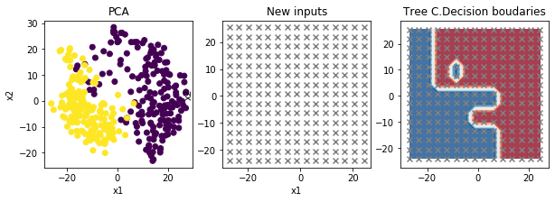
    


### Validation croisée


```python
cross_val(estimatorsParametres, inputs, outputs, k)
```

    Performances de GaussianNB: 
    Accuracy 0.7521367521367521
    precision 0.7936676431541643
    recall 0.7521367521367521
    f1 score 0.752136752136752
    Matrice de confusion [[37 25]
     [ 4 51]]
    ===================================
    Performances de LDA: 
    Accuracy 1.0
    precision 1.0
    recall 1.0
    f1 score 1.0
    Matrice de confusion [[62  0]
     [ 0 55]]
    ===================================
    Performances de QDA: 
    Accuracy 0.8803418803418803
    precision 0.8884818884818885
    recall 0.8803418803418803
    f1 score 0.8803418803418802
    Matrice de confusion [[51 11]
     [ 3 52]]
    ===================================
    Performances de LogisticRegression: 
    Accuracy 1.0
    precision 1.0
    recall 1.0
    f1 score 1.0
    Matrice de confusion [[62  0]
     [ 0 55]]
    ===================================
    Performances de kNN: 
    Accuracy 1.0
    precision 1.0
    recall 1.0
    f1 score 1.0
    Matrice de confusion [[62  0]
     [ 0 55]]
    ===================================
    Performances de tree: 
    Accuracy 0.9230769230769231
    precision 0.9287671869193609
    recall 0.9230769230769231
    f1 score 0.9230769230769231
    Matrice de confusion [[61  1]
     [ 8 47]]
    ===================================


    /opt/anaconda3/lib/python3.7/site-packages/sklearn/discriminant_analysis.py:691: UserWarning: Variables are collinear
      warnings.warn("Variables are collinear")
    /opt/anaconda3/lib/python3.7/site-packages/sklearn/linear_model/_logistic.py:940: ConvergenceWarning: lbfgs failed to converge (status=1):
    STOP: TOTAL NO. of ITERATIONS REACHED LIMIT.
    
    Increase the number of iterations (max_iter) or scale the data as shown in:
        https://scikit-learn.org/stable/modules/preprocessing.html
    Please also refer to the documentation for alternative solver options:
        https://scikit-learn.org/stable/modules/linear_model.html#logistic-regression
      extra_warning_msg=_LOGISTIC_SOLVER_CONVERGENCE_MSG)


k fold de notre estimateur calibré

### kfold


```python
k = 3
k_fold(bestEstimator, inputs, outputs, k)
```


    
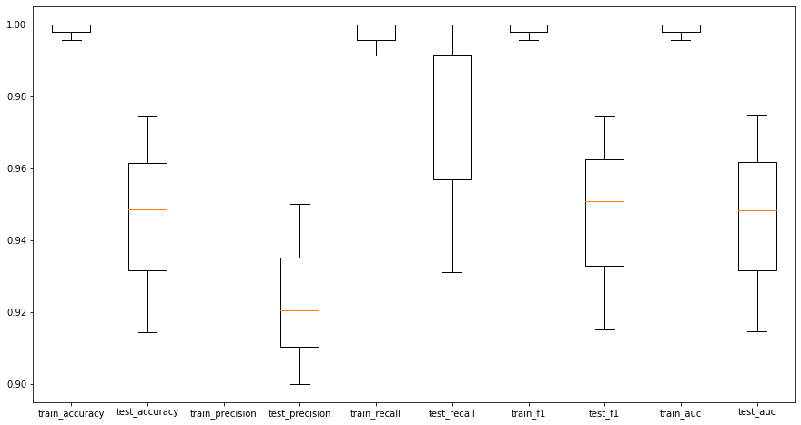
    


# Méthodes d'ensembles

## Bagging


```python
from sklearn.ensemble import BaggingClassifier
```

### Avec des paramètres par défaut


```python

treemod = tree.DecisionTreeClassifier()
bagmod=BaggingClassifier(base_estimator=treemod, n_estimators=10, random_state=0)
estimatorsParDefaut['bagging'] = bagmod
```

#### Test sur toutes les données


```python
showPerformanceEstimators(estimatorsParDefaut, inputs, outputs)
```

    Test sur toutes les données
    
    
    Performances de GaussianNB: 
    Accuracy 0.8490028490028491
    precision 0.8787482992219539
    recall 0.8490028490028491
    f1 score 0.8490028490028491
    Matrice de confusion [[126  51]
     [  2 172]]
    ===================================
    Performances de LDA: 
    Accuracy 1.0
    precision 1.0
    recall 1.0
    f1 score 1.0
    Matrice de confusion [[177   0]
     [  0 174]]
    ===================================
    Performances de QDA: 
    Accuracy 0.9943019943019943
    precision 0.9943667443667443
    recall 0.9943019943019943
    f1 score 0.9943019943019943
    Matrice de confusion [[175   2]
     [  0 174]]
    ===================================
    Performances de LogisticRegression: 
    Accuracy 1.0
    precision 1.0
    recall 1.0
    f1 score 1.0
    Matrice de confusion [[177   0]
     [  0 174]]
    ===================================
    Performances de kNN: 
    Accuracy 1.0
    precision 1.0
    recall 1.0
    f1 score 1.0
    Matrice de confusion [[177   0]
     [  0 174]]
    ===================================
    Performances de tree: 
    Accuracy 0.9544159544159544
    precision 0.9565748468974276
    recall 0.9544159544159544
    f1 score 0.9544159544159544
    Matrice de confusion [[163  14]
     [  2 172]]
    ===================================
    Performances de bagging: 
    Accuracy 1.0
    precision 1.0
    recall 1.0
    f1 score 1.0
    Matrice de confusion [[177   0]
     [  0 174]]
    ===================================


    /opt/anaconda3/lib/python3.7/site-packages/sklearn/discriminant_analysis.py:691: UserWarning: Variables are collinear
      warnings.warn("Variables are collinear")


### Decision Boundaries en fonction du PCA


```python
showDecisionBoundaries(proj, bagmod, outputs, 'bag')
```


    
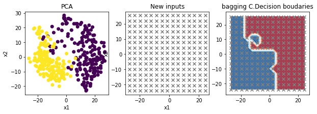
    


#### Valication croisée


```python
k = 3
cross_val(estimatorsParDefaut, inputs, outputs, k)
```

    Performances de GaussianNB: 
    Accuracy 0.7521367521367521
    precision 0.7936676431541643
    recall 0.7521367521367521
    f1 score 0.752136752136752
    Matrice de confusion [[37 25]
     [ 4 51]]
    ===================================
    Performances de LDA: 
    Accuracy 1.0
    precision 1.0
    recall 1.0
    f1 score 1.0
    Matrice de confusion [[62  0]
     [ 0 55]]
    ===================================
    Performances de QDA: 
    Accuracy 0.8803418803418803
    precision 0.8884818884818885
    recall 0.8803418803418803
    f1 score 0.8803418803418802
    Matrice de confusion [[51 11]
     [ 3 52]]
    ===================================
    Performances de LogisticRegression: 
    Accuracy 1.0
    precision 1.0
    recall 1.0
    f1 score 1.0
    Matrice de confusion [[62  0]
     [ 0 55]]
    ===================================
    Performances de kNN: 
    Accuracy 1.0
    precision 1.0
    recall 1.0
    f1 score 1.0
    Matrice de confusion [[62  0]
     [ 0 55]]
    ===================================
    Performances de tree: 
    Accuracy 0.9145299145299145
    precision 0.914842364134817
    recall 0.9145299145299145
    f1 score 0.9145299145299145
    Matrice de confusion [[58  4]
     [ 6 49]]
    ===================================
    Performances de bagging: 
    Accuracy 0.9829059829059829
    precision 0.9829059829059829
    recall 0.9829059829059829
    f1 score 0.9829059829059829
    Matrice de confusion [[61  1]
     [ 1 54]]
    ===================================


    /opt/anaconda3/lib/python3.7/site-packages/sklearn/discriminant_analysis.py:691: UserWarning: Variables are collinear
      warnings.warn("Variables are collinear")
    /opt/anaconda3/lib/python3.7/site-packages/sklearn/linear_model/_logistic.py:940: ConvergenceWarning: lbfgs failed to converge (status=1):
    STOP: TOTAL NO. of ITERATIONS REACHED LIMIT.
    
    Increase the number of iterations (max_iter) or scale the data as shown in:
        https://scikit-learn.org/stable/modules/preprocessing.html
    Please also refer to the documentation for alternative solver options:
        https://scikit-learn.org/stable/modules/linear_model.html#logistic-regression
      extra_warning_msg=_LOGISTIC_SOLVER_CONVERGENCE_MSG)


### Avec des paramètres choisis


```python
paramsAChoisir = {
    'base_estimator': [treemod],
    'n_estimators': [10,20,30,40,50,60,70,80,90,100],
    'bootstrap': [True, False]
    #'max_depth' : [2,3,5],
    #'learning_rate':[0.01,0.05,0.1]}
}

k = 3
bestEstimator, bestParams = getGoodPArams(bagmod, paramsAChoisir, inputs, outputs, k)
estimatorsParametres['bagging'] = bestEstimator
```

    Fitting 3 folds for each of 20 candidates, totalling 60 fits


    [Parallel(n_jobs=-1)]: Using backend LokyBackend with 8 concurrent workers.
    [Parallel(n_jobs=-1)]: Done  34 tasks      | elapsed:    0.9s
    [Parallel(n_jobs=-1)]: Done  45 out of  60 | elapsed:    1.2s remaining:    0.4s


    Résultat de la grid search : 0.9316239316239315 {'base_estimator': DecisionTreeClassifier(ccp_alpha=0.0, class_weight=None, criterion='gini',
                           max_depth=None, max_features=None, max_leaf_nodes=None,
                           min_impurity_decrease=0.0, min_impurity_split=None,
                           min_samples_leaf=1, min_samples_split=2,
                           min_weight_fraction_leaf=0.0, presort='deprecated',
                           random_state=None, splitter='best'), 'bootstrap': True, 'n_estimators': 30}


    [Parallel(n_jobs=-1)]: Done  60 out of  60 | elapsed:    1.6s finished


#### Test sur toutes les données


```python
showPerformanceEstimators(estimatorsParametres, inputs, outputs)
```

    Test sur toutes les données
    
    
    Performances de GaussianNB: 
    Accuracy 0.8490028490028491
    precision 0.8787482992219539
    recall 0.8490028490028491
    f1 score 0.8490028490028491
    Matrice de confusion [[126  51]
     [  2 172]]
    ===================================
    Performances de LDA: 
    Accuracy 1.0
    precision 1.0
    recall 1.0
    f1 score 1.0
    Matrice de confusion [[177   0]
     [  0 174]]
    ===================================
    Performances de QDA: 
    Accuracy 0.9943019943019943
    precision 0.9943667443667443
    recall 0.9943019943019943
    f1 score 0.9943019943019943
    Matrice de confusion [[175   2]
     [  0 174]]
    ===================================
    Performances de LogisticRegression: 
    Accuracy 1.0
    precision 1.0
    recall 1.0
    f1 score 1.0
    Matrice de confusion [[177   0]
     [  0 174]]
    ===================================
    Performances de kNN: 
    Accuracy 1.0
    precision 1.0
    recall 1.0
    f1 score 1.0
    Matrice de confusion [[177   0]
     [  0 174]]
    ===================================
    Performances de tree: 
    Accuracy 0.9971509971509972
    precision 0.9971670027849804
    recall 0.9971509971509972
    f1 score 0.9971509971509972
    Matrice de confusion [[177   0]
     [  1 173]]
    ===================================
    Performances de bagging: 
    Accuracy 1.0
    precision 1.0
    recall 1.0
    f1 score 1.0
    Matrice de confusion [[177   0]
     [  0 174]]
    ===================================


    /opt/anaconda3/lib/python3.7/site-packages/sklearn/discriminant_analysis.py:691: UserWarning: Variables are collinear
      warnings.warn("Variables are collinear")


### Decision Boundaries en fonction du PCA


```python
showDecisionBoundaries(proj, bestEstimator, outputs, 'bag')
```


    

    


#### Validation croisée


```python
k = 3
cross_val(estimatorsParametres, inputs, outputs, k)
```

    Performances de GaussianNB: 
    Accuracy 0.7521367521367521
    precision 0.7936676431541643
    recall 0.7521367521367521
    f1 score 0.752136752136752
    Matrice de confusion [[37 25]
     [ 4 51]]
    ===================================
    Performances de LDA: 
    Accuracy 1.0
    precision 1.0
    recall 1.0
    f1 score 1.0
    Matrice de confusion [[62  0]
     [ 0 55]]
    ===================================
    Performances de QDA: 
    Accuracy 0.8803418803418803
    precision 0.8884818884818885
    recall 0.8803418803418803
    f1 score 0.8803418803418802
    Matrice de confusion [[51 11]
     [ 3 52]]
    ===================================
    Performances de LogisticRegression: 
    Accuracy 1.0
    precision 1.0
    recall 1.0
    f1 score 1.0
    Matrice de confusion [[62  0]
     [ 0 55]]
    ===================================
    Performances de kNN: 
    Accuracy 1.0
    precision 1.0
    recall 1.0
    f1 score 1.0
    Matrice de confusion [[62  0]
     [ 0 55]]
    ===================================
    Performances de tree: 
    Accuracy 0.9230769230769231
    precision 0.9287671869193609
    recall 0.9230769230769231
    f1 score 0.9230769230769231
    Matrice de confusion [[61  1]
     [ 8 47]]
    ===================================
    Performances de bagging: 
    Accuracy 0.9743589743589743
    precision 0.9755424063116371
    recall 0.9743589743589743
    f1 score 0.9743589743589743
    Matrice de confusion [[62  0]
     [ 3 52]]
    ===================================


    /opt/anaconda3/lib/python3.7/site-packages/sklearn/discriminant_analysis.py:691: UserWarning: Variables are collinear
      warnings.warn("Variables are collinear")
    /opt/anaconda3/lib/python3.7/site-packages/sklearn/linear_model/_logistic.py:940: ConvergenceWarning: lbfgs failed to converge (status=1):
    STOP: TOTAL NO. of ITERATIONS REACHED LIMIT.
    
    Increase the number of iterations (max_iter) or scale the data as shown in:
        https://scikit-learn.org/stable/modules/preprocessing.html
    Please also refer to the documentation for alternative solver options:
        https://scikit-learn.org/stable/modules/linear_model.html#logistic-regression
      extra_warning_msg=_LOGISTIC_SOLVER_CONVERGENCE_MSG)


####  Kfold


```python
k = 3
k_fold(bestEstimator, inputs, outputs, k)
```


    
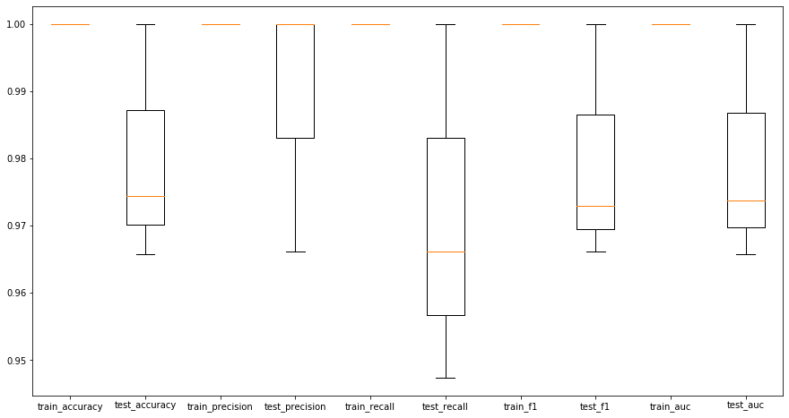
    


## Random Forest


```python
from sklearn.ensemble import RandomForestClassifier
```

### Paramètres par défaut


```python

RF = RandomForestClassifier(max_depth=5, random_state=0, oob_score = True)
estimatorsParDefaut['RF'] = RF
```

#### Test sur toutes les données


```python
showPerformanceEstimators(estimatorsParDefaut, inputs, outputs)
```

    Test sur toutes les données
    
    
    Performances de GaussianNB: 
    Accuracy 0.8490028490028491
    precision 0.8787482992219539
    recall 0.8490028490028491
    f1 score 0.8490028490028491
    Matrice de confusion [[126  51]
     [  2 172]]
    ===================================
    Performances de LDA: 
    Accuracy 1.0
    precision 1.0
    recall 1.0
    f1 score 1.0
    Matrice de confusion [[177   0]
     [  0 174]]
    ===================================
    Performances de QDA: 
    Accuracy 0.9943019943019943
    precision 0.9943667443667443
    recall 0.9943019943019943
    f1 score 0.9943019943019943
    Matrice de confusion [[175   2]
     [  0 174]]
    ===================================
    Performances de LogisticRegression: 
    Accuracy 1.0
    precision 1.0
    recall 1.0
    f1 score 1.0
    Matrice de confusion [[177   0]
     [  0 174]]
    ===================================
    Performances de kNN: 
    Accuracy 1.0
    precision 1.0
    recall 1.0
    f1 score 1.0
    Matrice de confusion [[177   0]
     [  0 174]]
    ===================================
    Performances de tree: 
    Accuracy 0.9544159544159544
    precision 0.9565748468974276
    recall 0.9544159544159544
    f1 score 0.9544159544159544
    Matrice de confusion [[163  14]
     [  2 172]]
    ===================================
    Performances de bagging: 
    Accuracy 1.0
    precision 1.0
    recall 1.0
    f1 score 1.0
    Matrice de confusion [[177   0]
     [  0 174]]
    ===================================
    Performances de RF: 


    /opt/anaconda3/lib/python3.7/site-packages/sklearn/discriminant_analysis.py:691: UserWarning: Variables are collinear
      warnings.warn("Variables are collinear")


    Accuracy 1.0
    precision 1.0
    recall 1.0
    f1 score 1.0
    Matrice de confusion [[177   0]
     [  0 174]]
    ===================================


### Decision Boundaries en fonction du PCA


```python
showDecisionBoundaries(proj, RF, outputs, 'rf')
```


    

    


#### Validation croisée


```python
k = 3

cross_val(estimatorsParDefaut, inputs, outputs, k)
OOB=RF.oob_score_
IF=RF.feature_importances_
#print("score", score)
print("OOB", OOB)
print("len(IF)", len(IF))
```

    Performances de GaussianNB: 
    Accuracy 0.7521367521367521
    precision 0.7936676431541643
    recall 0.7521367521367521
    f1 score 0.752136752136752
    Matrice de confusion [[37 25]
     [ 4 51]]
    ===================================
    Performances de LDA: 
    Accuracy 1.0
    precision 1.0
    recall 1.0
    f1 score 1.0
    Matrice de confusion [[62  0]
     [ 0 55]]
    ===================================
    Performances de QDA: 
    Accuracy 0.8803418803418803
    precision 0.8884818884818885
    recall 0.8803418803418803
    f1 score 0.8803418803418802
    Matrice de confusion [[51 11]
     [ 3 52]]
    ===================================
    Performances de LogisticRegression: 
    Accuracy 1.0
    precision 1.0
    recall 1.0
    f1 score 1.0
    Matrice de confusion [[62  0]
     [ 0 55]]
    ===================================
    Performances de kNN: 
    Accuracy 1.0
    precision 1.0
    recall 1.0
    f1 score 1.0
    Matrice de confusion [[62  0]
     [ 0 55]]
    ===================================
    Performances de tree: 
    Accuracy 0.9145299145299145
    precision 0.914842364134817
    recall 0.9145299145299145
    f1 score 0.9145299145299145
    Matrice de confusion [[58  4]
     [ 6 49]]
    ===================================
    Performances de bagging: 
    Accuracy 0.9829059829059829
    precision 0.9829059829059829
    recall 0.9829059829059829
    f1 score 0.9829059829059829
    Matrice de confusion [[61  1]
     [ 1 54]]
    ===================================
    Performances de RF: 


    /opt/anaconda3/lib/python3.7/site-packages/sklearn/discriminant_analysis.py:691: UserWarning: Variables are collinear
      warnings.warn("Variables are collinear")
    /opt/anaconda3/lib/python3.7/site-packages/sklearn/linear_model/_logistic.py:940: ConvergenceWarning: lbfgs failed to converge (status=1):
    STOP: TOTAL NO. of ITERATIONS REACHED LIMIT.
    
    Increase the number of iterations (max_iter) or scale the data as shown in:
        https://scikit-learn.org/stable/modules/preprocessing.html
    Please also refer to the documentation for alternative solver options:
        https://scikit-learn.org/stable/modules/linear_model.html#logistic-regression
      extra_warning_msg=_LOGISTIC_SOLVER_CONVERGENCE_MSG)


    Accuracy 0.9914529914529915
    precision 0.9915886582553249
    recall 0.9914529914529915
    f1 score 0.9914529914529915
    Matrice de confusion [[62  0]
     [ 1 54]]
    ===================================
    OOB 0.9957264957264957
    len(IF) 64


#### kfold


```python
k_fold(RF, inputs, outputs, k)
```


    
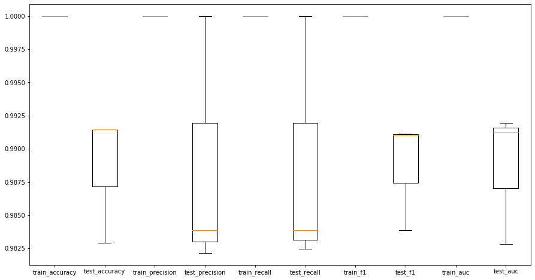
    


### Avec des paramètres choisis


```python
paramsAChoisir = {
    'max_depth': [50,60,70,80,90],
    #'n_estimators': [70,80,90],
    #'max_features': [3,4,5],
    'random_state': [None, 0,1],
    'min_samples_split' : [20,25,30],
    'min_samples_leaf': [3,4,5],
    'oob_score': [True]
}

bestEstimator, bestParams = getGoodPArams(RF, paramsAChoisir, inputs, outputs, k)
estimatorsParametres['RF'] = bestEstimator
```

    Fitting 3 folds for each of 135 candidates, totalling 405 fits


    [Parallel(n_jobs=-1)]: Using backend LokyBackend with 8 concurrent workers.
    [Parallel(n_jobs=-1)]: Done  25 tasks      | elapsed:    1.1s
    [Parallel(n_jobs=-1)]: Done 146 tasks      | elapsed:    5.6s
    [Parallel(n_jobs=-1)]: Done 349 tasks      | elapsed:   13.9s


    Résultat de la grid search : 0.982905982905983 {'max_depth': 50, 'min_samples_leaf': 5, 'min_samples_split': 25, 'oob_score': True, 'random_state': None}


    [Parallel(n_jobs=-1)]: Done 405 out of 405 | elapsed:   16.1s finished


#### Test sur toutes les données


```python
showPerformanceEstimators(estimatorsParametres, inputs, outputs)
```

    /opt/anaconda3/lib/python3.7/site-packages/sklearn/discriminant_analysis.py:691: UserWarning: Variables are collinear
      warnings.warn("Variables are collinear")


    Test sur toutes les données
    
    
    Performances de GaussianNB: 
    Accuracy 0.8490028490028491
    precision 0.8787482992219539
    recall 0.8490028490028491
    f1 score 0.8490028490028491
    Matrice de confusion [[126  51]
     [  2 172]]
    ===================================
    Performances de LDA: 
    Accuracy 1.0
    precision 1.0
    recall 1.0
    f1 score 1.0
    Matrice de confusion [[177   0]
     [  0 174]]
    ===================================
    Performances de QDA: 
    Accuracy 0.9943019943019943
    precision 0.9943667443667443
    recall 0.9943019943019943
    f1 score 0.9943019943019943
    Matrice de confusion [[175   2]
     [  0 174]]
    ===================================
    Performances de LogisticRegression: 
    Accuracy 1.0
    precision 1.0
    recall 1.0
    f1 score 1.0
    Matrice de confusion [[177   0]
     [  0 174]]
    ===================================
    Performances de kNN: 
    Accuracy 1.0
    precision 1.0
    recall 1.0
    f1 score 1.0
    Matrice de confusion [[177   0]
     [  0 174]]
    ===================================
    Performances de tree: 
    Accuracy 0.9971509971509972
    precision 0.9971670027849804
    recall 0.9971509971509972
    f1 score 0.9971509971509972
    Matrice de confusion [[177   0]
     [  1 173]]
    ===================================
    Performances de bagging: 
    Accuracy 1.0
    precision 1.0
    recall 1.0
    f1 score 1.0
    Matrice de confusion [[177   0]
     [  0 174]]
    ===================================
    Performances de RF: 
    Accuracy 1.0
    precision 1.0
    recall 1.0
    f1 score 1.0
    Matrice de confusion [[177   0]
     [  0 174]]
    ===================================


### Decision Boundaries en fonction du PCA


```python
showDecisionBoundaries(proj, bestEstimator, outputs, 'rf')
```


    
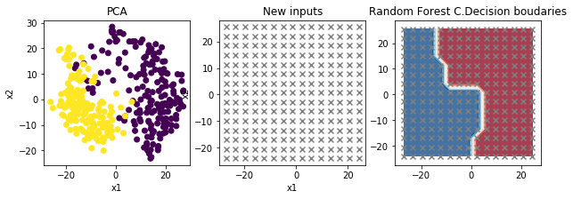
    


#### Validation croisée


```python
cross_val(estimatorsParametres, inputs, outputs, k)
score=bestEstimator.score;
OOB=bestEstimator.oob_score_
#print("score", score)
IF=bestEstimator.feature_importances_
print("OOB", OOB)
print("len(IF)", len(IF))
```

    Performances de GaussianNB: 
    Accuracy 0.7521367521367521
    precision 0.7936676431541643
    recall 0.7521367521367521
    f1 score 0.752136752136752
    Matrice de confusion [[37 25]
     [ 4 51]]
    ===================================
    Performances de LDA: 
    Accuracy 1.0
    precision 1.0
    recall 1.0
    f1 score 1.0
    Matrice de confusion [[62  0]
     [ 0 55]]
    ===================================
    Performances de QDA: 
    Accuracy 0.8803418803418803
    precision 0.8884818884818885
    recall 0.8803418803418803
    f1 score 0.8803418803418802
    Matrice de confusion [[51 11]
     [ 3 52]]
    ===================================
    Performances de LogisticRegression: 
    Accuracy 1.0
    precision 1.0
    recall 1.0
    f1 score 1.0
    Matrice de confusion [[62  0]
     [ 0 55]]
    ===================================
    Performances de kNN: 
    Accuracy 1.0
    precision 1.0
    recall 1.0
    f1 score 1.0
    Matrice de confusion [[62  0]
     [ 0 55]]
    ===================================
    Performances de tree: 
    Accuracy 0.9401709401709402
    precision 0.9431432580686313
    recall 0.9401709401709402
    f1 score 0.9401709401709402
    Matrice de confusion [[61  1]
     [ 6 49]]
    ===================================
    Performances de bagging: 
    Accuracy 0.9743589743589743
    precision 0.9755424063116371
    recall 0.9743589743589743
    f1 score 0.9743589743589743
    Matrice de confusion [[62  0]
     [ 3 52]]
    ===================================
    Performances de RF: 


    /opt/anaconda3/lib/python3.7/site-packages/sklearn/discriminant_analysis.py:691: UserWarning: Variables are collinear
      warnings.warn("Variables are collinear")
    /opt/anaconda3/lib/python3.7/site-packages/sklearn/linear_model/_logistic.py:940: ConvergenceWarning: lbfgs failed to converge (status=1):
    STOP: TOTAL NO. of ITERATIONS REACHED LIMIT.
    
    Increase the number of iterations (max_iter) or scale the data as shown in:
        https://scikit-learn.org/stable/modules/preprocessing.html
    Please also refer to the documentation for alternative solver options:
        https://scikit-learn.org/stable/modules/linear_model.html#logistic-regression
      extra_warning_msg=_LOGISTIC_SOLVER_CONVERGENCE_MSG)


    Accuracy 0.9829059829059829
    precision 0.9829059829059829
    recall 0.9829059829059829
    f1 score 0.9829059829059829
    Matrice de confusion [[61  1]
     [ 1 54]]
    ===================================
    OOB 0.9743589743589743
    len(IF) 64


####  Kfold


```python
k_fold(bestEstimator, inputs, outputs, k)
```


    
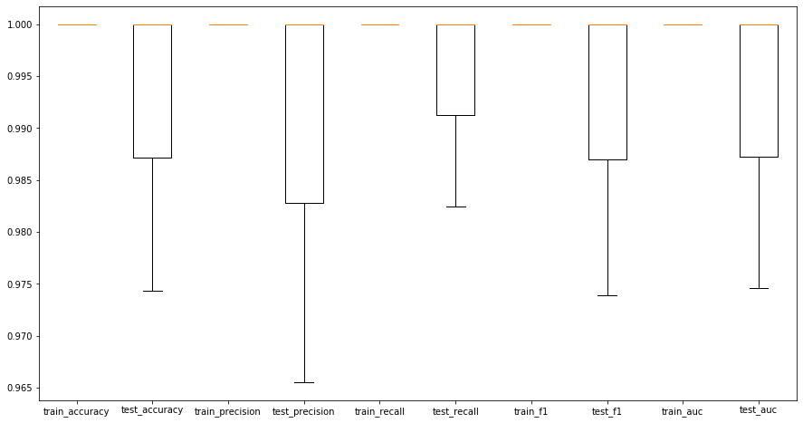
    


## Adaboost


```python
from sklearn.ensemble import AdaBoostClassifier
```

### Paramètres par défaut


```python

#from sklearn import metrics
Ab = AdaBoostClassifier(n_estimators=100, random_state=0)
estimatorsParDefaut['AdaBoost'] = Ab
#Abfit=Ab.fit(inputs, outputs)
#y_pred=Abfit.predict(inputs);
#E_all=(outputs != y_pred).sum()/len(outputs)
#print("Boost Error on the complete training set %5.2f->",E_all)
#allMesuresPerformances(outputs, y_pred)
```

#### Test sur toutes les données


```python
#allData(Ab, inputs, outputs)
showPerformanceEstimators(estimatorsParDefaut, inputs, outputs)
```

    Test sur toutes les données
    
    
    Performances de GaussianNB: 
    Accuracy 0.8490028490028491
    precision 0.8787482992219539
    recall 0.8490028490028491
    f1 score 0.8490028490028491
    Matrice de confusion [[126  51]
     [  2 172]]
    ===================================
    Performances de LDA: 
    Accuracy 1.0
    precision 1.0
    recall 1.0
    f1 score 1.0
    Matrice de confusion [[177   0]
     [  0 174]]
    ===================================
    Performances de QDA: 
    Accuracy 0.9943019943019943
    precision 0.9943667443667443
    recall 0.9943019943019943
    f1 score 0.9943019943019943
    Matrice de confusion [[175   2]
     [  0 174]]
    ===================================
    Performances de LogisticRegression: 
    Accuracy 1.0
    precision 1.0
    recall 1.0
    f1 score 1.0
    Matrice de confusion [[177   0]
     [  0 174]]
    ===================================
    Performances de kNN: 
    Accuracy 1.0
    precision 1.0
    recall 1.0
    f1 score 1.0
    Matrice de confusion [[177   0]
     [  0 174]]
    ===================================
    Performances de tree: 
    Accuracy 0.9544159544159544
    precision 0.9565748468974276
    recall 0.9544159544159544
    f1 score 0.9544159544159544
    Matrice de confusion [[163  14]
     [  2 172]]
    ===================================
    Performances de bagging: 
    Accuracy 1.0
    precision 1.0
    recall 1.0
    f1 score 1.0
    Matrice de confusion [[177   0]
     [  0 174]]
    ===================================
    Performances de RF: 


    /opt/anaconda3/lib/python3.7/site-packages/sklearn/discriminant_analysis.py:691: UserWarning: Variables are collinear
      warnings.warn("Variables are collinear")


    Accuracy 1.0
    precision 1.0
    recall 1.0
    f1 score 1.0
    Matrice de confusion [[177   0]
     [  0 174]]
    ===================================
    Performances de AdaBoost: 
    Accuracy 1.0
    precision 1.0
    recall 1.0
    f1 score 1.0
    Matrice de confusion [[177   0]
     [  0 174]]
    ===================================


```python
showDecisionBoundaries(proj, Ab, outputs, 'ab')
```


    
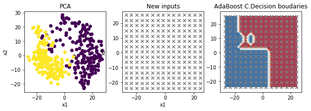
    


#### Validation croisée


```python
k = 3
cross_val(estimatorsParDefaut, inputs, outputs, k)
#y_test, y_pred = cross_val(Ab, inputs, outputs, k)
#allMesuresPerformances(y_test, y_pred)
#print("paramètres", Ab.get_params())
```

    Performances de GaussianNB: 
    Accuracy 0.7521367521367521
    precision 0.7936676431541643
    recall 0.7521367521367521
    f1 score 0.752136752136752
    Matrice de confusion [[37 25]
     [ 4 51]]
    ===================================
    Performances de LDA: 
    Accuracy 1.0
    precision 1.0
    recall 1.0
    f1 score 1.0
    Matrice de confusion [[62  0]
     [ 0 55]]
    ===================================
    Performances de QDA: 
    Accuracy 0.8803418803418803
    precision 0.8884818884818885
    recall 0.8803418803418803
    f1 score 0.8803418803418802
    Matrice de confusion [[51 11]
     [ 3 52]]
    ===================================
    Performances de LogisticRegression: 
    Accuracy 1.0
    precision 1.0
    recall 1.0
    f1 score 1.0
    Matrice de confusion [[62  0]
     [ 0 55]]
    ===================================
    Performances de kNN: 
    Accuracy 1.0
    precision 1.0
    recall 1.0
    f1 score 1.0
    Matrice de confusion [[62  0]
     [ 0 55]]
    ===================================
    Performances de tree: 
    Accuracy 0.9145299145299145
    precision 0.914842364134817
    recall 0.9145299145299145
    f1 score 0.9145299145299145
    Matrice de confusion [[58  4]
     [ 6 49]]
    ===================================
    Performances de bagging: 
    Accuracy 0.9829059829059829
    precision 0.9829059829059829
    recall 0.9829059829059829
    f1 score 0.9829059829059829
    Matrice de confusion [[61  1]
     [ 1 54]]
    ===================================
    Performances de RF: 


    /opt/anaconda3/lib/python3.7/site-packages/sklearn/discriminant_analysis.py:691: UserWarning: Variables are collinear
      warnings.warn("Variables are collinear")
    /opt/anaconda3/lib/python3.7/site-packages/sklearn/linear_model/_logistic.py:940: ConvergenceWarning: lbfgs failed to converge (status=1):
    STOP: TOTAL NO. of ITERATIONS REACHED LIMIT.
    
    Increase the number of iterations (max_iter) or scale the data as shown in:
        https://scikit-learn.org/stable/modules/preprocessing.html
    Please also refer to the documentation for alternative solver options:
        https://scikit-learn.org/stable/modules/linear_model.html#logistic-regression
      extra_warning_msg=_LOGISTIC_SOLVER_CONVERGENCE_MSG)


    Accuracy 0.9914529914529915
    precision 0.9915886582553249
    recall 0.9914529914529915
    f1 score 0.9914529914529915
    Matrice de confusion [[62  0]
     [ 1 54]]
    ===================================
    Performances de AdaBoost: 
    Accuracy 1.0
    precision 1.0
    recall 1.0
    f1 score 1.0
    Matrice de confusion [[62  0]
     [ 0 55]]
    ===================================


#### kfold


```python
k_fold(Ab, inputs, outputs, k)
```


    
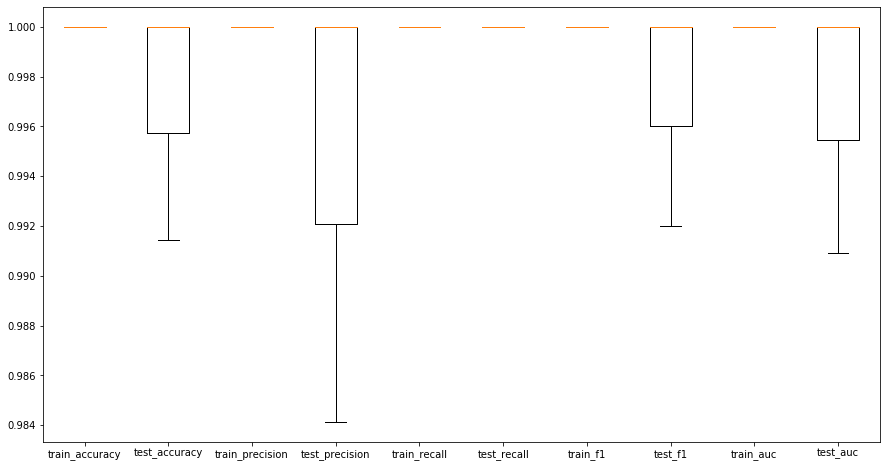
    


### Avec paramètres choisis


```python
paramsAChoisir = {
    'n_estimators': [90,100,150,170,190, 200,250],
}

bestEstimator, bestParams = getGoodPArams(Ab, paramsAChoisir, inputs, outputs, k)
estimatorsParametres['AdaBoost'] = bestEstimator
```

    Fitting 3 folds for each of 7 candidates, totalling 21 fits


    [Parallel(n_jobs=-1)]: Using backend LokyBackend with 8 concurrent workers.
    [Parallel(n_jobs=-1)]: Done  17 out of  21 | elapsed:    1.2s remaining:    0.3s
    [Parallel(n_jobs=-1)]: Done  21 out of  21 | elapsed:    1.5s finished


    Résultat de la grid search : 0.982905982905983 {'n_estimators': 150}


#### Test sur toutes les données


```python
#allData(bestEstimator, inputs, outputs)
showPerformanceEstimators(estimatorsParametres, inputs, outputs)
```

    Test sur toutes les données
    
    
    Performances de GaussianNB: 
    Accuracy 0.8490028490028491
    precision 0.8787482992219539
    recall 0.8490028490028491
    f1 score 0.8490028490028491
    Matrice de confusion [[126  51]
     [  2 172]]
    ===================================
    Performances de LDA: 
    Accuracy 1.0
    precision 1.0
    recall 1.0
    f1 score 1.0
    Matrice de confusion [[177   0]
     [  0 174]]
    ===================================
    Performances de QDA: 
    Accuracy 0.9943019943019943
    precision 0.9943667443667443
    recall 0.9943019943019943
    f1 score 0.9943019943019943
    Matrice de confusion [[175   2]
     [  0 174]]
    ===================================
    Performances de LogisticRegression: 
    Accuracy 1.0
    precision 1.0
    recall 1.0
    f1 score 1.0
    Matrice de confusion [[177   0]
     [  0 174]]
    ===================================
    Performances de kNN: 
    Accuracy 1.0
    precision 1.0
    recall 1.0
    f1 score 1.0
    Matrice de confusion [[177   0]
     [  0 174]]
    ===================================
    Performances de tree: 
    Accuracy 0.9971509971509972
    precision 0.9971670027849804
    recall 0.9971509971509972
    f1 score 0.9971509971509972
    Matrice de confusion [[177   0]
     [  1 173]]
    ===================================
    Performances de bagging: 
    Accuracy 1.0
    precision 1.0
    recall 1.0
    f1 score 1.0
    Matrice de confusion [[177   0]
     [  0 174]]
    ===================================
    Performances de RF: 


    /opt/anaconda3/lib/python3.7/site-packages/sklearn/discriminant_analysis.py:691: UserWarning: Variables are collinear
      warnings.warn("Variables are collinear")


    Accuracy 1.0
    precision 1.0
    recall 1.0
    f1 score 1.0
    Matrice de confusion [[177   0]
     [  0 174]]
    ===================================
    Performances de AdaBoost: 
    Accuracy 1.0
    precision 1.0
    recall 1.0
    f1 score 1.0
    Matrice de confusion [[177   0]
     [  0 174]]
    ===================================


```python
showDecisionBoundaries(proj, bestEstimator, outputs, 'ab')
```


    

    


#### Validation croisée


```python
k = 3
#y_test, y_pred = cross_val(bestEstimator, inputs, outputs, k)
#allMesuresPerformances(y_test, y_pred)
cross_val(estimatorsParametres, inputs, outputs,k)
```

    Performances de GaussianNB: 
    Accuracy 0.7521367521367521
    precision 0.7936676431541643
    recall 0.7521367521367521
    f1 score 0.752136752136752
    Matrice de confusion [[37 25]
     [ 4 51]]
    ===================================
    Performances de LDA: 
    Accuracy 1.0
    precision 1.0
    recall 1.0
    f1 score 1.0
    Matrice de confusion [[62  0]
     [ 0 55]]
    ===================================
    Performances de QDA: 
    Accuracy 0.8803418803418803
    precision 0.8884818884818885
    recall 0.8803418803418803
    f1 score 0.8803418803418802
    Matrice de confusion [[51 11]
     [ 3 52]]
    ===================================
    Performances de LogisticRegression: 
    Accuracy 1.0
    precision 1.0
    recall 1.0
    f1 score 1.0
    Matrice de confusion [[62  0]
     [ 0 55]]
    ===================================
    Performances de kNN: 
    Accuracy 1.0
    precision 1.0
    recall 1.0
    f1 score 1.0
    Matrice de confusion [[62  0]
     [ 0 55]]
    ===================================
    Performances de tree: 
    Accuracy 0.9230769230769231
    precision 0.9287671869193609
    recall 0.9230769230769231
    f1 score 0.9230769230769231
    Matrice de confusion [[61  1]
     [ 8 47]]
    ===================================
    Performances de bagging: 
    Accuracy 0.9743589743589743
    precision 0.9755424063116371
    recall 0.9743589743589743
    f1 score 0.9743589743589743
    Matrice de confusion [[62  0]
     [ 3 52]]
    ===================================
    Performances de RF: 


    /opt/anaconda3/lib/python3.7/site-packages/sklearn/discriminant_analysis.py:691: UserWarning: Variables are collinear
      warnings.warn("Variables are collinear")
    /opt/anaconda3/lib/python3.7/site-packages/sklearn/linear_model/_logistic.py:940: ConvergenceWarning: lbfgs failed to converge (status=1):
    STOP: TOTAL NO. of ITERATIONS REACHED LIMIT.
    
    Increase the number of iterations (max_iter) or scale the data as shown in:
        https://scikit-learn.org/stable/modules/preprocessing.html
    Please also refer to the documentation for alternative solver options:
        https://scikit-learn.org/stable/modules/linear_model.html#logistic-regression
      extra_warning_msg=_LOGISTIC_SOLVER_CONVERGENCE_MSG)


    Accuracy 0.9914529914529915
    precision 0.9915886582553249
    recall 0.9914529914529915
    f1 score 0.9914529914529915
    Matrice de confusion [[62  0]
     [ 1 54]]
    ===================================
    Performances de AdaBoost: 
    Accuracy 1.0
    precision 1.0
    recall 1.0
    f1 score 1.0
    Matrice de confusion [[62  0]
     [ 0 55]]
    ===================================


### Structure of the successive Adaboost trees


```python
def struct_succ(model, X, y):
    ad_staged = model.staged_predict(X)
    Ad_seq_errors = []
    for Ad_train_predict in model.staged_predict(X):
        Ad_seq_errors.append(metrics.accuracy_score(Ad_train_predict, y))
    plt.figure(figsize=(15, 5))
    plt.plot(Ad_seq_errors); plt.title('Adaboost underlaying tree Accuracy')
    plt.ylabel('Error'); plt.xlabel('Number of Trees')
```

Je fais la Structure of the successive Adaboost trees avec un modèle calibré


```python
Ad = bestEstimator
Ad.fit(X, y)
struct_succ(Ad, inputs, outputs)
```


    
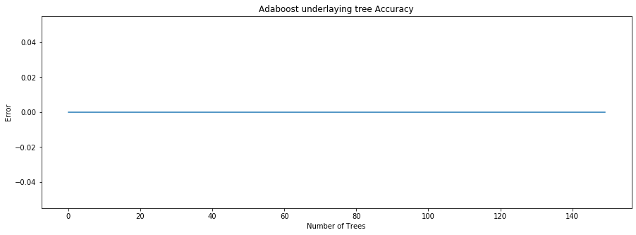
    


## Gradient Boosting

### Paramètres par défaut


```python
from sklearn.ensemble import GradientBoostingClassifier
```


```python
GB = GradientBoostingClassifier(random_state=0)
estimatorsParDefaut['GradientBoosting'] = GB
```

#### Test sur toutes les données


```python
showPerformanceEstimators(estimatorsParDefaut, inputs, outputs)
```

    Test sur toutes les données
    
    
    Performances de GaussianNB: 
    Accuracy 0.8490028490028491
    precision 0.8787482992219539
    recall 0.8490028490028491
    f1 score 0.8490028490028491
    Matrice de confusion [[126  51]
     [  2 172]]
    ===================================
    Performances de LDA: 
    Accuracy 1.0
    precision 1.0
    recall 1.0
    f1 score 1.0
    Matrice de confusion [[177   0]
     [  0 174]]
    ===================================
    Performances de QDA: 
    Accuracy 0.9943019943019943
    precision 0.9943667443667443
    recall 0.9943019943019943
    f1 score 0.9943019943019943
    Matrice de confusion [[175   2]
     [  0 174]]
    ===================================
    Performances de LogisticRegression: 
    Accuracy 1.0
    precision 1.0
    recall 1.0
    f1 score 1.0
    Matrice de confusion [[177   0]
     [  0 174]]
    ===================================
    Performances de kNN: 
    Accuracy 1.0
    precision 1.0
    recall 1.0
    f1 score 1.0
    Matrice de confusion [[177   0]
     [  0 174]]
    ===================================
    Performances de tree: 
    Accuracy 0.9544159544159544
    precision 0.9565748468974276
    recall 0.9544159544159544
    f1 score 0.9544159544159544
    Matrice de confusion [[163  14]
     [  2 172]]
    ===================================
    Performances de bagging: 
    Accuracy 1.0
    precision 1.0
    recall 1.0
    f1 score 1.0
    Matrice de confusion [[177   0]
     [  0 174]]
    ===================================
    Performances de RF: 


    /opt/anaconda3/lib/python3.7/site-packages/sklearn/discriminant_analysis.py:691: UserWarning: Variables are collinear
      warnings.warn("Variables are collinear")


    Accuracy 1.0
    precision 1.0
    recall 1.0
    f1 score 1.0
    Matrice de confusion [[177   0]
     [  0 174]]
    ===================================
    Performances de AdaBoost: 
    Accuracy 1.0
    precision 1.0
    recall 1.0
    f1 score 1.0
    Matrice de confusion [[177   0]
     [  0 174]]
    ===================================
    Performances de GradientBoosting: 
    Accuracy 1.0
    precision 1.0
    recall 1.0
    f1 score 1.0
    Matrice de confusion [[177   0]
     [  0 174]]
    ===================================


```python
showDecisionBoundaries(proj, GB, outputs, 'gb')
```


    

    


#### Validation croisée


```python
k = 3
cross_val(estimatorsParDefaut, inputs, outputs,k)
```

    Performances de GaussianNB: 
    Accuracy 0.7521367521367521
    precision 0.7936676431541643
    recall 0.7521367521367521
    f1 score 0.752136752136752
    Matrice de confusion [[37 25]
     [ 4 51]]
    ===================================
    Performances de LDA: 
    Accuracy 1.0
    precision 1.0
    recall 1.0
    f1 score 1.0
    Matrice de confusion [[62  0]
     [ 0 55]]
    ===================================
    Performances de QDA: 
    Accuracy 0.8803418803418803
    precision 0.8884818884818885
    recall 0.8803418803418803
    f1 score 0.8803418803418802
    Matrice de confusion [[51 11]
     [ 3 52]]
    ===================================
    Performances de LogisticRegression: 
    Accuracy 1.0
    precision 1.0
    recall 1.0
    f1 score 1.0
    Matrice de confusion [[62  0]
     [ 0 55]]
    ===================================
    Performances de kNN: 
    Accuracy 1.0
    precision 1.0
    recall 1.0
    f1 score 1.0
    Matrice de confusion [[62  0]
     [ 0 55]]
    ===================================
    Performances de tree: 
    Accuracy 0.9145299145299145
    precision 0.914842364134817
    recall 0.9145299145299145
    f1 score 0.9145299145299145
    Matrice de confusion [[58  4]
     [ 6 49]]
    ===================================
    Performances de bagging: 
    Accuracy 0.9829059829059829
    precision 0.9829059829059829
    recall 0.9829059829059829
    f1 score 0.9829059829059829
    Matrice de confusion [[61  1]
     [ 1 54]]
    ===================================
    Performances de RF: 


    /opt/anaconda3/lib/python3.7/site-packages/sklearn/discriminant_analysis.py:691: UserWarning: Variables are collinear
      warnings.warn("Variables are collinear")
    /opt/anaconda3/lib/python3.7/site-packages/sklearn/linear_model/_logistic.py:940: ConvergenceWarning: lbfgs failed to converge (status=1):
    STOP: TOTAL NO. of ITERATIONS REACHED LIMIT.
    
    Increase the number of iterations (max_iter) or scale the data as shown in:
        https://scikit-learn.org/stable/modules/preprocessing.html
    Please also refer to the documentation for alternative solver options:
        https://scikit-learn.org/stable/modules/linear_model.html#logistic-regression
      extra_warning_msg=_LOGISTIC_SOLVER_CONVERGENCE_MSG)


    Accuracy 0.9914529914529915
    precision 0.9915886582553249
    recall 0.9914529914529915
    f1 score 0.9914529914529915
    Matrice de confusion [[62  0]
     [ 1 54]]
    ===================================
    Performances de AdaBoost: 
    Accuracy 1.0
    precision 1.0
    recall 1.0
    f1 score 1.0
    Matrice de confusion [[62  0]
     [ 0 55]]
    ===================================
    Performances de GradientBoosting: 
    Accuracy 0.9914529914529915
    precision 0.9915886582553249
    recall 0.9914529914529915
    f1 score 0.9914529914529915
    Matrice de confusion [[62  0]
     [ 1 54]]
    ===================================


### Avec des paramètres choisis


```python
paramsAChoisir = {
    'max_depth': [2,3,5,10,50,60,70,80,90],
    'n_estimators' : [20,30,40,50,60,70,80,90,100,250,500],
    #'max_features': [3,4,5],
    #'random_state': [None, 0,1],
    #'min_samples_split' : [20,25,30],
    #'min_samples_leaf': [3,4,5],
    'learning_rate':[0.01,0.05,0.1]
}

bestEstimator, bestParams = getGoodPArams(GB, paramsAChoisir, inputs, outputs, k)
estimatorsParametres['GradientBoosting'] = bestEstimator
```

    Fitting 3 folds for each of 297 candidates, totalling 891 fits


    [Parallel(n_jobs=-1)]: Using backend LokyBackend with 8 concurrent workers.
    [Parallel(n_jobs=-1)]: Done  34 tasks      | elapsed:    0.6s
    [Parallel(n_jobs=-1)]: Done 276 tasks      | elapsed:    8.3s
    [Parallel(n_jobs=-1)]: Done 682 tasks      | elapsed:   18.4s
    [Parallel(n_jobs=-1)]: Done 876 out of 891 | elapsed:   22.6s remaining:    0.4s
    [Parallel(n_jobs=-1)]: Done 891 out of 891 | elapsed:   22.9s finished


    Résultat de la grid search : 0.9886039886039887 {'learning_rate': 0.05, 'max_depth': 2, 'n_estimators': 500}


#### Test sur toutes les données


```python
showPerformanceEstimators(estimatorsParametres, inputs, outputs)
```

    Test sur toutes les données
    
    
    Performances de GaussianNB: 
    Accuracy 0.8490028490028491
    precision 0.8787482992219539
    recall 0.8490028490028491
    f1 score 0.8490028490028491
    Matrice de confusion [[126  51]
     [  2 172]]
    ===================================
    Performances de LDA: 
    Accuracy 1.0
    precision 1.0
    recall 1.0
    f1 score 1.0
    Matrice de confusion [[177   0]
     [  0 174]]
    ===================================
    Performances de QDA: 
    Accuracy 0.9943019943019943
    precision 0.9943667443667443
    recall 0.9943019943019943
    f1 score 0.9943019943019943
    Matrice de confusion [[175   2]
     [  0 174]]
    ===================================
    Performances de LogisticRegression: 
    Accuracy 1.0
    precision 1.0
    recall 1.0
    f1 score 1.0
    Matrice de confusion [[177   0]
     [  0 174]]
    ===================================
    Performances de kNN: 
    Accuracy 1.0
    precision 1.0
    recall 1.0
    f1 score 1.0
    Matrice de confusion [[177   0]
     [  0 174]]
    ===================================
    Performances de tree: 
    Accuracy 0.9971509971509972
    precision 0.9971670027849804
    recall 0.9971509971509972
    f1 score 0.9971509971509972
    Matrice de confusion [[177   0]
     [  1 173]]
    ===================================
    Performances de bagging: 
    Accuracy 1.0
    precision 1.0
    recall 1.0
    f1 score 1.0
    Matrice de confusion [[177   0]
     [  0 174]]
    ===================================
    Performances de RF: 


    /opt/anaconda3/lib/python3.7/site-packages/sklearn/discriminant_analysis.py:691: UserWarning: Variables are collinear
      warnings.warn("Variables are collinear")


    Accuracy 0.9971509971509972
    precision 0.9971672771672773
    recall 0.9971509971509972
    f1 score 0.9971509971509972
    Matrice de confusion [[176   1]
     [  0 174]]
    ===================================
    Performances de AdaBoost: 
    Accuracy 1.0
    precision 1.0
    recall 1.0
    f1 score 1.0
    Matrice de confusion [[177   0]
     [  0 174]]
    ===================================
    Performances de GradientBoosting: 
    Accuracy 1.0
    precision 1.0
    recall 1.0
    f1 score 1.0
    Matrice de confusion [[177   0]
     [  0 174]]
    ===================================


```python
showDecisionBoundaries(proj, bestEstimator, outputs, 'gb')
```


    
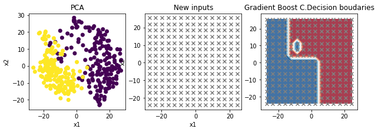
    


#### Validation croisée


```python
cross_val(estimatorsParametres, inputs, outputs, k)
score=bestEstimator.score;
```

    Performances de GaussianNB: 
    Accuracy 0.7521367521367521
    precision 0.7936676431541643
    recall 0.7521367521367521
    f1 score 0.752136752136752
    Matrice de confusion [[37 25]
     [ 4 51]]
    ===================================
    Performances de LDA: 
    Accuracy 1.0
    precision 1.0
    recall 1.0
    f1 score 1.0
    Matrice de confusion [[62  0]
     [ 0 55]]
    ===================================
    Performances de QDA: 
    Accuracy 0.8803418803418803
    precision 0.8884818884818885
    recall 0.8803418803418803
    f1 score 0.8803418803418802
    Matrice de confusion [[51 11]
     [ 3 52]]
    ===================================
    Performances de LogisticRegression: 
    Accuracy 1.0
    precision 1.0
    recall 1.0
    f1 score 1.0
    Matrice de confusion [[62  0]
     [ 0 55]]
    ===================================
    Performances de kNN: 
    Accuracy 1.0
    precision 1.0
    recall 1.0
    f1 score 1.0
    Matrice de confusion [[62  0]
     [ 0 55]]
    ===================================
    Performances de tree: 
    Accuracy 0.9145299145299145
    precision 0.921866313355675
    recall 0.9145299145299145
    f1 score 0.9145299145299145
    Matrice de confusion [[61  1]
     [ 9 46]]
    ===================================
    Performances de bagging: 
    Accuracy 0.9743589743589743
    precision 0.9755424063116371
    recall 0.9743589743589743
    f1 score 0.9743589743589743
    Matrice de confusion [[62  0]
     [ 3 52]]
    ===================================
    Performances de RF: 


    /opt/anaconda3/lib/python3.7/site-packages/sklearn/discriminant_analysis.py:691: UserWarning: Variables are collinear
      warnings.warn("Variables are collinear")
    /opt/anaconda3/lib/python3.7/site-packages/sklearn/linear_model/_logistic.py:940: ConvergenceWarning: lbfgs failed to converge (status=1):
    STOP: TOTAL NO. of ITERATIONS REACHED LIMIT.
    
    Increase the number of iterations (max_iter) or scale the data as shown in:
        https://scikit-learn.org/stable/modules/preprocessing.html
    Please also refer to the documentation for alternative solver options:
        https://scikit-learn.org/stable/modules/linear_model.html#logistic-regression
      extra_warning_msg=_LOGISTIC_SOLVER_CONVERGENCE_MSG)


    Accuracy 0.9914529914529915
    precision 0.9915886582553249
    recall 0.9914529914529915
    f1 score 0.9914529914529915
    Matrice de confusion [[62  0]
     [ 1 54]]
    ===================================
    Performances de AdaBoost: 
    Accuracy 1.0
    precision 1.0
    recall 1.0
    f1 score 1.0
    Matrice de confusion [[62  0]
     [ 0 55]]
    ===================================
    Performances de GradientBoosting: 
    Accuracy 1.0
    precision 1.0
    recall 1.0
    f1 score 1.0
    Matrice de confusion [[62  0]
     [ 0 55]]
    ===================================


```python
GB = bestEstimator
GB.fit(X, y)
struct_succ(GB, inputs, outputs)
```


    
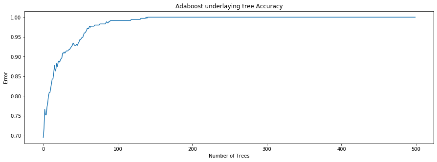
    


## Stacking


```python
from sklearn.ensemble import StackingClassifier
```


```python

estimators_tmp = getAllEstimators(estimatorsParametres)
#print(estimators)
#estimators = []
clf = StackingClassifier(estimators=estimators_tmp)
estimatorsParametres['Stacking'] = clf
estimators = getAllEstimators(estimatorsParametres)
showPerformanceEstimators(estimatorsParametres, inputs, outputs)
cross_val(estimatorsParametres, inputs, outputs, k)
```

    Test sur toutes les données
    
    
    Performances de GaussianNB: 
    Accuracy 0.8490028490028491
    precision 0.8787482992219539
    recall 0.8490028490028491
    f1 score 0.8490028490028491
    Matrice de confusion [[126  51]
     [  2 172]]
    ===================================
    Performances de LDA: 
    Accuracy 1.0
    precision 1.0
    recall 1.0
    f1 score 1.0
    Matrice de confusion [[177   0]
     [  0 174]]
    ===================================
    Performances de QDA: 
    Accuracy 0.9943019943019943
    precision 0.9943667443667443
    recall 0.9943019943019943
    f1 score 0.9943019943019943
    Matrice de confusion [[175   2]
     [  0 174]]
    ===================================
    Performances de LogisticRegression: 
    Accuracy 1.0
    precision 1.0
    recall 1.0
    f1 score 1.0
    Matrice de confusion [[177   0]
     [  0 174]]
    ===================================
    Performances de kNN: 
    Accuracy 1.0
    precision 1.0
    recall 1.0
    f1 score 1.0
    Matrice de confusion [[177   0]
     [  0 174]]
    ===================================
    Performances de tree: 
    Accuracy 0.9971509971509972
    precision 0.9971670027849804
    recall 0.9971509971509972
    f1 score 0.9971509971509972
    Matrice de confusion [[177   0]
     [  1 173]]
    ===================================
    Performances de bagging: 
    Accuracy 1.0
    precision 1.0
    recall 1.0
    f1 score 1.0
    Matrice de confusion [[177   0]
     [  0 174]]
    ===================================
    Performances de RF: 


    /opt/anaconda3/lib/python3.7/site-packages/sklearn/discriminant_analysis.py:691: UserWarning: Variables are collinear
      warnings.warn("Variables are collinear")


    Accuracy 1.0
    precision 1.0
    recall 1.0
    f1 score 1.0
    Matrice de confusion [[177   0]
     [  0 174]]
    ===================================
    Performances de AdaBoost: 
    Accuracy 1.0
    precision 1.0
    recall 1.0
    f1 score 1.0
    Matrice de confusion [[177   0]
     [  0 174]]
    ===================================
    Performances de GradientBoosting: 
    Accuracy 1.0
    precision 1.0
    recall 1.0
    f1 score 1.0
    Matrice de confusion [[177   0]
     [  0 174]]
    ===================================
    Performances de Stacking: 


    /opt/anaconda3/lib/python3.7/site-packages/sklearn/discriminant_analysis.py:691: UserWarning: Variables are collinear
      warnings.warn("Variables are collinear")
    /opt/anaconda3/lib/python3.7/site-packages/sklearn/discriminant_analysis.py:691: UserWarning: Variables are collinear
      warnings.warn("Variables are collinear")
    /opt/anaconda3/lib/python3.7/site-packages/sklearn/discriminant_analysis.py:691: UserWarning: Variables are collinear
      warnings.warn("Variables are collinear")
    /opt/anaconda3/lib/python3.7/site-packages/sklearn/discriminant_analysis.py:691: UserWarning: Variables are collinear
      warnings.warn("Variables are collinear")
    /opt/anaconda3/lib/python3.7/site-packages/sklearn/discriminant_analysis.py:691: UserWarning: Variables are collinear
      warnings.warn("Variables are collinear")
    /opt/anaconda3/lib/python3.7/site-packages/sklearn/discriminant_analysis.py:691: UserWarning: Variables are collinear
      warnings.warn("Variables are collinear")
    /opt/anaconda3/lib/python3.7/site-packages/sklearn/linear_model/_logistic.py:940: ConvergenceWarning: lbfgs failed to converge (status=1):
    STOP: TOTAL NO. of ITERATIONS REACHED LIMIT.
    
    Increase the number of iterations (max_iter) or scale the data as shown in:
        https://scikit-learn.org/stable/modules/preprocessing.html
    Please also refer to the documentation for alternative solver options:
        https://scikit-learn.org/stable/modules/linear_model.html#logistic-regression
      extra_warning_msg=_LOGISTIC_SOLVER_CONVERGENCE_MSG)
    /opt/anaconda3/lib/python3.7/site-packages/sklearn/linear_model/_logistic.py:940: ConvergenceWarning: lbfgs failed to converge (status=1):
    STOP: TOTAL NO. of ITERATIONS REACHED LIMIT.
    
    Increase the number of iterations (max_iter) or scale the data as shown in:
        https://scikit-learn.org/stable/modules/preprocessing.html
    Please also refer to the documentation for alternative solver options:
        https://scikit-learn.org/stable/modules/linear_model.html#logistic-regression
      extra_warning_msg=_LOGISTIC_SOLVER_CONVERGENCE_MSG)


    Accuracy 1.0
    precision 1.0
    recall 1.0
    f1 score 1.0
    Matrice de confusion [[177   0]
     [  0 174]]
    ===================================
    Performances de GaussianNB: 
    Accuracy 0.7521367521367521
    precision 0.7936676431541643
    recall 0.7521367521367521
    f1 score 0.752136752136752
    Matrice de confusion [[37 25]
     [ 4 51]]
    ===================================
    Performances de LDA: 
    Accuracy 1.0
    precision 1.0
    recall 1.0
    f1 score 1.0
    Matrice de confusion [[62  0]
     [ 0 55]]
    ===================================
    Performances de QDA: 
    Accuracy 0.8803418803418803
    precision 0.8884818884818885
    recall 0.8803418803418803
    f1 score 0.8803418803418802
    Matrice de confusion [[51 11]
     [ 3 52]]
    ===================================
    Performances de LogisticRegression: 
    Accuracy 1.0
    precision 1.0
    recall 1.0
    f1 score 1.0
    Matrice de confusion [[62  0]
     [ 0 55]]
    ===================================
    Performances de kNN: 
    Accuracy 1.0
    precision 1.0
    recall 1.0
    f1 score 1.0
    Matrice de confusion [[62  0]
     [ 0 55]]
    ===================================
    Performances de tree: 
    Accuracy 0.9230769230769231
    precision 0.9287671869193609
    recall 0.9230769230769231
    f1 score 0.9230769230769231
    Matrice de confusion [[61  1]
     [ 8 47]]
    ===================================
    Performances de bagging: 
    Accuracy 0.9743589743589743
    precision 0.9755424063116371
    recall 0.9743589743589743
    f1 score 0.9743589743589743
    Matrice de confusion [[62  0]
     [ 3 52]]
    ===================================
    Performances de RF: 


    /opt/anaconda3/lib/python3.7/site-packages/sklearn/discriminant_analysis.py:691: UserWarning: Variables are collinear
      warnings.warn("Variables are collinear")
    /opt/anaconda3/lib/python3.7/site-packages/sklearn/linear_model/_logistic.py:940: ConvergenceWarning: lbfgs failed to converge (status=1):
    STOP: TOTAL NO. of ITERATIONS REACHED LIMIT.
    
    Increase the number of iterations (max_iter) or scale the data as shown in:
        https://scikit-learn.org/stable/modules/preprocessing.html
    Please also refer to the documentation for alternative solver options:
        https://scikit-learn.org/stable/modules/linear_model.html#logistic-regression
      extra_warning_msg=_LOGISTIC_SOLVER_CONVERGENCE_MSG)


    Accuracy 0.9914529914529915
    precision 0.9915886582553249
    recall 0.9914529914529915
    f1 score 0.9914529914529915
    Matrice de confusion [[62  0]
     [ 1 54]]
    ===================================
    Performances de AdaBoost: 
    Accuracy 1.0
    precision 1.0
    recall 1.0
    f1 score 1.0
    Matrice de confusion [[62  0]
     [ 0 55]]
    ===================================
    Performances de GradientBoosting: 
    Accuracy 1.0
    precision 1.0
    recall 1.0
    f1 score 1.0
    Matrice de confusion [[62  0]
     [ 0 55]]
    ===================================
    Performances de Stacking: 


    /opt/anaconda3/lib/python3.7/site-packages/sklearn/discriminant_analysis.py:691: UserWarning: Variables are collinear
      warnings.warn("Variables are collinear")
    /opt/anaconda3/lib/python3.7/site-packages/sklearn/linear_model/_logistic.py:940: ConvergenceWarning: lbfgs failed to converge (status=1):
    STOP: TOTAL NO. of ITERATIONS REACHED LIMIT.
    
    Increase the number of iterations (max_iter) or scale the data as shown in:
        https://scikit-learn.org/stable/modules/preprocessing.html
    Please also refer to the documentation for alternative solver options:
        https://scikit-learn.org/stable/modules/linear_model.html#logistic-regression
      extra_warning_msg=_LOGISTIC_SOLVER_CONVERGENCE_MSG)
    /opt/anaconda3/lib/python3.7/site-packages/sklearn/discriminant_analysis.py:691: UserWarning: Variables are collinear
      warnings.warn("Variables are collinear")
    /opt/anaconda3/lib/python3.7/site-packages/sklearn/discriminant_analysis.py:691: UserWarning: Variables are collinear
      warnings.warn("Variables are collinear")
    /opt/anaconda3/lib/python3.7/site-packages/sklearn/discriminant_analysis.py:691: UserWarning: Variables are collinear
      warnings.warn("Variables are collinear")
    /opt/anaconda3/lib/python3.7/site-packages/sklearn/discriminant_analysis.py:691: UserWarning: Variables are collinear
      warnings.warn("Variables are collinear")
    /opt/anaconda3/lib/python3.7/site-packages/sklearn/discriminant_analysis.py:691: UserWarning: Variables are collinear
      warnings.warn("Variables are collinear")
    /opt/anaconda3/lib/python3.7/site-packages/sklearn/linear_model/_logistic.py:940: ConvergenceWarning: lbfgs failed to converge (status=1):
    STOP: TOTAL NO. of ITERATIONS REACHED LIMIT.
    
    Increase the number of iterations (max_iter) or scale the data as shown in:
        https://scikit-learn.org/stable/modules/preprocessing.html
    Please also refer to the documentation for alternative solver options:
        https://scikit-learn.org/stable/modules/linear_model.html#logistic-regression
      extra_warning_msg=_LOGISTIC_SOLVER_CONVERGENCE_MSG)
    /opt/anaconda3/lib/python3.7/site-packages/sklearn/linear_model/_logistic.py:940: ConvergenceWarning: lbfgs failed to converge (status=1):
    STOP: TOTAL NO. of ITERATIONS REACHED LIMIT.
    
    Increase the number of iterations (max_iter) or scale the data as shown in:
        https://scikit-learn.org/stable/modules/preprocessing.html
    Please also refer to the documentation for alternative solver options:
        https://scikit-learn.org/stable/modules/linear_model.html#logistic-regression
      extra_warning_msg=_LOGISTIC_SOLVER_CONVERGENCE_MSG)


    Accuracy 1.0
    precision 1.0
    recall 1.0
    f1 score 1.0
    Matrice de confusion [[62  0]
     [ 0 55]]
    ===================================


```python
showDecisionBoundaries(proj, clf, outputs, 'stack')
```


    
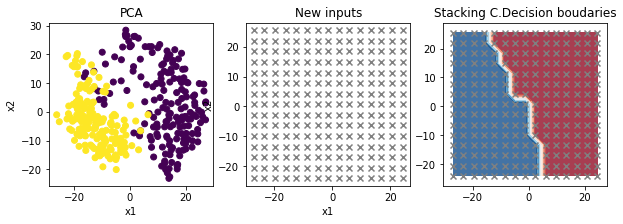
    


# Choix du meilleur Classifieur parmi tous les estimateurs

Je choisis le meillleur classifieur parmi tous les classifieurs précédents calibrés à l'aide de la méthode KFold


```python
from sklearn.model_selection import RepeatedStratifiedKFold
from sklearn.model_selection import cross_val_score
from sklearn.datasets import make_classification
from numpy import mean
from numpy import std
```


```python
def evaluate_model(model, X, y):
    cv = RepeatedStratifiedKFold(n_splits=10, n_repeats=3, random_state=1)
    scores = cross_val_score(model, X, y, scoring='accuracy', cv=cv, n_jobs=-1, error_score='raise')
    return scores


def k_fold_estimators(estimators, inputs, outputs, k):
    
    kf = KFold(n_splits=k, shuffle=True)
    results = list()
    labels, models =  zip(*estimators)
    labels = np.array(labels)
    models = np.array(models)
    labels.flatten()
    models.flatten()
    #print("models", models[1])
    for i in range(len(labels)):
        scores = evaluate_model(models[i], inputs, outputs)
        results.append(scores)
        print('>%s -> mean %.3f variance (%.3f)---Digit Dataset' % (labels[i], mean(scores), std(scores)))        
    plt.rcParams["figure.figsize"] = (15,6)
    plt.boxplot(results, labels=[r for r in labels], showmeans=True)
    plt.show()
```


```python
k = 2
k_fold_estimators(estimators, inputs, outputs, k)
```

    >GaussianNB -> mean 0.844 variance (0.069)---Digit Dataset
    >LDA -> mean 0.999 variance (0.005)---Digit Dataset
    >QDA -> mean 0.918 variance (0.063)---Digit Dataset
    >LogisticRegression -> mean 0.996 variance (0.010)---Digit Dataset
    >kNN -> mean 1.000 variance (0.000)---Digit Dataset
    >tree -> mean 0.933 variance (0.029)---Digit Dataset
    >bagging -> mean 0.986 variance (0.021)---Digit Dataset
    >RF -> mean 0.997 variance (0.009)---Digit Dataset
    >AdaBoost -> mean 0.996 variance (0.010)---Digit Dataset
    >GradientBoosting -> mean 0.994 variance (0.011)---Digit Dataset
    >Stacking -> mean 1.000 variance (0.000)---Digit Dataset


    

    


Lors des tests, je remarque que le stacking ne donne pas forcément la meilleure performance mais je remarque une certaine régularité lors de nos tests avec différentes classes.


```python

```
