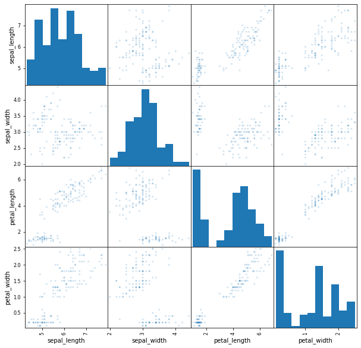

# 4. Machine learning with Spark MLlib

For this last lab, there will be no "walkthrough", you will be free to do your own machine learning project, as long as you follow these guidelines:

1. Choose **any** dataset from http://archive.ics.uci.edu/ml/index.php
2. Download the dataset file and upload to Databricks
3. Your solution notebook must have a part using RDDs, including **at least** the following steps:
  1. Reading the file into an RDD
  2. Converting into MLlib matrix or RDD of vectors
  3. Applying some statistics with the  MLlib's RDD API
  4. Learning a classification or regression model with the RDD API
  5. Applying the model to the test data and computing the errors
4. It also must include a part using DataFrames, including **at least** the following steps:
  1. Reading the file into a DataFrame:
  2. Running some aggregations and explorations using DataFrame functions (not MLlib!) 
  3. Creating a pipeline with **at least** one feature extraction/manipulation and one model estimator
  4. Fitting the pipeline to the training data
  5. Applying the model to the test data and computing the errors
  
Notes: 
  - Don't forget to split your data into training and test (and validation if you want) sets
  - You can start with the DataFrame part, if you want (I actually recommend doing it; it's easier to explore and understand the data using DFs)
  - You can do this project in groups of **2 members**
  - I'll accept submissions by e-mail until **Friday 19/03 23h59**
  - All submissions after the deadlines won't be considered
    - **It's much better to submit an incomplete solution than nothing at all!**
  - If you have any question or problem, don't hesitate to send me a slack message or an e-mail; I try to answer as quickly as possible (usually under 24h)
  
Resources:
  - [Spark MLlib guide](https://spark.apache.org/docs/latest/ml-guide.html)
  - [Databricks MLlib guide](https://docs.databricks.com/spark/latest/mllib/index.html#)
  - [pyspark MLlib RDD API docs](https://spark.apache.org/docs/latest/api/python/pyspark.mllib.html)
  - [pyspark MLlib DataFrame API docs](https://spark.apache.org/docs/latest/api/python/pyspark.ml.html)
  - [pyspark complete docs](https://spark.apache.org/docs/latest/api/python/)
  - [Course Homepage](https://danielpes.github.io/SparkCourse/)
  
### May the force be with you!

## Data

J'ai choisi le dataset Iris sur UCI machine learning, un jeu de données multivariées avec 3 classes (setosa, versicolor, viriginica) correspondant à  trois espèces des fleurs d'Iris.     
[Iris dataset](http://archive.ics.uci.edu/ml/datasets/Iris)

Ce dataset contient 150 échantillons dont 50 de chaque classe.    
Quatre caractéristiques ont été mesurées à partir de chaque échantillon : la longueur et la largeur des sépales et des pétales, en centimètres.     

On est dans dans un contexte de classification supervisée.

## Dataframe solution

### 1. Reading the file into a DataFrame:


```python
from pyspark.sql.types import StructType
from pyspark.sql.types import DoubleType
from pyspark.sql.types import StringType
```


<style scoped>
  .ansiout {
    display: block;
    unicode-bidi: embed;
    white-space: pre-wrap;
    word-wrap: break-word;
    word-break: break-all;
    font-family: "Source Code Pro", "Menlo", monospace;;
    font-size: 13px;
    color: #555;
    margin-left: 4px;
    line-height: 19px;
  }
</style>
<div class="ansiout"></div>


```python
customSchema = StructType() \
              .add("sepal_length", DoubleType(),True) \
              .add("sepal_width", DoubleType(),True) \
              .add("petal_length", DoubleType(),True) \
              .add("petal_width", DoubleType(),True) \
              .add("label", StringType(),True) \
```


<style scoped>
  .ansiout {
    display: block;
    unicode-bidi: embed;
    white-space: pre-wrap;
    word-wrap: break-word;
    word-break: break-all;
    font-family: "Source Code Pro", "Menlo", monospace;;
    font-size: 13px;
    color: #555;
    margin-left: 4px;
    line-height: 19px;
  }
</style>
<div class="ansiout"></div>


```python

df = spark.read.csv("/FileStore/tables/iris.data", sep=",", header=False, schema=customSchema, inferSchema=True)
#           .schema(schema)
```


<style scoped>
  .ansiout {
    display: block;
    unicode-bidi: embed;
    white-space: pre-wrap;
    word-wrap: break-word;
    word-break: break-all;
    font-family: "Source Code Pro", "Menlo", monospace;;
    font-size: 13px;
    color: #555;
    margin-left: 4px;
    line-height: 19px;
  }
</style>
<div class="ansiout"></div>


```python
df.printSchema()
```


<style scoped>
  .ansiout {
    display: block;
    unicode-bidi: embed;
    white-space: pre-wrap;
    word-wrap: break-word;
    word-break: break-all;
    font-family: "Source Code Pro", "Menlo", monospace;;
    font-size: 13px;
    color: #555;
    margin-left: 4px;
    line-height: 19px;
  }
</style>
<div class="ansiout">root
-- sepal_length: double (nullable = true)
-- sepal_width: double (nullable = true)
-- petal_length: double (nullable = true)
-- petal_width: double (nullable = true)
-- label: string (nullable = true)

</div>


```python
df.show()
```


<style scoped>
  .ansiout {
    display: block;
    unicode-bidi: embed;
    white-space: pre-wrap;
    word-wrap: break-word;
    word-break: break-all;
    font-family: "Source Code Pro", "Menlo", monospace;;
    font-size: 13px;
    color: #555;
    margin-left: 4px;
    line-height: 19px;
  }
</style>
<div class="ansiout">+------------+-----------+------------+-----------+-----------+
sepal_length|sepal_width|petal_length|petal_width|      label|
+------------+-----------+------------+-----------+-----------+
         5.1|        3.5|         1.4|        0.2|Iris-setosa|
         4.9|        3.0|         1.4|        0.2|Iris-setosa|
         4.7|        3.2|         1.3|        0.2|Iris-setosa|
         4.6|        3.1|         1.5|        0.2|Iris-setosa|
         5.0|        3.6|         1.4|        0.2|Iris-setosa|
         5.4|        3.9|         1.7|        0.4|Iris-setosa|
         4.6|        3.4|         1.4|        0.3|Iris-setosa|
         5.0|        3.4|         1.5|        0.2|Iris-setosa|
         4.4|        2.9|         1.4|        0.2|Iris-setosa|
         4.9|        3.1|         1.5|        0.1|Iris-setosa|
         5.4|        3.7|         1.5|        0.2|Iris-setosa|
         4.8|        3.4|         1.6|        0.2|Iris-setosa|
         4.8|        3.0|         1.4|        0.1|Iris-setosa|
         4.3|        3.0|         1.1|        0.1|Iris-setosa|
         5.8|        4.0|         1.2|        0.2|Iris-setosa|
         5.7|        4.4|         1.5|        0.4|Iris-setosa|
         5.4|        3.9|         1.3|        0.4|Iris-setosa|
         5.1|        3.5|         1.4|        0.3|Iris-setosa|
         5.7|        3.8|         1.7|        0.3|Iris-setosa|
         5.1|        3.8|         1.5|        0.3|Iris-setosa|
+------------+-----------+------------+-----------+-----------+
only showing top 20 rows

</div>


### 2. Some aggregations and explorations using DataFrame functions


```python
from pyspark.sql import functions as fn
```


<style scoped>
  .ansiout {
    display: block;
    unicode-bidi: embed;
    white-space: pre-wrap;
    word-wrap: break-word;
    word-break: break-all;
    font-family: "Source Code Pro", "Menlo", monospace;;
    font-size: 13px;
    color: #555;
    margin-left: 4px;
    line-height: 19px;
  }
</style>
<div class="ansiout"></div>


Average, min, max de sepal_length par label


```python
aggreg_sepal = df.groupBy("label").agg(fn.avg("sepal_length").alias("avg_sepal_length_by_species"),
                                  fn.min("sepal_length").alias("min_sepal_length_by_species"),
                                 fn.max("sepal_length").alias("max_sepal_length_by_species"),
                                )
aggreg_sepal.show()
```


<style scoped>
  .ansiout {
    display: block;
    unicode-bidi: embed;
    white-space: pre-wrap;
    word-wrap: break-word;
    word-break: break-all;
    font-family: "Source Code Pro", "Menlo", monospace;;
    font-size: 13px;
    color: #555;
    margin-left: 4px;
    line-height: 19px;
  }
</style>
<div class="ansiout">+---------------+---------------------------+---------------------------+---------------------------+
          label|avg_sepal_length_by_species|min_sepal_length_by_species|max_sepal_length_by_species|
+---------------+---------------------------+---------------------------+---------------------------+
 Iris-virginica|          6.587999999999998|                        4.9|                        7.9|
    Iris-setosa|          5.005999999999999|                        4.3|                        5.8|
Iris-versicolor|                      5.936|                        4.9|                        7.0|
+---------------+---------------------------+---------------------------+---------------------------+

</div>


Average, min, max de sepal_length par labels des sepal_length entre 4 et 5.7


```python
aggreg_sepal2 = df.where(df.sepal_length.between(4,5.7)).groupBy("label").agg(fn.count("sepal_length").alias("Nb sepal_length between 4 and 5.7"))

aggreg_sepal2.show()
```


<style scoped>
  .ansiout {
    display: block;
    unicode-bidi: embed;
    white-space: pre-wrap;
    word-wrap: break-word;
    word-break: break-all;
    font-family: "Source Code Pro", "Menlo", monospace;;
    font-size: 13px;
    color: #555;
    margin-left: 4px;
    line-height: 19px;
  }
</style>
<div class="ansiout">+---------------+---------------------------------+
          label|Nb sepal_length between 4 and 5.7|
+---------------+---------------------------------+
 Iris-virginica|                                3|
    Iris-setosa|                               49|
Iris-versicolor|                               21|
+---------------+---------------------------------+

</div>


```python
df.groupBy('label').agg(fn.avg("sepal_width"), fn.min("sepal_width"), fn.max("sepal_width")).show()
```


<style scoped>
  .ansiout {
    display: block;
    unicode-bidi: embed;
    white-space: pre-wrap;
    word-wrap: break-word;
    word-break: break-all;
    font-family: "Source Code Pro", "Menlo", monospace;;
    font-size: 13px;
    color: #555;
    margin-left: 4px;
    line-height: 19px;
  }
</style>
<div class="ansiout">+---------------+------------------+----------------+----------------+
          label|  avg(sepal_width)|min(sepal_width)|max(sepal_width)|
+---------------+------------------+----------------+----------------+
 Iris-virginica|2.9739999999999998|             2.2|             3.8|
    Iris-setosa|3.4180000000000006|             2.3|             4.4|
Iris-versicolor|2.7700000000000005|             2.0|             3.4|
+---------------+------------------+----------------+----------------+

</div>


Corrélation entre deux colonnes


```python
test2 = df.select("*").agg(fn.corr("sepal_length", "sepal_width").alias("correlation-sepal_length-sepal_width"),
                           fn.corr("sepal_length", "petal_length").alias("correlation-sepal_length-petal_width"),
                          )
display(test2)
```


<style scoped>
  .table-result-container {
    max-height: 300px;
    overflow: auto;
  }
  table, th, td {
    border: 1px solid black;
    border-collapse: collapse;
  }
  th, td {
    padding: 5px;
  }
  th {
    text-align: left;
  }
</style><div class='table-result-container'><table class='table-result'><thead style='background-color: white'><tr><th>correlation-sepal_length-sepal_width</th><th>correlation-sepal_length-petal_width</th></tr></thead><tbody><tr><td>-0.10936924995064931</td><td>0.8717541573048717</td></tr></tbody></table></div>


##### Exploring Data


```python
display(df.describe())
```


<style scoped>
  .table-result-container {
    max-height: 300px;
    overflow: auto;
  }
  table, th, td {
    border: 1px solid black;
    border-collapse: collapse;
  }
  th, td {
    padding: 5px;
  }
  th {
    text-align: left;
  }
</style><div class='table-result-container'><table class='table-result'><thead style='background-color: white'><tr><th>summary</th><th>sepal_length</th><th>sepal_width</th><th>petal_length</th><th>petal_width</th><th>label</th></tr></thead><tbody><tr><td>count</td><td>150</td><td>150</td><td>150</td><td>150</td><td>150</td></tr><tr><td>mean</td><td>5.843333333333335</td><td>3.0540000000000007</td><td>3.7586666666666693</td><td>1.1986666666666672</td><td>null</td></tr><tr><td>stddev</td><td>0.8280661279778637</td><td>0.43359431136217375</td><td>1.764420419952262</td><td>0.7631607417008414</td><td>null</td></tr><tr><td>min</td><td>4.3</td><td>2.0</td><td>1.0</td><td>0.1</td><td>Iris-setosa</td></tr><tr><td>max</td><td>7.9</td><td>4.4</td><td>6.9</td><td>2.5</td><td>Iris-virginica</td></tr></tbody></table></div>


```python
import pandas as pd
from pandas.plotting import scatter_matrix
```


<style scoped>
  .ansiout {
    display: block;
    unicode-bidi: embed;
    white-space: pre-wrap;
    word-wrap: break-word;
    word-break: break-all;
    font-family: "Source Code Pro", "Menlo", monospace;;
    font-size: 13px;
    color: #555;
    margin-left: 4px;
    line-height: 19px;
  }
</style>
<div class="ansiout"></div>


```python
features_vec = df.select("sepal_length", "sepal_width", "petal_length", "petal_width").toPandas()
axs = scatter_matrix(features_vec, alpha=0.2, figsize=(10,10));
```


    

    


### 3. Pipeline with at least one feature extraction/manipulation and one model estimator


```python
from pyspark.ml.feature import StringIndexer, VectorAssembler
from pyspark.ml.feature import StandardScaler
from pyspark.ml import Pipeline

```


<style scoped>
  .ansiout {
    display: block;
    unicode-bidi: embed;
    white-space: pre-wrap;
    word-wrap: break-word;
    word-break: break-all;
    font-family: "Source Code Pro", "Menlo", monospace;;
    font-size: 13px;
    color: #555;
    margin-left: 4px;
    line-height: 19px;
  }
</style>
<div class="ansiout"></div>


Je transforme les labels en string en index avec `StringIndexer`


```python
labelIndexer = StringIndexer(inputCol="label", outputCol="indexedLabel")
```


<style scoped>
  .ansiout {
    display: block;
    unicode-bidi: embed;
    white-space: pre-wrap;
    word-wrap: break-word;
    word-break: break-all;
    font-family: "Source Code Pro", "Menlo", monospace;;
    font-size: 13px;
    color: #555;
    margin-left: 4px;
    line-height: 19px;
  }
</style>
<div class="ansiout"></div>


On vectorise nos features avec `VectorAssembler`


```python
feature_cols = df.columns[:-1]
feature_cols
```


<style scoped>
  .ansiout {
    display: block;
    unicode-bidi: embed;
    white-space: pre-wrap;
    word-wrap: break-word;
    word-break: break-all;
    font-family: "Source Code Pro", "Menlo", monospace;;
    font-size: 13px;
    color: #555;
    margin-left: 4px;
    line-height: 19px;
  }
</style>
<div class="ansiout">Out[16]: [&#39;sepal_length&#39;, &#39;sepal_width&#39;, &#39;petal_length&#39;, &#39;petal_width&#39;]</div>


```python
vectorAssembler = VectorAssembler(inputCols=feature_cols, outputCol="indexedFeatures")
```


<style scoped>
  .ansiout {
    display: block;
    unicode-bidi: embed;
    white-space: pre-wrap;
    word-wrap: break-word;
    word-break: break-all;
    font-family: "Source Code Pro", "Menlo", monospace;;
    font-size: 13px;
    color: #555;
    margin-left: 4px;
    line-height: 19px;
  }
</style>
<div class="ansiout"></div>


J'utilise `DecisionTreeClassifier` comme classifieur


```python
from pyspark.ml.classification import DecisionTreeClassifier, RandomForestClassifier
dt = DecisionTreeClassifier(labelCol="indexedLabel", featuresCol="indexedFeatures")
```


<style scoped>
  .ansiout {
    display: block;
    unicode-bidi: embed;
    white-space: pre-wrap;
    word-wrap: break-word;
    word-break: break-all;
    font-family: "Source Code Pro", "Menlo", monospace;;
    font-size: 13px;
    color: #555;
    margin-left: 4px;
    line-height: 19px;
  }
</style>
<div class="ansiout"></div>


On crée la pipeline


```python
stages = [labelIndexer, vectorAssembler, dt]
pipeline = Pipeline(stages=stages)
```


<style scoped>
  .ansiout {
    display: block;
    unicode-bidi: embed;
    white-space: pre-wrap;
    word-wrap: break-word;
    word-break: break-all;
    font-family: "Source Code Pro", "Menlo", monospace;;
    font-size: 13px;
    color: #555;
    margin-left: 4px;
    line-height: 19px;
  }
</style>
<div class="ansiout"></div>


### 4.Fitting the pipeline to the training data

##### On partionne les donées en train et test avec 70% train et 30% test


```python
(train, test) = df.randomSplit([.7, .3])
```


<style scoped>
  .ansiout {
    display: block;
    unicode-bidi: embed;
    white-space: pre-wrap;
    word-wrap: break-word;
    word-break: break-all;
    font-family: "Source Code Pro", "Menlo", monospace;;
    font-size: 13px;
    color: #555;
    margin-left: 4px;
    line-height: 19px;
  }
</style>
<div class="ansiout"></div>


```python
train.count()
```


<style scoped>
  .ansiout {
    display: block;
    unicode-bidi: embed;
    white-space: pre-wrap;
    word-wrap: break-word;
    word-break: break-all;
    font-family: "Source Code Pro", "Menlo", monospace;;
    font-size: 13px;
    color: #555;
    margin-left: 4px;
    line-height: 19px;
  }
</style>
<div class="ansiout">Out[21]: 114</div>


```python
test.count()
```


<style scoped>
  .ansiout {
    display: block;
    unicode-bidi: embed;
    white-space: pre-wrap;
    word-wrap: break-word;
    word-break: break-all;
    font-family: "Source Code Pro", "Menlo", monospace;;
    font-size: 13px;
    color: #555;
    margin-left: 4px;
    line-height: 19px;
  }
</style>
<div class="ansiout">Out[22]: 36</div>


Training


```python
model = pipeline.fit(train)
```


<style scoped>
  .ansiout {
    display: block;
    unicode-bidi: embed;
    white-space: pre-wrap;
    word-wrap: break-word;
    word-break: break-all;
    font-family: "Source Code Pro", "Menlo", monospace;;
    font-size: 13px;
    color: #555;
    margin-left: 4px;
    line-height: 19px;
  }
</style>
<div class="ansiout"></div>


### 5. Model on the test data and the computed errors

Prediction


```python
predictions = model.transform(test)
```


<style scoped>
  .ansiout {
    display: block;
    unicode-bidi: embed;
    white-space: pre-wrap;
    word-wrap: break-word;
    word-break: break-all;
    font-family: "Source Code Pro", "Menlo", monospace;;
    font-size: 13px;
    color: #555;
    margin-left: 4px;
    line-height: 19px;
  }
</style>
<div class="ansiout"></div>


```python
# predictions.select("*").show(5)
predictions.select("prediction", "indexedLabel", "indexedFeatures").show(5)
```


<style scoped>
  .ansiout {
    display: block;
    unicode-bidi: embed;
    white-space: pre-wrap;
    word-wrap: break-word;
    word-break: break-all;
    font-family: "Source Code Pro", "Menlo", monospace;;
    font-size: 13px;
    color: #555;
    margin-left: 4px;
    line-height: 19px;
  }
</style>
<div class="ansiout">+----------+------------+-----------------+
prediction|indexedLabel|  indexedFeatures|
+----------+------------+-----------------+
       2.0|         2.0|[4.4,3.0,1.3,0.2]|
       2.0|         2.0|[4.5,2.3,1.3,0.3]|
       2.0|         2.0|[4.6,3.1,1.5,0.2]|
       2.0|         2.0|[4.6,3.4,1.4,0.3]|
       2.0|         2.0|[4.6,3.6,1.0,0.2]|
+----------+------------+-----------------+
only showing top 5 rows

</div>


Evaluation of model


```python
from pyspark.ml.evaluation import MulticlassClassificationEvaluator
```


<style scoped>
  .ansiout {
    display: block;
    unicode-bidi: embed;
    white-space: pre-wrap;
    word-wrap: break-word;
    word-break: break-all;
    font-family: "Source Code Pro", "Menlo", monospace;;
    font-size: 13px;
    color: #555;
    margin-left: 4px;
    line-height: 19px;
  }
</style>
<div class="ansiout"></div>


```python
evaluator = MulticlassClassificationEvaluator(labelCol="indexedLabel", predictionCol="prediction", metricName="accuracy")
```


<style scoped>
  .ansiout {
    display: block;
    unicode-bidi: embed;
    white-space: pre-wrap;
    word-wrap: break-word;
    word-break: break-all;
    font-family: "Source Code Pro", "Menlo", monospace;;
    font-size: 13px;
    color: #555;
    margin-left: 4px;
    line-height: 19px;
  }
</style>
<div class="ansiout"></div>


```python
accuracy = evaluator.evaluate(predictions)
```


<style scoped>
  .ansiout {
    display: block;
    unicode-bidi: embed;
    white-space: pre-wrap;
    word-wrap: break-word;
    word-break: break-all;
    font-family: "Source Code Pro", "Menlo", monospace;;
    font-size: 13px;
    color: #555;
    margin-left: 4px;
    line-height: 19px;
  }
</style>
<div class="ansiout"></div>


```python
print(accuracy)
```


<style scoped>
  .ansiout {
    display: block;
    unicode-bidi: embed;
    white-space: pre-wrap;
    word-wrap: break-word;
    word-break: break-all;
    font-family: "Source Code Pro", "Menlo", monospace;;
    font-size: 13px;
    color: #555;
    margin-left: 4px;
    line-height: 19px;
  }
</style>
<div class="ansiout">0.8888888888888888
</div>


Errors


```python
print("Test Error = %g" % (1.0 - accuracy))
```


<style scoped>
  .ansiout {
    display: block;
    unicode-bidi: embed;
    white-space: pre-wrap;
    word-wrap: break-word;
    word-break: break-all;
    font-family: "Source Code Pro", "Menlo", monospace;;
    font-size: 13px;
    color: #555;
    margin-left: 4px;
    line-height: 19px;
  }
</style>
<div class="ansiout">Test Error = 0.111111
</div>


## Test de divers paramètres  avec `ParamGrid` et `Cross Validation`


```python
from pyspark.ml.tuning import ParamGridBuilder, CrossValidator
```


<style scoped>
  .ansiout {
    display: block;
    unicode-bidi: embed;
    white-space: pre-wrap;
    word-wrap: break-word;
    word-break: break-all;
    font-family: "Source Code Pro", "Menlo", monospace;;
    font-size: 13px;
    color: #555;
    margin-left: 4px;
    line-height: 19px;
  }
</style>
<div class="ansiout"></div>


ParamGrid


```python

paramGrid = (ParamGridBuilder()
             .addGrid(dt.maxDepth, [2, 5, 10,20,25,30])
             .addGrid(dt.minInstancesPerNode,[1, 5, 10])
             .build())
```


<style scoped>
  .ansiout {
    display: block;
    unicode-bidi: embed;
    white-space: pre-wrap;
    word-wrap: break-word;
    word-break: break-all;
    font-family: "Source Code Pro", "Menlo", monospace;;
    font-size: 13px;
    color: #555;
    margin-left: 4px;
    line-height: 19px;
  }
</style>
<div class="ansiout"></div>


Cross Validation


```python
cv = CrossValidator(estimator=pipeline, \
                    estimatorParamMaps=paramGrid, \
                    evaluator=evaluator)
```


<style scoped>
  .ansiout {
    display: block;
    unicode-bidi: embed;
    white-space: pre-wrap;
    word-wrap: break-word;
    word-break: break-all;
    font-family: "Source Code Pro", "Menlo", monospace;;
    font-size: 13px;
    color: #555;
    margin-left: 4px;
    line-height: 19px;
  }
</style>
<div class="ansiout"></div>


```python
cvModel = cv.fit(train)
```


<style scoped>
  .ansiout {
    display: block;
    unicode-bidi: embed;
    white-space: pre-wrap;
    word-wrap: break-word;
    word-break: break-all;
    font-family: "Source Code Pro", "Menlo", monospace;;
    font-size: 13px;
    color: #555;
    margin-left: 4px;
    line-height: 19px;
  }
</style>
<div class="ansiout">/databricks/spark/python/pyspark/ml/util.py:762: UserWarning: Cannot find mlflow module. To enable MLflow logging, install mlflow from PyPI.
  warnings.warn(_MLflowInstrumentation._NO_MLFLOW_WARNING)
</div>


```python
predictions2 = cvModel.transform(test)
# evaluator2 = MulticlassClassificationEvaluator(labelCol="indexedLabel", predictionCol="prediction", metricName="accuracy")
evaluator.evaluate(predictions2)
```


<style scoped>
  .ansiout {
    display: block;
    unicode-bidi: embed;
    white-space: pre-wrap;
    word-wrap: break-word;
    word-break: break-all;
    font-family: "Source Code Pro", "Menlo", monospace;;
    font-size: 13px;
    color: #555;
    margin-left: 4px;
    line-height: 19px;
  }
</style>
<div class="ansiout">Out[35]: 0.9166666666666666</div>


## RDD solution

### 1. Reading the file into an RDD


```python
rdd = sc.textFile("/FileStore/tables/iris.data")
```


<style scoped>
  .ansiout {
    display: block;
    unicode-bidi: embed;
    white-space: pre-wrap;
    word-wrap: break-word;
    word-break: break-all;
    font-family: "Source Code Pro", "Menlo", monospace;;
    font-size: 13px;
    color: #555;
    margin-left: 4px;
    line-height: 19px;
  }
</style>
<div class="ansiout"></div>


```python
rdd.take(5)
```


<style scoped>
  .ansiout {
    display: block;
    unicode-bidi: embed;
    white-space: pre-wrap;
    word-wrap: break-word;
    word-break: break-all;
    font-family: "Source Code Pro", "Menlo", monospace;;
    font-size: 13px;
    color: #555;
    margin-left: 4px;
    line-height: 19px;
  }
</style>
<div class="ansiout">Out[37]: [&#39;5.1,3.5,1.4,0.2,Iris-setosa&#39;,
 &#39;4.9,3.0,1.4,0.2,Iris-setosa&#39;,
 &#39;4.7,3.2,1.3,0.2,Iris-setosa&#39;,
 &#39;4.6,3.1,1.5,0.2,Iris-setosa&#39;,
 &#39;5.0,3.6,1.4,0.2,Iris-setosa&#39;]</div>


### 2. Converting into RDD of vectors


```python
rdd = rdd.filter(lambda x: x != '').map(lambda line: line.strip().split(","))
```


<style scoped>
  .ansiout {
    display: block;
    unicode-bidi: embed;
    white-space: pre-wrap;
    word-wrap: break-word;
    word-break: break-all;
    font-family: "Source Code Pro", "Menlo", monospace;;
    font-size: 13px;
    color: #555;
    margin-left: 4px;
    line-height: 19px;
  }
</style>
<div class="ansiout"></div>


```python
rdd.take(5)
```


<style scoped>
  .ansiout {
    display: block;
    unicode-bidi: embed;
    white-space: pre-wrap;
    word-wrap: break-word;
    word-break: break-all;
    font-family: "Source Code Pro", "Menlo", monospace;;
    font-size: 13px;
    color: #555;
    margin-left: 4px;
    line-height: 19px;
  }
</style>
<div class="ansiout">Out[39]: [[&#39;5.1&#39;, &#39;3.5&#39;, &#39;1.4&#39;, &#39;0.2&#39;, &#39;Iris-setosa&#39;],
 [&#39;4.9&#39;, &#39;3.0&#39;, &#39;1.4&#39;, &#39;0.2&#39;, &#39;Iris-setosa&#39;],
 [&#39;4.7&#39;, &#39;3.2&#39;, &#39;1.3&#39;, &#39;0.2&#39;, &#39;Iris-setosa&#39;],
 [&#39;4.6&#39;, &#39;3.1&#39;, &#39;1.5&#39;, &#39;0.2&#39;, &#39;Iris-setosa&#39;],
 [&#39;5.0&#39;, &#39;3.6&#39;, &#39;1.4&#39;, &#39;0.2&#39;, &#39;Iris-setosa&#39;]]</div>


```python
def getFeatures(line):
  sepal_length = line[0]
  sepal_width = line[1]
  petal_length = line[2]
  petal_width = float(line[3])
  return [sepal_length, sepal_width, petal_length, petal_width]
```


<style scoped>
  .ansiout {
    display: block;
    unicode-bidi: embed;
    white-space: pre-wrap;
    word-wrap: break-word;
    word-break: break-all;
    font-family: "Source Code Pro", "Menlo", monospace;;
    font-size: 13px;
    color: #555;
    margin-left: 4px;
    line-height: 19px;
  }
</style>
<div class="ansiout"></div>


```python
features = rdd.map(getFeatures)
```


<style scoped>
  .ansiout {
    display: block;
    unicode-bidi: embed;
    white-space: pre-wrap;
    word-wrap: break-word;
    word-break: break-all;
    font-family: "Source Code Pro", "Menlo", monospace;;
    font-size: 13px;
    color: #555;
    margin-left: 4px;
    line-height: 19px;
  }
</style>
<div class="ansiout"></div>


```python
features.count()
```


<style scoped>
  .ansiout {
    display: block;
    unicode-bidi: embed;
    white-space: pre-wrap;
    word-wrap: break-word;
    word-break: break-all;
    font-family: "Source Code Pro", "Menlo", monospace;;
    font-size: 13px;
    color: #555;
    margin-left: 4px;
    line-height: 19px;
  }
</style>
<div class="ansiout">Out[42]: 150</div>


### 3. Statistiques


```python
from pyspark.mllib.stat import Statistics
```


<style scoped>
  .ansiout {
    display: block;
    unicode-bidi: embed;
    white-space: pre-wrap;
    word-wrap: break-word;
    word-break: break-all;
    font-family: "Source Code Pro", "Menlo", monospace;;
    font-size: 13px;
    color: #555;
    margin-left: 4px;
    line-height: 19px;
  }
</style>
<div class="ansiout"></div>


```python
summary = Statistics.colStats(features)
```


<style scoped>
  .ansiout {
    display: block;
    unicode-bidi: embed;
    white-space: pre-wrap;
    word-wrap: break-word;
    word-break: break-all;
    font-family: "Source Code Pro", "Menlo", monospace;;
    font-size: 13px;
    color: #555;
    margin-left: 4px;
    line-height: 19px;
  }
</style>
<div class="ansiout"></div>


```python
print("Min")
print(summary.min())
print("Max")
print(summary.max())
```


<style scoped>
  .ansiout {
    display: block;
    unicode-bidi: embed;
    white-space: pre-wrap;
    word-wrap: break-word;
    word-break: break-all;
    font-family: "Source Code Pro", "Menlo", monospace;;
    font-size: 13px;
    color: #555;
    margin-left: 4px;
    line-height: 19px;
  }
</style>
<div class="ansiout">Min
[4.3 2.  1.  0.1]
Max
[7.9 4.4 6.9 2.5]
</div>


```python
print(summary.mean())
```


<style scoped>
  .ansiout {
    display: block;
    unicode-bidi: embed;
    white-space: pre-wrap;
    word-wrap: break-word;
    word-break: break-all;
    font-family: "Source Code Pro", "Menlo", monospace;;
    font-size: 13px;
    color: #555;
    margin-left: 4px;
    line-height: 19px;
  }
</style>
<div class="ansiout">[5.84333333 3.054      3.75866667 1.19866667]
</div>


```python
print(summary.variance())

```


<style scoped>
  .ansiout {
    display: block;
    unicode-bidi: embed;
    white-space: pre-wrap;
    word-wrap: break-word;
    word-break: break-all;
    font-family: "Source Code Pro", "Menlo", monospace;;
    font-size: 13px;
    color: #555;
    margin-left: 4px;
    line-height: 19px;
  }
</style>
<div class="ansiout">[0.68569351 0.18800403 3.11317942 0.58241432]
</div>


```python
print(summary.numNonzeros())
```


<style scoped>
  .ansiout {
    display: block;
    unicode-bidi: embed;
    white-space: pre-wrap;
    word-wrap: break-word;
    word-break: break-all;
    font-family: "Source Code Pro", "Menlo", monospace;;
    font-size: 13px;
    color: #555;
    margin-left: 4px;
    line-height: 19px;
  }
</style>
<div class="ansiout">[150. 150. 150. 150.]
</div>


```python
print(Statistics.corr(features, method="pearson"))
```


<style scoped>
  .ansiout {
    display: block;
    unicode-bidi: embed;
    white-space: pre-wrap;
    word-wrap: break-word;
    word-break: break-all;
    font-family: "Source Code Pro", "Menlo", monospace;;
    font-size: 13px;
    color: #555;
    margin-left: 4px;
    line-height: 19px;
  }
</style>
<div class="ansiout">[[ 1.         -0.10936925  0.87175416  0.81795363]
 [-0.10936925  1.         -0.4205161  -0.35654409]
 [ 0.87175416 -0.4205161   1.          0.9627571 ]
 [ 0.81795363 -0.35654409  0.9627571   1.        ]]
</div>


**Test du khi-deux**

Pour faire le test du khi-deux on a besoin de `LabeledPoint`, on va mettre nos features sous ce format


```python
def mapSpeciesType(species_name):
  if species_name == 'Iris-setosa':
    return 0
  elif species_name == 'Iris-versicolor':
     return 1
  elif species_name == 'Iris-virginica':
    return 2
```


<style scoped>
  .ansiout {
    display: block;
    unicode-bidi: embed;
    white-space: pre-wrap;
    word-wrap: break-word;
    word-break: break-all;
    font-family: "Source Code Pro", "Menlo", monospace;;
    font-size: 13px;
    color: #555;
    margin-left: 4px;
    line-height: 19px;
  }
</style>
<div class="ansiout"></div>


```python
from pyspark.mllib.regression import LabeledPoint
```


<style scoped>
  .ansiout {
    display: block;
    unicode-bidi: embed;
    white-space: pre-wrap;
    word-wrap: break-word;
    word-break: break-all;
    font-family: "Source Code Pro", "Menlo", monospace;;
    font-size: 13px;
    color: #555;
    margin-left: 4px;
    line-height: 19px;
  }
</style>
<div class="ansiout"></div>


```python
def createLabeledPoints(vec):
  sepal_length = float(vec[0])
  sepal_width = float(vec[1])
  petal_length = float(vec[2])
  petal_width = float(vec[3])
  species = mapSpeciesType(vec[4])
  return LabeledPoint(species, [sepal_length, sepal_width, petal_length, petal_width])
```


<style scoped>
  .ansiout {
    display: block;
    unicode-bidi: embed;
    white-space: pre-wrap;
    word-wrap: break-word;
    word-break: break-all;
    font-family: "Source Code Pro", "Menlo", monospace;;
    font-size: 13px;
    color: #555;
    margin-left: 4px;
    line-height: 19px;
  }
</style>
<div class="ansiout"></div>


```python
data = rdd.map(createLabeledPoints)
```


<style scoped>
  .ansiout {
    display: block;
    unicode-bidi: embed;
    white-space: pre-wrap;
    word-wrap: break-word;
    word-break: break-all;
    font-family: "Source Code Pro", "Menlo", monospace;;
    font-size: 13px;
    color: #555;
    margin-left: 4px;
    line-height: 19px;
  }
</style>
<div class="ansiout"></div>


```python
data.take(5)
```


<style scoped>
  .ansiout {
    display: block;
    unicode-bidi: embed;
    white-space: pre-wrap;
    word-wrap: break-word;
    word-break: break-all;
    font-family: "Source Code Pro", "Menlo", monospace;;
    font-size: 13px;
    color: #555;
    margin-left: 4px;
    line-height: 19px;
  }
</style>
<div class="ansiout">Out[54]: [LabeledPoint(0.0, [5.1,3.5,1.4,0.2]),
 LabeledPoint(0.0, [4.9,3.0,1.4,0.2]),
 LabeledPoint(0.0, [4.7,3.2,1.3,0.2]),
 LabeledPoint(0.0, [4.6,3.1,1.5,0.2]),
 LabeledPoint(0.0, [5.0,3.6,1.4,0.2])]</div>


```python
featureTestResults = Statistics.chiSqTest(data)
for i, result in enumerate(featureTestResults):
    print("Column %d:\n%s" % (i + 1, result))
    print("\n")
```


<style scoped>
  .ansiout {
    display: block;
    unicode-bidi: embed;
    white-space: pre-wrap;
    word-wrap: break-word;
    word-break: break-all;
    font-family: "Source Code Pro", "Menlo", monospace;;
    font-size: 13px;
    color: #555;
    margin-left: 4px;
    line-height: 19px;
  }
</style>
<div class="ansiout">Column 1:
Chi squared test summary:
method: pearson
degrees of freedom = 68 
statistic = 156.26666666666665 
pValue = 6.6659873176888595E-9 
Very strong presumption against null hypothesis: the occurrence of the outcomes is statistically independent..


Column 2:
Chi squared test summary:
method: pearson
degrees of freedom = 44 
statistic = 88.36446886446883 
pValue = 8.303947787857702E-5 
Very strong presumption against null hypothesis: the occurrence of the outcomes is statistically independent..


Column 3:
Chi squared test summary:
method: pearson
degrees of freedom = 84 
statistic = 271.79999999999995 
pValue = 0.0 
Very strong presumption against null hypothesis: the occurrence of the outcomes is statistically independent..


Column 4:
Chi squared test summary:
method: pearson
degrees of freedom = 42 
statistic = 271.75 
pValue = 0.0 
Very strong presumption against null hypothesis: the occurrence of the outcomes is statistically independent..


</div>


### 4. Classification  model with the RDD API

on coupe les données `data` qui ont été mis précédemment sous forme `LabeledPoint` en train et test


```python
(trainingData, testData) = data.randomSplit([0.7, 0.3])
```


<style scoped>
  .ansiout {
    display: block;
    unicode-bidi: embed;
    white-space: pre-wrap;
    word-wrap: break-word;
    word-break: break-all;
    font-family: "Source Code Pro", "Menlo", monospace;;
    font-size: 13px;
    color: #555;
    margin-left: 4px;
    line-height: 19px;
  }
</style>
<div class="ansiout"></div>


```python
from pyspark.mllib.tree import DecisionTree
```


<style scoped>
  .ansiout {
    display: block;
    unicode-bidi: embed;
    white-space: pre-wrap;
    word-wrap: break-word;
    word-break: break-all;
    font-family: "Source Code Pro", "Menlo", monospace;;
    font-size: 13px;
    color: #555;
    margin-left: 4px;
    line-height: 19px;
  }
</style>
<div class="ansiout"></div>


```python
model = DecisionTree.trainClassifier(trainingData,numClasses=3, categoricalFeaturesInfo={}, impurity='gini', maxDepth=5, maxBins=32)
```


<style scoped>
  .ansiout {
    display: block;
    unicode-bidi: embed;
    white-space: pre-wrap;
    word-wrap: break-word;
    word-break: break-all;
    font-family: "Source Code Pro", "Menlo", monospace;;
    font-size: 13px;
    color: #555;
    margin-left: 4px;
    line-height: 19px;
  }
</style>
<div class="ansiout"></div>


### 5. Model on the test data and the errors


```python
predictions = model.predict(testData.map(lambda x: x.features))
```


<style scoped>
  .ansiout {
    display: block;
    unicode-bidi: embed;
    white-space: pre-wrap;
    word-wrap: break-word;
    word-break: break-all;
    font-family: "Source Code Pro", "Menlo", monospace;;
    font-size: 13px;
    color: #555;
    margin-left: 4px;
    line-height: 19px;
  }
</style>
<div class="ansiout"></div>


```python
labelsAndPreds = testData.map(lambda lp: lp.label)\
                         .zip(predictions)
```


<style scoped>
  .ansiout {
    display: block;
    unicode-bidi: embed;
    white-space: pre-wrap;
    word-wrap: break-word;
    word-break: break-all;
    font-family: "Source Code Pro", "Menlo", monospace;;
    font-size: 13px;
    color: #555;
    margin-left: 4px;
    line-height: 19px;
  }
</style>
<div class="ansiout"></div>


```python
testErr = labelsAndPreds.filter(lambda lp: lp[0] != lp[1])\
                        .count() / float(testData.count())
```


<style scoped>
  .ansiout {
    display: block;
    unicode-bidi: embed;
    white-space: pre-wrap;
    word-wrap: break-word;
    word-break: break-all;
    font-family: "Source Code Pro", "Menlo", monospace;;
    font-size: 13px;
    color: #555;
    margin-left: 4px;
    line-height: 19px;
  }
</style>
<div class="ansiout"></div>


Error


```python
testErr
```


<style scoped>
  .ansiout {
    display: block;
    unicode-bidi: embed;
    white-space: pre-wrap;
    word-wrap: break-word;
    word-break: break-all;
    font-family: "Source Code Pro", "Menlo", monospace;;
    font-size: 13px;
    color: #555;
    margin-left: 4px;
    line-height: 19px;
  }
</style>
<div class="ansiout">Out[64]: 0.061224489795918366</div>


```python

```


<style scoped>
  .ansiout {
    display: block;
    unicode-bidi: embed;
    white-space: pre-wrap;
    word-wrap: break-word;
    word-break: break-all;
    font-family: "Source Code Pro", "Menlo", monospace;;
    font-size: 13px;
    color: #555;
    margin-left: 4px;
    line-height: 19px;
  }
</style>

